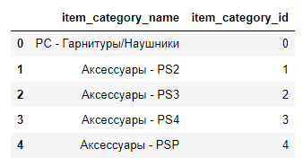
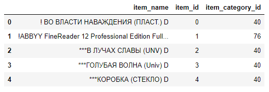
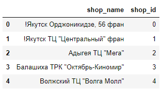
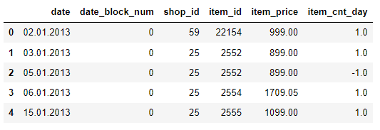
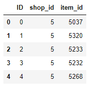
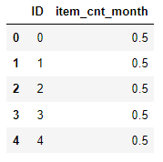

# My First Kaggle

> 일일 과거 판매 데이터를 가지고
>
> 다음 달의 모든 제품과 매장의 총 매출을 예측하기


**파일 설명**

- sales_train.csv - 훈련 세트. 2013년 1월부터 2015년 10월까지의 일일 과거 데이터입니다.
- test.csv - 테스트 세트. 2015년 11월 이러한 상점 및 제품의 매출을 예측해야 합니다.
- sample_submission.csv - 올바른 형식의 샘플 제출 파일입니다.
- items.csv - 항목/제품에 대한 추가 정보입니다.
- item_categories.csv - 항목 카테고리에 대한 추가 정보입니다.
- shops.csv - 상점에 대한 추가 정보입니다.


**데이터 필드**

- ID - 테스트 세트 내 (Shop, Item) 튜플을 나타내는 ID
- shop_id - 상점의 고유 식별자
- item_id - 제품의 고유 식별자
- item_category_id - 항목 카테고리의 고유 식별자
- item_cnt_day - 판매된 제품 수. 이 측정값의 월별 금액을 예측하고 있습니다.
- item_price - 항목의 현재 가격
- 날짜 - dd/mm/yyyy 형식의 날짜
- date_block_num - 편의를 위해 사용되는 연속 월 숫자입니다. 2013년 1월은 0, 2013년 2월은 1,..., 2015년 10월은 33
- item_name - 항목의 이름
- shop_name - 가게 이름
- item_category_name - 항목 범주의 이름 이 데이터 세트는 상업적 사용을 포함한 모든 목적으로 사용할 수 있습니다.


### 1) EDA 분석하기


**1. 데이터 로드**

```python
import numpy as np
import pandas as pd
import matplotlib.pyplot as plt
import seaborn as sns
%matplotlib inline
```

```python
categories = pd.read_csv('./item_categories.csv') #항목 카테고리 추가 정보
items = pd.read_csv('./items.csv') #항목/제품 추가 정보
sales_train = pd.read_csv('./sales_train.csv')  #훈련시킬 세트, 2013년 1월~ 2015년 10월까지 데이터
sample = pd.read_csv('./sample_submission.csv') #올바른 형식의 샘플 제출 파일
shops = pd.read_csv('./shops.csv') #상점 추가 정보
test = pd.read_csv('./test.csv') #테스트 세트, 2015년 11월의 상점 및 제품 매출 예측
```

```
총 여섯 가지의 CSV파일의 HEAD 미리보기
```



(categories.head)



(items.head)



(shops.head)



(sales_train.head)



(test.head)



(sample.head)


**2. 중복있나 체크**


**3. null값 체크**


**4. 이상치 제거**