## 1일차 - 자료형태의 이해


#### 범주형 자료

**도수분포표**

- 범주형 데이터

- 도수 : 각 범주에 속하는 관측값의 개수 value_counts()
- 상대도수  : 도수를 자료의 전체 개수로 나눈 비율 value_counts(normalize = True)
- 도수분포표 : 범주와 그 범주에 대응하는 도수, 상대도수를 나열해서 표로


**범주형 데이터**

- 수치로 측정 불가능(성별, 혈액형, 지역 등)
- 질적 자료(qualitative data)
- 분류
  - 순위형 자료(ordinal data)
    - 범주 사이 순서 의미 있음
    - 학점
    - 수치 매핑(범주를 0,1로, 세 개 이상일 때는 수치 크기 간격을 같게)
  - 명목형 자료(norminal data)
    - 범주 사이 순서 의미 없음
    - 혈액형
    - 수치 매핑, 더미기법(각 범주를 0 or 1로 변환)


**1. 불러오기**

```python
import pandas as pd
import numpy as np
import matplotlib.pyplot as plt

drink = pd.read_csv('./drink.csv') #drink라는 csv파일 데려오기
#밑에 캡쳐한 사진은 헤드만 보여준 거(상위 5개)(아래에 더 있음)
```


**2. 도수 계산하기**

```python
drink['Attend'].value_counts() #도수 계산 (attend라는 열에 각 범주에 속하는 값 개수)
#0    13
#1    12
#Name: Attend, dtype: int64

drink_freq = drink['Attend'].value_counts() #이걸 drink_freq라고 새 변수에 넣기

drink[drink.Attend == 1].Name.Value_counts() #attend가 1인 것 중 name의 value_counts하기
```


#### 수치형 자료

**수치형 데이터**

- 수치로 측정 가능
- 양적 자료
- 키, 몸무게, 시험 점수, 나이 등
  - 이산형 자료(discrete data)
    - 셀 수 있는 관측값(뉴스 글자 수, 주문 상품 개수)
  - 연속형 자료(continuous data)
    - 연속적인 관측값(원주율, 시간)
- 많은 양 자료 > 의미있는 수치로 요약 > 대략적 분포 상태 파악 가능
- 분류
  - 평균
    - 극단적으로 큰 값이나 작은 값의 영향 많이 받음
  - 분산/표준편차
    - 퍼진 정도를 측정할 때는 이 두개로
    - 분산이 작을수록 좋음 > 평균에 몰려있으니까


**히스토그램**

- 범주형에서의 막대그래프 포지션


**1. 평균**

```python
coffee = np.array([202,177,121,148,89,121,137,158])
cf_mean = coffee.mean() # np.mean(coffee)로 해도 됨
round(cf_mean, 2) #소수점 둘째 자리까지
```


**2. 표준편차**

```python
from statistics import stdev
cf_std = stdev(coffee)
round(cf_std, 2)
```


**3. 히스토그램**

```python
flg, ax = plt.subplots()
#figure, axes객체를 포함하는 튜플을 반환
#예는 fig = figure() , ax = fig.add_subplot()한 것과 동일
plt.hist(coffee, bins = 3) #3개 계급으로 나뉜다
```


---


## 2일차 - 데이터 전처리

> 실제로 데이터를 전처리 해보기


**전처리의 역할**

1. 머신러닝의 입력 형태로 데이터 변환
   - 대부분은 숫자 데이터 입력받음, but 실제 데이터는 다양해서 수치형 자료로 바꿔줘야
2. 결측치, 이상치 처리해서 데이터 정제
3. 학습용, 평가용으로 데이터 분리


**데이터 정제 및 분리**

- 결측값 처리
- 이상치 처리
  - 모델 성능 저하될 수 있음
  - 통계지표(카이제곱 검정, IQR 지표 등) 사용해서 판단
  - 데이터 분포보고 직접 판단
- 지도학습 데이터 분리
  - feature/label : 예측하기 위한 입력값 / 예측할 대상이 되는 데이터


**범주형 데이터**

**1. 데이터 불러오기**

```python
import pandas as pd
import numpy as np
import matplotlib.pyplot as plt

df = pd.read_csv('./titanic.csv')
```

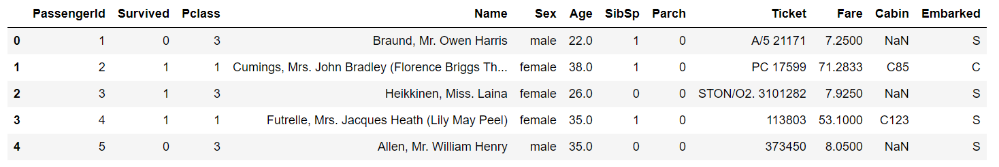


**2. replace하기(문자를 숫자로)**

```python
df = df.relace({'male':0, 'female':1}) #딕셔너리 형태로 replace
#남자는 0, 여자는 1로 바꿈
```


**3. dummy 방식(명목형 자료 변환)**

```python
pd.get_dummies(df.Embarked) #get_dummies 사용해서 변환
#embarked열 값들이 c,q,s인데 이걸 0, 1로 변환
```

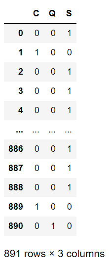


**수치형 데이터**

**1. 정규화 함수 구현(minmax scaling)**

```python
def normal(data):
    maxx = max(data)
    minn = min(data)
    data = (data-minn)/(maxx-minn)
    return data
print(df.Fare.head())
df.Fare = normal(df.Fare)
df.Fare.head()
```

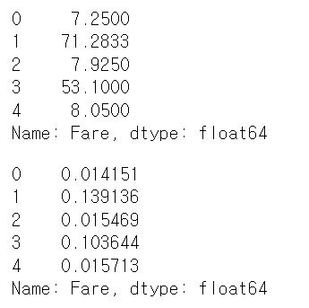


**2. 표준화 함수 구현(standardzation)**

```python
#x-(x.mean)/x.std << 표준화
def standard(data):
    data = (data - data.mean()) / data.std()
    return data
print(df.Fare.head())
df.Fare = standard(df.Fare)
df.Fare.head()
```

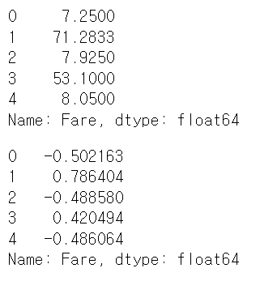

**3. 결측치 처리**

```python
df.info()
##   Column       Non-Null Count  Dtype  
#---  ------       --------------  -----  
# 0   PassengerId  891 non-null    int64  
# 1   Survived     891 non-null    int64  
# 2   Pclass       891 non-null    int64  
# 3   Name         891 non-null    object 
# 4   Sex          891 non-null    object 
# 5   Age          714 non-null    float64
# 6   SibSp        891 non-null    int64  
# 7   Parch        891 non-null    int64  
# 8   Ticket       891 non-null    object 
# 9   Fare         891 non-null    float64
# 10  Cabin        204 non-null    object 
# 11  Embarked     889 non-null    object 

#cabin은 null이 너무 많아서 지워버리고
#embarked는 null값 두 개 처리하고(대체)
#age는 좀 봐야겠네
#라고 판단
```

```python
#1. cabin  변수 제거
df = df.drop(columns = ['Cabin'])

#2. 결측값 포함되어있는 샘플 제거
df = df.dropna()  #왜 대체안하고 그냥 drop했는지는 기억이 안남
```


**4. 이상치 처리**

```python
df.boxplot() #age, fare가 이상치가 엄청 많네
```

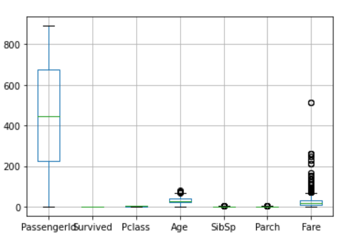

```python
#age값 - age내림값(기준) > 0보다 크면 소수점 갖는 데이터로 분류

df.Age
np.floor(df.Age) #내림값

outlier = df[df.Age - np.floor(df.Age) > 0] #0보다 큰 값들을 나오게 함(이상치들)
#왜냐하면 나이에는 실수형이 없으니까
df_final = df[df.Age - np.floor(df.Age) = 0] #정상값(소수점 없는)

len(outlier) #25개
```


**5. 모델링**

```python
#1. 데이터 분리
from sklearn.model_selection import train_test_split

#feature data, label data(지도학습)
X = df_final.drop(columns = ['Survived']) #아까 그 정상값들 중에 survived drop
y = df_final['Survived'] #정상값들의 survived 열

print('X의 데이터 개수 : %d'%(len(X)))
print('y의 데이터 개수 : %d'%(len(y)))

#출력결과
#X의 데이터 개수 : 687
#y의 데이터 개수 : 687

#train data, test data로 분리
X_train, X_test, y_train, y_test = train_test_split(X,y,test_size = 0.3, random_state = 42) #42인 이유 : 노가다 해보니 얘가 제일 값이 잘 나오더라

print('학습한 데이터 개수 : %d'%(len(X_train)))
print('테스트하기 위해 남겨둔 데이터 개수 : %d'%(len(X_test)))

#출력결과
#학습한 데이터 개수 : 480
#테스트하기 위해 남겨둔 데이터 개수 : 207
```


---


## 3일차 - 지도학습(회귀분석)

> 지도학습 두 분석 종류인 회귀분석과 분류분석을 해보자


#### 회귀분석

> 데이터를 가장 잘 설명하는 모델을 찾아서 입력값에  따른 미래 결과값을 예측하는 알고리즘


**어떤 게 좋은 예측일까?**

1. 실제값과 예측값의 차이가 작을수록 좋다?

   1. 실제값-예측값에는 예외가 있음
   2. 그렇다면 차이의 제곱합으로 해보자

2. loss 함수를 이용한다

   1. loss함수가 작을수록 좋은 모델이다
   2. y절편과 기울기값을 조절해서 함수의 크기를 작게 해나가야 한다

3. 함수의 크기를 작게하는 y절편과 기울기를 찾는 방법은?

   1. gradient descent(경사 하강법)

      - 한 번의 계산으로 구하는 게 아니라, 초기값에서 점진적으로 구하는 방ㅎ식
        1. 절편과 기울기를 랜덤하게 초기화
        2. 현재 절편과 기울기값으로 loss값을 계산한다
        3. 어떻게 해야 줄일 수 있는지 알 수 있는 gradient값을 계산한다
        4. 이 값을 활용해서 절편과 기울기값을 업데이트 한다
        5. loss값 차이가 거의 없어질 때까지 2번 ~ 4번 정도 과정을 반복한다(gradient값도 작아짐)

   2. normal equation(least squars)

      - 회귀 분석에서 사용되는 표준 방식 > 실험, 관찰통해서 얻어진 데이터 분석 > 미지 상수 구할 때 사용
      -  이 공식을 통해 일차 함수 기울기와 y절편 구할 수 있음

   3. brute force search

      - 가능한 경우 일일이 탐색
      - 굉장히 오래 걸림
      - 시간복잡도 > O(N^2)

      

**종류**

- 단순 선형 회귀 : 데이터를 설명하는 모델을 직선 형태로 가정 > y절편과 기울기를 구해야 함
  - 특징
    - 가장 기초적이고 많이 사용
    - 입력값이 1개일 때만 적용이 가능하다
    - 입력값과 결과값의 관계를 알아보는데 좋다
    - 영향을 얼마나 미치는 지 알 수 있다
    - 직관적으로 관계를 해석하고 싶을 때 활용한다
- 다중 선형 회귀 : 여러 개 입력값으로 결과값 예측할 때
  - 특징
    - 여러 개 입력값 사이 간 상관관계가 높을 경우 결과 신뢰성 잃을 수 있음


**회귀 평가 지표** : 어떤 모델이 좋은 모델인지 / 실제값과 예측값 차이에 기반한 평가

- RSS
  - 단순 오차 제곱 합
  - 값 작을수록 성능 좋음
  - 가장 간단하고 직관적 해석 가능
  - 오차 그대로 이용 > 입력값 크기에 의존적
  - 절대적 값과 비교 불가능
- MAE,MSE
  - 절대적 크기에 의존한 지표
  - 평균을 그대로 이용하기 때문에 입력값 크기에 의존적
  - 절대적 값과 비교 불가능
  - MSE(mean squared error)
    - 실제값-예측값 > 제곱 > 평균화
    - 예측값과 실제값 차이 면적 합
    - 작을수록 성능 좋음
    - 이상치에 민감(특이값 존재하면 수치가 많이 늘어남)
  - MAE(mean absolute error) 
    - 실제값-예측값 > 절대값으로 변환 > 평균화
    - 작을수록 성능 좋음
    - 변동성 큰 지표와 낮은 지표 같이 예측할 때 굿
- RMSE(root mean squared error)
  - MSE에 루트 씌우기
  - 에러에 따른 손실이 크게 오를 때 굿
- MSLE(mean squared log error)
  - MSE에 로그
- MAPE(mean absolute percentage error)
  - MAE를 퍼센트로
  - 단점은 MAE랑 같음
  - 편향 존재
- R제곱(결정 계수)
  - 결정 계수 : 회귀식이 얼마나 정확한지 나타내는 수
  - 0~1 사이로 >> 0에 가까울수록 정확도가 낮고 / 1에 가까울수록 정확도가 높다
  - 구하는 방법
    - 상관계수 > 제곱
    - 분산분석 데이터 이용(SSR/SST)
  - 1 - RSS/TSS
  - 이것만으로는 의사결정하기 힘듦 > 가설검정을 통해 의사결정(양자택일)


```python
import matplotlib.pyplot as plt
import numpy as np
import pandas as pd
from sklearn.linear_model import LinearRegression
```

```python
X = [8.70153760, 3.90825773, 1.89362433, 3.28730045, 7.39333004, 2.98984649, 2.25757240, 9.84450732, 9.94589513, 5.48321616]
Y = [5.64413093, 3.75876583, 3.87233310, 4.40990425, 6.43845020, 4.02827829, 2.26105955, 7.15768995, 6.2909744,
     5.19692852]
```

```python
#1.X의 형태를 변환 > train_X 저장
#2.Y의 형태를 변환 > train_Y에 저장
train_X = pd.DataFrame(X, columns = ['X'])
train_Y = pd.Series(Y)

# 변환된 데이터를 출력.
print('전 처리한 X 데이터: \n {}'.format(train_X))
print('전 처리한 X 데이터 shape: {}\n'.format(train_X.shape))

print('전 처리한 Y 데이터: \n {}'.format(train_Y))
print('전 처리한 Y 데이터 shape: {}'.format(train_Y.shape))  
```

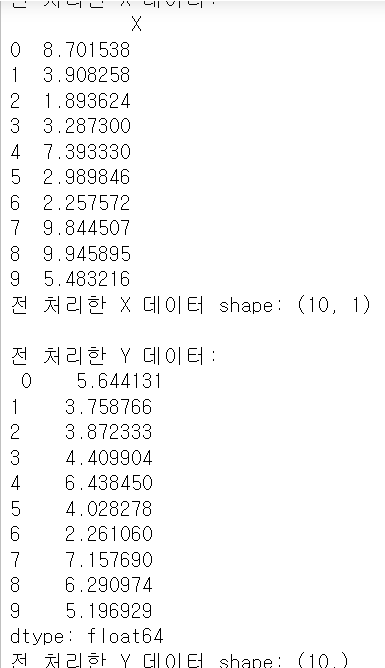

```python
#모델 초기화
lrmodel = LinearRegression()
#train/test
lrmodel.fit(train_X, train_Y)
```

```
linearregression() : 선형회귀

- 가장 기본
- 훈련데이터에 가장 잘 들어맞는 선형 방정식
```

```python
#학습한 결과 시각화
plt.scatter(X,Y) #산점도
plt.plot([0,10], [lrmodel.intercept_, 10*lrmodel.coef_[0] + lrmodel.intercept_], c = 'pink')
plt.xlim(0,10)
plt.ylim(0,10)
plt.title('result')
plt.show()
```

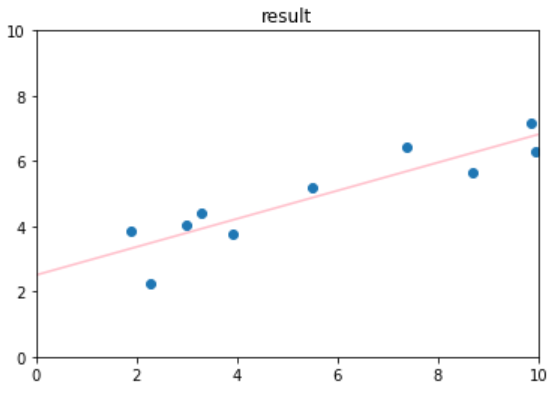

```
.coef_ : 추정된 가중치들을 보여줌
.intercept_ : y절편(추정된 상수)
```

```python
lrmode.intercept_  #2.5061811726114125
lrmodel.coef_  #array([0.43078118]) array 형태
beta_0 = lrmodel.intercept_
beta_1 = lrmodel.coef_[0] #계수값(weight값) > 0.4307811782769159
print(beta_0) #2.5061811726114125
print(beta_1) #0.4307811782769159
```


```python
#단순선형회귀 예측
import matplotlib.pyplot as plt
import pandas as pd
import numpy as np
from sklearn.linear_model import LinearRegression

X = [8.70153760, 3.90825773, 1.89362433, 3.28730045, 7.39333004, 2.98984649, 2.25757240, 9.84450732, 9.94589513, 5.48321616]
Y = [5.64413093, 3.75876583, 3.87233310, 4.40990425, 6.43845020, 4.02827829, 2.26105955, 7.15768995, 6.29097441, 5.19692852]

train_X = pd.DataFrame(X, columns=['X'])
train_Y = pd.Series(Y)

lrmodel = LinearRegression()
lrmodel.fit(train_X, train_Y)
```

```python
#train_X 예측(predict)
pred_X = lrmodel.predict(train_X)
print(pred_X)
print(train_Y)
```

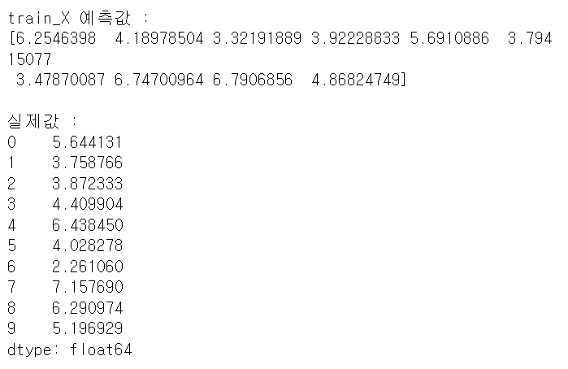


```python
#다중선형회귀 - 데이터전처리
import numpy as np
import pandas as pd
from sklearn.linear_model import LinearRegression
from sklearn.metrics import r2_score  #평가 지표 / 결정 계수 보겠다
from sklearn.model_selection import train_test_split
```

```python
df = pd.read_csv('./Advertising.csv')
df.head()
```

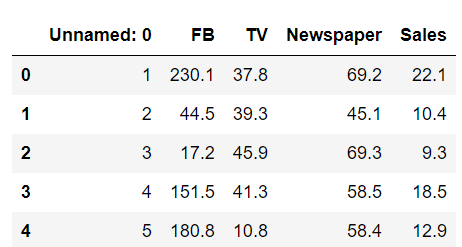

```python
#필요없는 열 제거
df = df.drop(columns = ['Unnamed: 0'])
#info로 확인
df.info()
# 0   FB         200 non-null    float64
# 1   TV         200 non-null    float64
# 2   Newspaper  200 non-null    float64
# 3   Sales      200 non-null    float64
```

```python
#1. sales변수는 label데이터로 y에 저장, 나머지는 x에 저장
X = df.iloc[:,:-1]
Y = df.iloc[:,-1]

#2. train/test
train_X, test_X, train_Y, test_Y = train_test_split(X, Y, test_size = 0.2, random_state = 42) #8:2로 

print(train_X)
print(train_Y)
print(test_X)
print(test_Y)
```

```python
#학습시키기
lrmodel = LinearRegression()
lrmodel.fit(train_X, train_Y)

#학습된 파라미터 값 불러오기
beta_0 = lrmodel.intercept_ #y절편(기본 판매량)
beta_1 = lrmodel.coef_[0] #1번째 변수에 대한 계수(FB)
beta_2 = lrmodel.coef_[1] #2번째 변수에 대한 계수(TV)
beta_3 = lrmodel.coef_[2]

print(beta_0)
print(beta_1)
print(beta_2)
print(beta_3)
#2.979067338122629
#0.044729517468716326
#0.18919505423437655
#0.0027611143413671757

#회귀식 >> Y(종속변수) = 0.04*x1 + 0.18*x2 + 0.002*x3 + 2.979
```

```python
#예측
lrmodel.predict(test_X)
#array([16.4080242 , 20.88988209, 21.55384318, 10.60850256, 22.11237326,
#       13.10559172, 21.05719192,  7.46101034, 13.60634581, 15.15506967,
#        9.04831992,  6.65328312, 14.34554487,  8.90349333,  9.68959028,
#       12.16494386,  8.73628397, 16.26507258, 10.27759582, 18.83109103,
#       19.56036653, 13.25103464, 12.33620695, 21.30695132,  7.82740305,
#        5.80957448, 20.75753231, 11.98138077,  9.18349576,  8.5066991 ,
#       12.46646769, 10.00337695, 21.3876709 , 12.24966368, 18.26661538,
#       20.13766267, 14.05514005, 20.85411186, 11.0174441 ,  4.56899622])
```

독립변수 X > feature

종속변수 Y > target

잔차 = 샘플 관측값 - 예측값

```python
#회귀 알고리즘 평가지표_mse, mae
from sklearn.metrics import r2_score
from sklearn.model_selection import train_test_split
from sklearn.metrics import mean_absolute_error
from sklearn.metrics import mean_squared_error
```

```python
#train_X, mse, mae 계산
pred_train = lrmodel.predict(train_X)
pred_test = lrmodel.predict(test_X)

mse_train = mean_absolute_error(train_Y, pred_train)
mae_train = mean_squared_error(train_Y, pred_train)

print('MSE_train : %f' % MSE_train)
print('MAE_train : %f' % MAE_train)
#MSE_train : 1.198468
#MAE_train : 2.705129

#train 데이터가 당연히 test 데이터보다 잘나옴
```

```python
MSE_test = mean_absolute_error(test_Y, pred_test)
MAE_test = mean_squared_error(test_Y,pred_test)

print('MSE_test : %f' % MSE_test)
print('MAE_test : %f' % MAE_test)
#MSE_test : 1.460757
#MAE_test : 3.174097
```

```python
#train_X 결정계수(R2)
# 결정계수는 '설명력'
r2_train = r2_score(train_Y, pred_train)
print('R2_train : %f'%R2_train)
#R2_train : 0.895701 >> 89%
```

```python
#test_X 예측값 계산
lrmodel.predict(test_X)

pred_test = lrmodel.predict(test_X)
r2_test = r2_score(test_Y, pred_test)
print('R2_test : %f'%R2_test) 
#R2_test : 0.899438 >> 89%
# >> test가 더 좋네 ? > 언더피팅 
#제일 이상적인 건 train 98%, test95~98%래
```


---


## 4일차 - 지도학습(분류분석)


**분류** : 입력값이 어떤 클래스에 속할 지에 대한 결과값 도출하는 알고리즘


| 트리 구조 기반 | 의사결정나무, 랜덤포레스트..              |
| -------------- | ----------------------------------------- |
| 확률 모델 기반 | 나이브 베이즈 분류기, ..                  |
| 결정 경계 기반 | 선형 분류기, 로지스틱 회귀 분류기, SVM... |
| 신경망         | 퍼셉트론, 딥러닝 모델...                  |
| ..             |                                           |


**의사결정나무**

- 의사결정 규칙을 나무 구조로 나타내서 > 소집단으로 분류 or 예측
- 연속적으로 발생하는 의사결정 문제 시각화 > 이뤄지는 시점과 성과 한 눈에
- 가지치기
  - 가지를 잘라내서 모형 단순화
- 가치분할
  - 나무 가지 생성
- 결정 규칙
  - 분할규칙
    - 새 가지를 어디에서 나오게?
  - 정지규칙
    - 어떻게 해야 새 가지가 더 못나오게 ?
  - 가지치기 규칙
    - 어느 가지를 쳐내야 예측력이 높게?
    - 끝마디 너무 많지 않게
- 훈련용/검정용/시험용
- 특징
  - 노복잡
  - 대용량 데이터 빠르게 가능
  - 비정상적 잡음 데이터에 대해서도 민감함없이 분류 가능
  - 분류 정확도 굿
  - 비모수적 모형(수학적 가정 불필요)
  - 수치형/범주형 변수 모두 사용 가능
- 활용
  - 세분화(segmentation)
    - 비슷한 특성 데이터 몇 개 그룹으로 분할 > 특성 발견
  - 분류(classification, stratification)
    - 목표변수의 범주를 몇 등급으로 나눌 때
  - 차원축소, 변수 선택
  - 예측
  - 교호작용효과의 파악
    - 교호작용 : 두 개 이상 사물이나 현상이 서로 원인-결과가 되는
  - 범주의 병함, 연속형 변수의 이산화
- 구현 단계
  1. 데이터 삽입
  2. 학습/실험 데이터 
  3. 의사결정나무 모형
  4. 분류
  5. 성과 분석
  6. 모형 수정
- 패키지
  - rpart
  - party
  - printcp() : cross validation 계산
  - plotcp() : cross validation을 그래프로 보여주는 함수
  - prune() : 가지치기
  - confusionMatrix(예측값, 실제값)


```python
#의사결정나무

import numpy as np
import pandas as pd

#풍속을 threshold값에 따라 분리하는 의사결정나무
def binary_tree(data, threshold):
    yes = []
    no = []
    
    for wind in data['풍속']:
        if wind > threshold:
            yes.append(wind)
        else:
            np.append(wind)
	data_yes = pd.DataFrame({'풍속' : yes, '예상 지연 여부' : ['Yes']*len(yes)})
    data_no = pd.DataFrame({'풍속' : no, '예상 지연 여부' : ['No']*len(no)})
    return data_no.append(data_yes, ignore_index = True)  
#data_yes를 data_no에다가 append(인덱스 무시하고 걍 붙여라)

Wind = [1, 1.5, 2.5, 5, 5.5, 6.5]
Delay  = ['No', 'No', 'No', 'Yes', 'Yes', 'Yes']

data = pd.DataFrame({'풍속' : Wind, '지연여부' : Delay})
print(data)
```

```python
'''
1. binary_tree 모델을 사용하여 항공 지연 여부를 예측합니다.
   data의 지연 여부와 예상 지연 여부가 같은 값이 나오도록 
   의사결정나무의 
   결과물을 data_pred에 저장하세요'''
data_pred = binary_tree(data, threshold = 4)
print(data_pred)
```

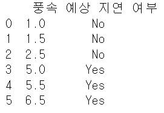

```python
#sklearn 의사결정나무 - 데이터 전처리
from sklearn.datasets import load_iris
from sklearn.tree import DecisionTreeClassifier
from sklearn.model_selection import train_test_split
from sklearn.metrics import accuracy_score

#sklearn 저장된 데이터 불러오기
X, Y = load_iris(return_X_y = True) #return_X_y > feature랑 label만 필요

df = pd.DataFrame(X, columns = ['꽃받침 길이', '꽃받침 넓이', '꽃잎 길이', '꽃잎 넓이'])

df['클래스(품종)'] = Y #새로 만듦
```

```python
#학습용, 평가용
train_X, test_X, train_Y, test_Y = train_test_split(X, Y, test_size = 0.2, random_state = 42)

#원본데이터 출력
print(df[])

#전처리한 데이터 5개만 추출, 출력
print(train_X[:5])
print(train_Y[:5]) #[0 0 1 0 0]
print(test_X[:5])
print(test_Y[:5]) #[1 0 2 1 1]
```

```python
from matplotlib import pyplot as plt #이런 방법도 있음
from sklearn import tree

#의사결정나무 모델 초기화, 학습
dtmodel = DecisionTreeClassifier(max_depth = 2)
dtmodel.fit(train_X, train_Y)

#학습한 결과 출력
plt.rc('font', family = 'NanumGothic')
fig = plt.figure(figsize = (25,20))
tree.plot_tree(dtmodel,
              feature_names = ['꽃받침 길이', '꽃받침 넓이', '꽃잎 길이', '꽃잎 넓이'],
              class_names = ['setosa', 'versicolor', 'virginica'],
              filled = True)
plt.show()
```

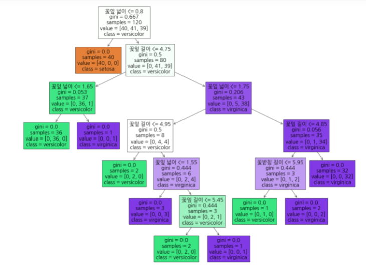

```python
#test data로 예측
dtmodel.predict(test_X)
#array([1, 0, 2, 1, 1, 0, 1, 2, 1, 1, 2, 0, 0, 0, 0, 1, 2, 1, 1, 2, 0, 2,
#       0, 2, 2, 2, 2, 2, 0, 0])
```


**2번째**

```python
import numpy as np
import pandas as pd
import seaborn as sns
import matplotlib.pyplot as plt
from sklearn.datasets import load_breast_cancer
from sklearn.tree import DecisionTreeClassifier
from sklearn.model_selection import train_test_split
from sklearn.metrics import accuracy_score
from sklearn.metrics import precision_score
from sklearn.metrics import recall_score
from sklearn import tree
from sklearn.metrics import confusion_matrix
from sklearn.utils.multiclass import unique_labels
```

```python
#데이터 불러오기

X, Y = load_breast_cancer(return_X_y=True)
X = np.array(X)
Y = np.array(Y)

len(X[0]) #feature 개수 > 30

X.shape #(569,30)
```

```python
#train, test
train_X, test_X, train_Y, test_Y = train_test_split(X, Y, test_size= 0.2, random_state=42)

len(test_Y) #평가용 샘플 개수 : 455

#class가 0인거, 1인 거
len(test_Y) - sum(test_Y) #클래스가 0인 평가용 샘플 > 43
sum(test_Y) #클래스가 1인 평가용 샘플

#의사결정나무 초기화 > 학습
dtmodel = DecisionTreeClassifier()
dtmodel.fit(train_X, train_Y) 

#예측
y_pred = dtmodel.predict(test_X)
```

````python
#혼동행렬
cm = confusion_matrix(test_Y, y_pred)
print(cm)
#Confusion Matrix : 
# [[40  3]
# [ 3 68]]

#출력
fig = fig = plt.figure(figsize=(5,5))
ax = sns.heatmap(cm, annot=True) #annot > 각 셀에 숫자
ax.set(title='Confusion Matrix',
            ylabel='True label',
            xlabel='Predicted label')
fig.savefig("decistion_tree.png")
````

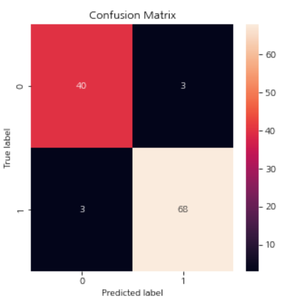

```python
#예측값 저장
y_pred_train = dtmodel.predict(train_X)
y_pred_test = dtmodel.predict(test_X)

#혼동행렬 계산
cm_train = confusion_matrix(train_Y, y_pred_train)
cm_test = confusion_matrix(test_Y, y_pred_test)

print('trainX confusion matrix  : \n{}'.format(cm_train))
print('testX confusion matrix : \n{}'.format(cm_test))
#trainX confusion matrix  : 
#[[169   0]
# [  0 286]]
#testX confusion matrix : 
#[[40  3]
# [ 3 68]]
```

```python
#정확도 계산
acc_train = dtmodel.score(train_X, train_Y)
acc_test = dtmodel.score(test_X, test_Y)

#출력
print('train_X Accuracy: %f' % (acc_train))
print('test_X Accuracy: %f' % (acc_test))
#train_X Accuracy: 1.000000
#test_X Accuracy: 0.947368

accuracy_score(test_Y, y_pred) #0.9473684210526315 > 94%

#정밀도 계산
precision_train = precision_score(train_Y, y_pred_train)
precision_test = precision_Score(test_Y, y_pred_test)

print(precision_train)
print(precision_test)
#1.0
#0.9577464788732394

#재현율 계산
recall_train = recall_score(train_Y, y_pred_train)
recall_test = recall_score(test_Y, y_pred_test)

print(recall_train)
print(recall_test)
#1.0
#0.9577464788732394
```

