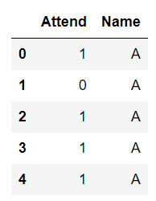

## 1일차 - 자료형태의 이해


#### 범주형 자료

**도수분포표**

- 범주형 데이터

- 도수 : 각 범주에 속하는 관측값의 개수 value_counts()
- 상대도수  : 도수를 자료의 전체 개수로 나눈 비율 value_counts(normalize = True)
- 도수분포표 : 범주와 그 범주에 대응하는 도수, 상대도수를 나열해서 표로


**범주형 데이터**

- 수치로 측정 불가능(성별, 혈액형, 지역 등)
- 질적 자료(qualitative data)
- 분류
  - 순위형 자료(ordinal data)
    - 범주 사이 순서 의미 있음
    - 학점
    - 수치 매핑(범주를 0,1로, 세 개 이상일 때는 수치 크기 간격을 같게)
  - 명목형 자료(norminal data)
    - 범주 사이 순서 의미 없음
    - 혈액형
    - 수치 매핑, 더미기법(각 범주를 0 or 1로 변환)


**1. 불러오기**

```python
import pandas as pd
import numpy as np
import matplotlib.pyplot as plt

drink = pd.read_csv('./drink.csv') #drink라는 csv파일 데려오기
#밑에 캡쳐한 사진은 헤드만 보여준 거(상위 5개)(아래에 더 있음)
```



**2. 도수 계산하기**

```python
drink['Attend'].value_counts() #도수 계산 (attend라는 열에 각 범주에 속하는 값 개수)
#0    13
#1    12
#Name: Attend, dtype: int64

drink_freq = drink['Attend'].value_counts() #이걸 drink_freq라고 새 변수에 넣기

drink[drink.Attend == 1].Name.Value_counts() #attend가 1인 것 중 name의 value_counts하기
```


#### 수치형 자료

**수치형 데이터**

- 수치로 측정 가능
- 양적 자료
- 키, 몸무게, 시험 점수, 나이 등
  - 이산형 자료(discrete data)
    - 셀 수 있는 관측값(뉴스 글자 수, 주문 상품 개수)
  - 연속형 자료(continuous data)
    - 연속적인 관측값(원주율, 시간)
- 많은 양 자료 > 의미있는 수치로 요약 > 대략적 분포 상태 파악 가능
- 분류
  - 평균
    - 극단적으로 큰 값이나 작은 값의 영향 많이 받음
  - 분산/표준편차
    - 퍼진 정도를 측정할 때는 이 두개로
    - 분산이 작을수록 좋음 > 평균에 몰려있으니까


**히스토그램**

- 범주형에서의 막대그래프 포지션


**1. 평균**

```python
coffee = np.array([202,177,121,148,89,121,137,158])
cf_mean = coffee.mean() # np.mean(coffee)로 해도 됨
round(cf_mean, 2) #소수점 둘째 자리까지
```


**2. 표준편차**

```python
from statistics import stdev
cf_std = stdev(coffee)
round(cf_std, 2)
```


**3. 히스토그램**

```python
flg, ax = plt.subplots()
#figure, axes객체를 포함하는 튜플을 반환
#예는 fig = figure() , ax = fig.add_subplot()한 것과 동일
plt.hist(coffee, bins = 3) #3개 계급으로 나뉜다
```


---


## 2일차 - 데이터 전처리

> 실제로 데이터를 전처리 해보기


**전처리의 역할**

1. 머신러닝의 입력 형태로 데이터 변환
   - 대부분은 숫자 데이터 입력받음, but 실제 데이터는 다양해서 수치형 자료로 바꿔줘야
2. 결측치, 이상치 처리해서 데이터 정제
3. 학습용, 평가용으로 데이터 분리


**데이터 정제 및 분리**

- 결측값 처리
- 이상치 처리
  - 모델 성능 저하될 수 있음
  - 통계지표(카이제곱 검정, IQR 지표 등) 사용해서 판단
  - 데이터 분포보고 직접 판단
- 지도학습 데이터 분리
  - feature/label : 예측하기 위한 입력값 / 예측할 대상이 되는 데이터


**범주형 데이터**

**1. 데이터 불러오기**

```python
import pandas as pd
import numpy as np
import matplotlib.pyplot as plt

df = pd.read_csv('./titanic.csv')
```


**2. replace하기(문자를 숫자로)**

```python
df = df.relace({'male':0, 'female':1}) #딕셔너리 형태로 replace
#남자는 0, 여자는 1로 바꿈
```


**3. dummy 방식(명목형 자료 변환)**

```python
pd.get_dummies(df.Embarked) #get_dummies 사용해서 변환
#embarked열 값들이 c,q,s인데 이걸 0, 1로 변환
```


**수치형 데이터**

**1. 정규화 함수 구현(minmax scaling)**

```python
def normal(data):
    maxx = max(data)
    minn = min(data)
    data = (data-minn)/(maxx-minn)
    return data
print(df.Fare.head())
df.Fare = normal(df.Fare)
df.Fare.head()
```


**2. 표준화 함수 구현(standardzation)**

```python
#x-(x.mean)/x.std << 표준화
def standard(data):
    data = (data - data.mean()) / data.std()
    return data
print(df.Fare.head())
df.Fare = standard(df.Fare)
df.Fare.head()
```


**3. 결측치 처리**

```python
df.info()
##   Column       Non-Null Count  Dtype  
#---  ------       --------------  -----  
# 0   PassengerId  891 non-null    int64  
# 1   Survived     891 non-null    int64  
# 2   Pclass       891 non-null    int64  
# 3   Name         891 non-null    object 
# 4   Sex          891 non-null    object 
# 5   Age          714 non-null    float64
# 6   SibSp        891 non-null    int64  
# 7   Parch        891 non-null    int64  
# 8   Ticket       891 non-null    object 
# 9   Fare         891 non-null    float64
# 10  Cabin        204 non-null    object 
# 11  Embarked     889 non-null    object 

#cabin은 null이 너무 많아서 지워버리고
#embarked는 null값 두 개 처리하고(대체)
#age는 좀 봐야겠네
#라고 판단
```

```python
#1. cabin  변수 제거
df = df.drop(columns = ['Cabin'])

#2. 결측값 포함되어있는 샘플 제거
df = df.dropna()  #왜 대체안하고 그냥 drop했는지는 기억이 안남
```


**4. 이상치 처리**

```python
df.boxplot() #age, fare가 이상치가 엄청 많네
```


```python
#age값 - age내림값(기준) > 0보다 크면 소수점 갖는 데이터로 분류

df.Age
np.floor(df.Age) #내림값

outlier = df[df.Age - np.floor(df.Age) > 0] #0보다 큰 값들을 나오게 함(이상치들)
#왜냐하면 나이에는 실수형이 없으니까
df_final = df[df.Age - np.floor(df.Age) = 0] #정상값(소수점 없는)

len(outlier) #25개
```


**5. 모델링**

```python
#1. 데이터 분리
from sklearn.model_selection import train_test_split

#feature data, label data(지도학습)
X = df_final.drop(columns = ['Survived']) #아까 그 정상값들 중에 survived drop
y = df_final['Survived'] #정상값들의 survived 열

print('X의 데이터 개수 : %d'%(len(X)))
print('y의 데이터 개수 : %d'%(len(y)))

#출력결과
#X의 데이터 개수 : 687
#y의 데이터 개수 : 687

#train data, test data로 분리
X_train, X_test, y_train, y_test = train_test_split(X,y,test_size = 0.3, random_state = 42) #42인 이유 : 노가다 해보니 얘가 제일 값이 잘 나오더라

print('학습한 데이터 개수 : %d'%(len(X_train)))
print('테스트하기 위해 남겨둔 데이터 개수 : %d'%(len(X_test)))

#출력결과
#학습한 데이터 개수 : 480
#테스트하기 위해 남겨둔 데이터 개수 : 207
```


---


## 3일차 - 지도학습

> 지도학습 두 분석 종류인 회귀분석과 분류분석을 해보자


#### 회귀분석

> 데이터를 가장 잘 설명하는 모델을 찾아서 입력값에  따른 미래 결과값을 예측하는 알고리즘


**어떤 게 좋은 예측일까?**

1. 실제값과 예측값의 차이가 작을수록 좋다?

   1. 실제값-예측값에는 예외가 있음
   2. 그렇다면 차이의 제곱합으로 해보자

2. loss 함수를 이용한다

   1. loss함수가 작을수록 좋은 모델이다
   2. y절편과 기울기값을 조절해서 함수의 크기를 작게 해나가야 한다

3. 함수의 크기를 작게하는 y절편과 기울기를 찾는 방법은?

   1. gradient descent(경사 하강법)

      - 한 번의 계산으로 구하는 게 아니라, 초기값에서 점진적으로 구하는 방ㅎ식
        1. 절편과 기울기를 랜덤하게 초기화
        2. 현재 절편과 기울기값으로 loss값을 계산한다
        3. 어떻게 해야 줄일 수 있는지 알 수 있는 gradient값을 계산한다
        4. 이 값을 활용해서 절편과 기울기값을 업데이트 한다
        5. loss값 차이가 거의 없어질 때까지 2번 ~ 4번 정도 과정을 반복한다(gradient값도 작아짐)

   2. normal equation(least squars)

      - 회귀 분석에서 사용되는 표준 방식 > 실험, 관찰통해서 얻어진 데이터 분석 > 미지 상수 구할 때 사용
      -  이 공식을 통해 일차 함수 기울기와 y절편 구할 수 있음

   3. brute force search

      - 가능한 경우 일일이 탐색
      - 굉장히 오래 걸림
      - 시간복잡도 > O(N^2)

      

**종류**

- 단순 선형 회귀 : 데이터를 설명하는 모델을 직선 형태로 가정 > y절편과 기울기를 구해야 함
  - 특징
    - 가장 기초적이고 많이 사용
    - 입력값이 1개일 때만 적용이 가능하다
    - 입력값과 결과값의 관계를 알아보는데 좋다
    - 영향을 얼마나 미치는 지 알 수 있다
    - 직관적으로 관계를 해석하고 싶을 때 활용한다
- 다중 선형 회귀 : 여러 개 입력값으로 결과값 예측할 때
  - 특징
    - 여러 개 입력값 사이 간 상관관계가 높을 경우 결과 신뢰성 잃을 수 있음


**회귀 평가 지표** : 어떤 모델이 좋은 모델인지 / 실제값과 예측값 차이에 기반한 평가

- RSS
  - 단순 오차 제곱 합
  - 값 작을수록 성능 좋음
  - 가장 간단하고 직관적 해석 가능
  - 오차 그대로 이용 > 입력값 크기에 의존적
  - 절대적 값과 비교 불가능
- MAE,MSE
  - 절대적 크기에 의존한 지표
  - 평균을 그대로 이용하기 때문에 입력값 크기에 의존적
  - 절대적 값과 비교 불가능
  - MSE(mean squared error)
    - 작을수록 성능 좋음
    - 이상치에 민감
  - MAE(mean absolute error) 
    - 평균 절대값 오차(오차값 절대값 평균)
    - 작을수록 성능 좋음
    - 변동성 큰 지표와 낮은 지표 같이 예측할 때 굿
- RMSE
- MSLE
- MAPE
- R제곱(결정 계수)
