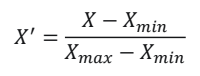

## 인공지능/머신러닝


**머신러닝** : 빅데이터를 분석할 수 있는 강력한 툴 > 기존 통계학 및 시각화 방법의 한계를 해결

​					명시적으로 프로그래밍 안해도 컴퓨터가 학습할 수 있는 능력을 갖게 하는 것

```
case 1)
	action1
case 2)
	action2
```

```
train
~
predict
	action
```


---


## 자료의 형태


**자료의 형태를 알아야 하는 이유**

> 머신러닝을 사용하기 위한 필수 과정, 아래 질문들에 대한 답을 얻을 수 있음
>
> 1. 데이터가 어떻게 구성되어 있는지
> 2. 어떤 머신러닝 모델을 사용해야 하는지
> 3. 데이터 전처리를 어떻게 해야 하는지


**자료 형태 구분**

- 수치형 자료(numerical data)
  - 연속형 자료(continuous data)
  - 이산형 자료(discrete data)
- 범주형 자료(categorical data)
  - 순위형 자료(ordinal data)
  - 명목형 자료(norminal data)


**수치형 vs 범주형**

- 수치형
  - 양적 자료(quantitative data)
  - 수치로 측정 가능
  - 키, 몸무게, 시험 점수, 나이 등
    - 연속형 자료(continuous data)
      - 연속적인 관측값을 가짐
      - 원주율, 시간
    - 이산형 자료(discrete data)
      - 셀 수 있는 관측값을 가짐
      - 뉴스 글자 수, 주문 상품 개수
  - 많은 양의 자료를 의미 있는 수치로 요약해서 대략적 분포상태 파악 가능
  - np.mean( ) : 극단적으로 큰 값이나 작은 값의 영향을 많이 받음
  - 퍼진 정도 측도 > 분산, 표준편차로 (분산이 작을수록 좋음 > 평균에 몰려있으니까)
    - variance() 분산
    - stdev()  표준편차 (분산 양 제곱근)
  - plt.hist() 히스토그램(범주에서 막대그래프와 같은)
- 범주형
  - 질적 자료(qualitative data)
  - 수치로 측정 불가능
  - 성별, 지역, 혈액형 등
    - 순위형 자료(ordinal data)
      - 범주 사이 순서 의미 있음
      - 학점
    - 명목형 자료(norminal data)
      - 범주 사이 순서 의미 없음
        - 혈액형
  - 도수분포표
    - 도수 : 각 범주에 속하는 관측값의 개수 value_counts()
    - 상대도수 : 도수를 자료의 전체 개수로 나눈 비율 value_counts(normalize = True)
    - 도수분포표 : 범주와 그 범주에 대응하는 도수, 상대도수를 나열해서 표로
  - 막대그래프
    - 각 범주에서 도수의 크기를 막대로 그림
    - y축 : 도수에 대한 눈금
    - x축 : 범주를 나열
    - 도수의 크기 차이 비교 쉬움
    - but 각 범주가 차지하는 비율의 비교는 어려움


---


## 데이터 전처리


**머신러닝 과정**

1. 데이터 수집
   - 크롤링, DB 데이터를 통해서 수집
2. 데이터 분석 및 전처리
   - 데이터를 분석하고 머신러닝에 사용할 형태로 전처리
3. 머신러닝 학습
   - 머신러닝 모델을 사용해서 데이터 학습
4. 머신러닝 평가
   - 평가용 데이터를 사용해서 평가


**전처리 역할**

- 머신러닝의 입력 형태로 '데이터 변환'
  - 대부분의 머신러닝 모델은 숫자 데이터를 입력받음, but 실제 데이터는 다양 > 수치형 자료로
- 결측치, 이상치 처리해서 데이터 정제
- 학습용, 평가용 데이터 분리


**범주형 자료 전처리**

- 명목형 자료
  - 수치 매핑 
    - 범주를 0, 1로 (세 개 이상일 때는 수치 크기 간격을 같게)
  - 더미(dummy) 기법
    - 각 범주를 0 or 1로 변환
- 순서형 자료
  - 수치 매핑
    - 수치 간 크기 차이 커스텀 가능(이 크기 차이가 머신러닝 결과에 영향 갈 수 있음)


**수치형 자료 전처리**

\- 모델의 성능을 높이기 위해 데이터 변환 필요

1. 스케일링 - 정규화(normalization), 표준화(standardization)
   - 스케일링 : 변수 값의 범위 및 크기 변환(변수 간 범위의 차이가 나면 사용)
   - 정규화 : 
   - 표준화 : 
2. 범주화
   - 변수의 값보다 범주가 중요할 때 사용


**데이터 정제 및 분리**

- 결측값 처리
  - 결측값이 존재하는 샘플 삭제
  - 많이 존재하는 변수 삭제
  - 다른 값으로 대체
- 이상치 처리
  - 이상치가 있으면 모델 성능 저하될 수 있음
  - 어떤 값이 이상치인지 판단하는 기준이 중요
  - 통계지표(카이제곱 검정, IQR 지표 등)을 사용해서 판단
  - 데이터 분포를 보고 직접 판단
  - 머신러닝 기법을 사용해서 이상치 분류
- 지도학습 데이터 분리
  - feature/label : 예측하기 위한 입력값/예측할 대상이 되는 데이터


---


## 지도학습 - 회귀


**회귀분석** : 데이터를 가장 잘 설명하는 모델을 찾아서 입력값에 따른 미래 결과값 예측하는 알고리즘

​				  (완벽한 예측 불가능 > 최대한 잘 근사해야

​					실제값과 예측값의 차이를 최소한으로 하는 선 찾아야) > 단순 선형 회귀 모델 학습하며 찾기


**단순 선형 회귀** : 데이터를 설명하는 모델을 직선 형태로 가정 > y절편과 기울기 구해야

특징

- 가장 기초적 but 여전히 많이 사용
- 입력값 1개일 때만 적용 가능
- 입력값과 결과값의 관계를 알아보는 데 좋음
- 영향을 얼마나 미치는 지 알 수 있음
- 관계를 직관적으로 해석하고 싶을 때 활용


**어떤 게 좋은 예측일까**

1. 실제 값과 예측값의 차이가 작을수록 좋다?

   - 실제값-예측값에는 예외가 있음(1이랑 -1)

   - 차이의 제곱합으로 해보기

2. loss 함수 이용
   - loss함수가 작을수록 좋은 모델
   - y절편과 기울기 값을 조절해서 함수의 크기를 작게 해야
3. 함수의 크기를 작게 하는 y절편과 기울기 찾는 방법
   1. gradient descent(경사 하강법)
      - 계산 한 번으로 절편과 기울기를 구하는 게 아니라, 초기값에서 점진적으로 구하는 방식
        1. 절편과 기울기를 랜덤하게 초기화
        2. 현재 절편, 기울기 값으로  loss값 계산
        3. 이 값을 어떻게 해야 줄일 수 있는지 알 수 있는 gradiendt값 계산
        4. 이 값을 활용해서 절편과 기울기 값 업데이트
        5. loss값 차이가 거의 없어질 때까지 2~4번 정도 과정 반복(gradient값도 작아짐)
   2. normal equation(least squares)
   3. brute force search


**다중 선형 회귀** : 여러 개의 입력값으로 결과값을 예측할 때

특징

- 여러 개의 입력값 사이 간 상관관계가 높을 경우, 결과에 대한 신뢰성 잃을 수 있음


**회귀 평가 지표** : 어떤 모델이 좋은 모델인지 / 실제값과 예측값 차이에 기반한 평가

​							(RSS, MSE, MAE, MAPE, R제곱)

- RSS
  - 단순 오차 제곱 합
  - 값이 작을수록 성능이 높음
  - 가장 간단, 직관적 해석 가능
  - 오차를 그대로 이용하기 때문에 입력값의 크기에 의존적
  - 절대적인 값과 비교 불가능
- MAE, MSE - 절대적인 크기에 의존한 지표
  - MSE(mean squared error) : 평균 제곱 오차(RSS에서 데이터 수만큼 나눈 값)
    - 작을수록 모델 성능 높음
    - '이상치에 민감함'
  - MAE(mean absolute error) : 평균 절대값 오차(오차의 절대값의 평균)
    - 작을수록 모델 성능 높음
    - 변동성이 큰 지표와 낮은 지표를 같이 예측할 때 유용
  - 평균을 그대로 이용하기 때문에 입력값의 크기에 의존적
  - 절대적인 값과 비교 불가능
- R제곱(결정 계수) : 회귀 모델의 설명력을 표현하는 지표(**1**에 가까울수록 높은 성능 모델)
  - 1 - RSS/TSS ( TSS : 데이퍼 평균 값과 실제값 차이의 제곱)
  - 오차가 없을수록 1에 가까워짐
  - 값이 0일 때는 데이터 평균 값을 출력하는 직선 모델을 의미
  - 음수 값이 나올 때는 평균값 예측보다 성능이 좋지 않음


---


## 지도학습 - 분류


**분류** : 입력값이 어떤 클래스에 속할지에 대한 결과값 도출하는 알고리즘

| 트리 구조 기반 | 의사결정나무, 랜덤포레스트..              |
| -------------- | ----------------------------------------- |
| 확률 모델 기반 | 나이브 베이즈 분류기, ..                  |
| 결정 경계 기반 | 선형 분류기, 로지스틱 회귀 분류기, SVM... |
| 신경망         | 퍼셉트론, 딥러닝 모델...                  |
| ..             |                                           |


(계단식, 시그노이드 수업시간에 말한 거 나중에 정리해)

