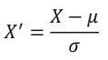

## 인공지능/머신러닝


**머신러닝** : 빅데이터를 분석할 수 있는 강력한 툴 > 기존 통계학 및 시각화 방법의 한계를 해결

​					명시적으로 프로그래밍 안해도 컴퓨터가 학습할 수 있는 능력을 갖게 하는 것

```
case 1)
	action1
case 2)
	action2
```

```
train
~
predict
	action
```


---


## 자료의 형태


**자료의 형태를 알아야 하는 이유**

> 머신러닝을 사용하기 위한 필수 과정, 아래 질문들에 대한 답을 얻을 수 있음
>
> 1. 데이터가 어떻게 구성되어 있는지
> 2. 어떤 머신러닝 모델을 사용해야 하는지
> 3. 데이터 전처리를 어떻게 해야 하는지


**자료 형태 구분**

- 수치형 자료(numerical data)
  - 연속형 자료(continuous data)
  - 이산형 자료(discrete data)
- 범주형 자료(categorical data)
  - 순위형 자료(ordinal data)
  - 명목형 자료(norminal data)


**수치형 vs 범주형**

- 수치형
  - 양적 자료(quantitative data)
  - 수치로 측정 가능
  - 키, 몸무게, 시험 점수, 나이 등
    - 연속형 자료(continuous data)
      - 연속적인 관측값을 가짐
      - 원주율, 시간
    - 이산형 자료(discrete data)
      - 셀 수 있는 관측값을 가짐
      - 뉴스 글자 수, 주문 상품 개수
  - 많은 양의 자료를 의미 있는 수치로 요약해서 대략적 분포상태 파악 가능
  - np.mean( ) : 극단적으로 큰 값이나 작은 값의 영향을 많이 받음
  - 퍼진 정도 측도 > 분산, 표준편차로 (분산이 작을수록 좋음 > 평균에 몰려있으니까)
    - variance() 분산
    - stdev()  표준편차 (분산 양 제곱근)
  - plt.hist() 히스토그램(범주에서 막대그래프와 같은)
- 범주형
  - 질적 자료(qualitative data)
  - 수치로 측정 불가능
  - 성별, 지역, 혈액형 등
    - 순위형 자료(ordinal data)
      - 범주 사이 순서 의미 있음
      - 학점
    - 명목형 자료(norminal data)
      - 범주 사이 순서 의미 없음
        - 혈액형
  - 도수분포표
    - 도수 : 각 범주에 속하는 관측값의 개수 value_counts()
    - 상대도수 : 도수를 자료의 전체 개수로 나눈 비율 value_counts(normalize = True)
    - 도수분포표 : 범주와 그 범주에 대응하는 도수, 상대도수를 나열해서 표로
  - 막대그래프
    - 각 범주에서 도수의 크기를 막대로 그림
    - y축 : 도수에 대한 눈금
    - x축 : 범주를 나열
    - 도수의 크기 차이 비교 쉬움
    - but 각 범주가 차지하는 비율의 비교는 어려움


---


## 데이터 전처리


**머신러닝 과정**

1. 데이터 수집
   - 크롤링, DB 데이터를 통해서 수집
2. 데이터 분석 및 전처리
   - 데이터를 분석하고 머신러닝에 사용할 형태로 전처리
3. 머신러닝 학습
   - 머신러닝 모델을 사용해서 데이터 학습
4. 머신러닝 평가
   - 평가용 데이터를 사용해서 평가


**전처리 역할**

- 머신러닝의 입력 형태로 '데이터 변환'
  - 대부분의 머신러닝 모델은 숫자 데이터를 입력받음, but 실제 데이터는 다양 > 수치형 자료로
- 결측치, 이상치 처리해서 데이터 정제
- 학습용, 평가용 데이터 분리


**범주형 자료 전처리**

- 명목형 자료
  - 수치 매핑 
    - 범주를 0, 1로 (세 개 이상일 때는 수치 크기 간격을 같게)
  - 더미(dummy) 기법
    - 각 범주를 0 or 1로 변환
- 순서형 자료
  - 수치 매핑
    - 수치 간 크기 차이 커스텀 가능(이 크기 차이가 머신러닝 결과에 영향 갈 수 있음)


**수치형 자료 전처리**

\- 모델의 성능을 높이기 위해 데이터 변환 필요

1. 스케일링 - 정규화(normalization), 표준화(standardization)
   - 스케일링 : 변수 값의 범위 및 크기 변환(변수 간 범위의 차이가 나면 사용)
   - 정규화 : 
   - 표준화 : 
2. 범주화
   - 변수의 값보다 범주가 중요할 때 사용


**데이터 정제 및 분리**

- 결측값 처리
  - 결측값이 존재하는 샘플 삭제
  - 많이 존재하는 변수 삭제
  - 다른 값으로 대체
- 이상치 처리
  - 이상치가 있으면 모델 성능 저하될 수 있음
  - 어떤 값이 이상치인지 판단하는 기준이 중요
  - 통계지표(카이제곱 검정, IQR 지표 등)을 사용해서 판단
  - 데이터 분포를 보고 직접 판단
  - 머신러닝 기법을 사용해서 이상치 분류
- 지도학습 데이터 분리
  - feature/label : 예측하기 위한 입력값/예측할 대상이 되는 데이터
  - 


**머신러닝 기법 구분**

- 지도학습
  - 회귀분석(regression)
  - 분류(classification)
- 비지도학습
- 강화학습
  - 자율학습 끝판왕


**지도학습 구현 위해**

1. 데이터 이해
2. 데이터 처리
3. 지도학습 모델


---


## 자료형태 이해


**원핫인코딩 찾아봐(수업시간에 중요하대)**


**구분**

- 수치형(numerical) : 양적 자료(quantitative)
  - 연속형() : 연속적 관측값(원주율)
  - 이산형 : 셀 수 있는 관측값(뉴스 글자 수)
- 범주형(categorical) : 질적 자료(qualitiative) (수치로 측정 불가능 ex 지역, 혈액형, 성별 등)
  -  순위형(ex : 학점) : 범주 사이 순서 의미 있음
  - 명목형(ex : 혈액형) : 범줏 ㅏ이 순서 의미 없음


**도수분포표**

도수 : 각 범주에 속하는 관츠값 개수

상대도수 : 도수를 자료의 전체 개수로 나눈 비율

도수분포표 : 범주형 자료에서 범주와 그 범주에 대응하는 도수


**수치형 자료**

통계값을 사용한 요약이 가능

(이상치에 민감하다) > 극단적으로 큰 값이나 작은 값에 영향 많이 받음

분산 > 퍼진 정도의 측도 > 분산이 적을수록 좋다(뾰족한게) > 이유는 평균에 몰려있으니까

모델 성능 높이기 위해 데이터 변환이 필요

- 스케일링
  - 정규화
  - 표준화
- 범주화
  - 변수값보다 범주가 중요한 경우 사용


범주 > 막대

수치 > 히스토그램


명목형 > 수치 매핑(범주를 0과1로), 더미기법(4계절 중 하나는 0으로 하는)(각 범주를 0이나 1로 변환)

순서형 > 수치 매핑 방식


**결측값**

1. 샘플 삭제
2. 많이 존재하는 변수 삭제
3. 다른 값으로 대체


**이상치**

\- 모델 성능 저하할 수 있어서 전처리 할 때 제거함

판단 기준 방법들 있음


---


## 회귀분석


- 단순 선형 회귀
  - 데이터 설명 모델을 직선 형태로 가정
  - y절편과 기울기 구해야


(계단식/시그노이드)