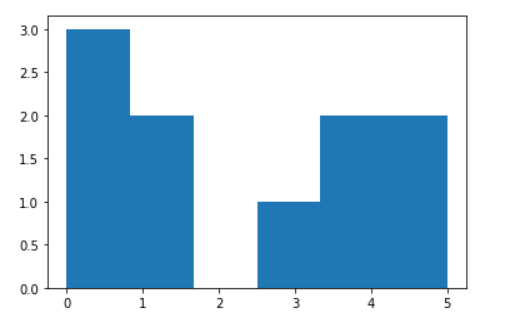
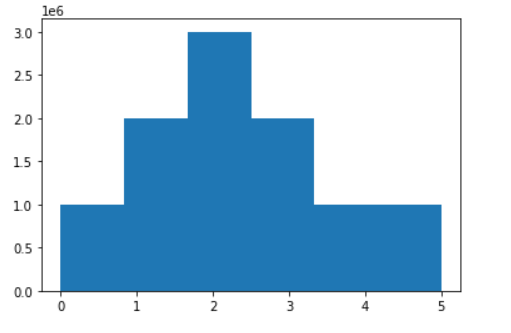

# Numpy

> (Numerical Python)
>
> 행렬이나 일반적으로 대규모 다차원 배열을 쉽게 처리할 수 있도록 지원하는 파이썬 라이브러리
>
> (matplotlib 안에)


```
? matplotlib란 ?

파이썬으로 데이터를 시각화하는 데 많이 사용되는 라이브러리
파이썬에서 2D형태의 그래프나 이미지 등을 그릴 때 사용
```


**Numpy의 특징**

1. 일반 list에 비해 빠르고, 메모리를 효율적으로 사용(간결)
2. 반복문없이 데이터 배열에 대한 처리를 지원해서 빠르고 편리
3. 선형대수와 관련된 다양한 기능 제공
4. C, C++. 포트란 등의 언어와 통합 가능


**기본 구조**

```python
import numpy as np

#기본 넘파이 array
np.array([1,2,3])

#2차원 배열(수리적 모형 : 행, 열)
print(np.array([[[1,2,3],[4,5,6]],[[7,8,9],[10,11,12]]]))

print(np.arange(1, 26))
print(np.arange(1, 26).reshape(5, 5)) #numpy가 차원을 넘나드는 게 중요(딥러닝에 사용)
#reshape(5, 4)는 안돼. 25개라서 축소시켜야 함

a = np.zeros(10)  #0으로 이루어진 크기가 10인 배열 생성
b = np.ones(10)   #1로 이루어진 크기가 10인 배열 생성
c = np.eye(3)     #3X3 단위 배열 생성
print(c) 
#실행결과
#[[1, 0, 0]
# [0, 1, 0]
# [0, 0, 1]]
```


**numpy array와 list의 공통점과 차이점**

|            numpy array            |          list           |
| :-------------------------------: | :---------------------: |
|                []                 |           []            |
|       인덱싱, 슬라이싱 가능       |  인덱싱, 슬라이싱 가능  |
| 한 가지 타입의 데이터만 저장 가능 | 다양한 데이터 타입 가능 |


**색인**

```python
#array[행 : 열]
a2 = np.array([[1,2,3],[4,5,6],[7,8,9]])

#정수 색인(두 번째 열 선택 : 차원 축소 발생)
print(a2[1, :])
print(a2[:,1])

#슬라이스 색인(두 번째 열 선택 : 차원 축소 발생 안 함)
print(a2[:,1:2])

#a2에서 1, 3행 선택
print(a2[0:3:2,:])
print(a2[[0,2],:])
print(a2[(0,2), :])
print(a2[[1,2],[1,2]])    # a2[1,1], a2[2,2]랑 포인트 인덱싱
#해결법
print(a2[np.ix_([1,2],[1,2])])  #색인함수 (ix_()) 사용해서 해결

#포인트 인덱싱과 ix 출력결과
#[5 9]
#[[5 6]
# [8 9]]

#조건 색인
print(a2 > 5)
print(a2[a2 > 5])  #true만 출력
print(a2[:,0]>5)
print(a2[a2[:,0]>5])
#조건의 결과를 행 방향의 색인 값으로 전달

#조건 색인 출력결과
#[[False False False]
# [False False  True]
# [ True  True  True]]
#[6 7 8 9]
#[False False  True]
#[[7 8 9]]
```

(근데 왜 print(a2[a2[:,0]>5])의 결과값이 [7]이 아니라 [[7 8 9]]로 나오는 거지..?)

```
loc VS iloc VS ix 차이

.loc : 레이블을 이용해 행 선택, 슬라이싱할 경우 처음과 끝이 둘 다 포함
.iloc : 위치 정수 이용해 행 선택, 슬라이싱할 경우 처음은 포함되지만 끝은 미포함
.ix : 레이블과 위치정수 모두 사용 가능, but 사용 지양
```


**메소드**

```python
print(a2.dtype)    		   		#numpy를 구성하는 데이터 타입
print(a2.shape)    		   		#모형 알려주는 메소드(인자를 넣으면 안됌!)
print(a2.shape[0]) 		   		#numpy 행의 수
print(a2.shape[1]) 		   		#numpy 열의 수
print(a2.ndim)                  #array 차원

#형변환
print(a2.astype('float'))       #실수형으로 형변환
#astype()안에 쓸 때는 문자형으로 '' 안에 써야 함 (int, str, float)

#조건
print(np.where(a2>5, 'A','B'))  #조건, 참인 값 반환, 거짓인 값 반환
```


**연산**(메소드)

```python
#list끼리는 원소끼리 연산 불가(확장으로 해석됨)
np.array([1,2,3]) + np.array([4,5,6])

#a2
#[[1 2 3]
# [4 5 6]
# [7 8 9]]

print(a2.sum())
print(a2.mean()) 				#평균
print(a2.var())					#분산
print(a2.std())					#표준편차(평균에서 떨어진 정도)
print(a2.min())
print(a2.max())

print((a2>5).sum()) 			#a2에서 5보다 큰 값의 수(true의 수)
print((a2>5).any())				#5보다 큰 값 하나라도 있으면 참
print((a2>5).all())				#5보다 큰 값 모두여야 참
print(a2.sum(axis=0))			#축으로 따졌을 때 x축이 0 행 별 총합(서로 다른 행끼리)
print(a2.sum(axis=1))			#축으로 따졌을 때 y축이 1 열 별 총합(서로 다른 열끼리)
#axis 출력결과
#[12 15 18]
#[ 6 15 24]
```


```
! 축 번호!

2차원 : 행(0) 열(1)
3차원 : 층(0) 행(1) 열(2)
```


**전치(메소드)**

```python
#1 행과 열 전치
print(np.arange(1,9))
a1 = np.arange(1,9).reshpae(4,2)
print(a1)
print(a1.T)
#출력결과
#[1 2 3 4 5 6 7 8]
#[[1 2]
# [3 4]
# [5 6]
# [7 8]]
#[[1 3 5 7]
# [2 4 6 8]]

#2 swapaxes 두 축을 전달받아서 서로 전치, 전달 순서 중요치 않음
print(a1.swapaxes(0,1))
print(a1.swapaxes(1,0))  #순서 차이 없음

# transpose 원본의 차원에 맞는 축번호를 인수에 차례대로 전달,그리고 그대로 전치 전달되는 순서 중요
print(a1.transpose(0,1)) #원본 그대로 출력
print(a1.transpose(1,0)) #행과 열 전치
```


### 수업 외 내용

> 모두의 데이터분석 with python 책 속 numpy 설명


**랜던 함수**

```python
import numpy as np
a = np.random.rand(5)
print(a)
#출력결과는 실수형

print(np.random.choice(6,10)) #0~5 사이 숫자 랜덤하게 10번 선택
print(np.random.choice(10,6, replace = False)) #0~9사이 숫자 6번 선택 '안겹치게'
print(np.random.choice(6,10, p = [0.1, 0.2, 0.3, 0.2, 0.1, 0.1])) # p[] : 각각의 숫자가 나올 확률 지정
```


**그래프 그리기**

```python
import matplotlib.pyplot as plt
import numpy as np
dice = np.random.choice(6,10)

plt.hist(dice, bins = 6)
plt.show()
```



```python
#엄청 많이 돌렸을 때
import matplotlib.pyplot as plt
import numpy as np
dice = np.random.choice(6,10000000,p = [0.1,0.2,0.3,0.2,0.1,0.1])
plt.hist(dice, bins = 6)
plt.show()
```




|                  arange()                  |                   linspace()                    |
| :----------------------------------------: | :---------------------------------------------: |
|                 간격 지정                  |                구간의 개수 지정                 |
| 특정 간격에 해당하는 값을 생성하고 싶을 때 | 특정 개수의 구간으로 나눈 값을 생성하고 싶을 때 |


**numpy array의 다양한 활용**

```python
import numpy as np
a =np.zeros(10) + 5  #초기값이 5인 배열(10개)
print(a)
#[5. 5. 5. 5. 5. 5. 5. 5. 5. 5.]
```


