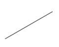
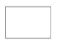
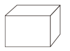
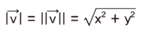
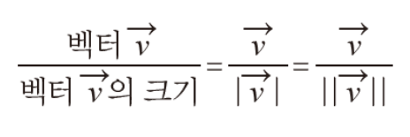
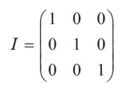
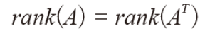

# Vector

> 방향이 있고, 순서가 있고, 차원의 공간에 존재하는 점
>
> \> 이직 유무를 알아내기 위해 업무 만족도, 전년도 평가, 평균 급여 등 여러 항목을 측정
>
> \> 숫자 네 개는 묶음 하나로 묶어(tuple)
>
> \> 이런 데이터 묶음을 '벡터' (선형대수에서)
>
> 인공지능에서 벡터는 숫자의 집합 및 배열 >> 특성 벡터(feature vector)


- 스칼라
  - 열과 행의 개수가 각각 1
- 벡터
  - 열의 개수가 1
  - 크기(magnitude)와 방향(direction)을 가진 물리량
- 텐서
  - 3차원 이상의 배열 >> 크기가 같은 행렬이 여러 개 같이 묶임


| 구분   | 스칼라 | 벡터                                                         | 행렬                                                         | 텐서                                                         |
| ------ | ------ | ------------------------------------------------------------ | ------------------------------------------------------------ | ------------------------------------------------------------ |
| 영어   | Scalar | Vector                                                       | Matrix                                                       | Tensor                                                       |
| 차원   | 0      | 1                                                            | 2                                                            | 3차원 이상                                                   |
| 공간상 |        |  |  |  |


```python
#행 벡터
a = np.array([1,2,3])
print(a)
#[[1 2 3]]

#열 벡터
b = np.array([[1], [2], [3]])
print(b)
#[[1]
# [2]
# [3]]
```


Numpy는 벡터 및 행렬 연산을 할 때 편리한 기능을 많이 제공


---

### 벡터의 특징

1. 방향성을 가짐
2. 크기와 방향은 중요하지만 어디에 표현하는지는 중요하지 않음
3. 좌표상의 위치가 동일하지 않음(같은 벡터라고 해서)
4. 크기가 같아도 방향이 다르면 다른 벡터


- 크기(길이) 구하기
  - 
  - 벡터의 크기 = 벡터의 길이 = 벡터의 norm(노름)


---

### 단위벡터

> 같은 벡터라도 좌표가 다를 수 있다는 점에서 대수학적으로 보면 의미가 다름
>
> \>> 해석하기 위해 단위벡터 사용


\- 길이가 1인 벡터, 방향 성분만 나타냄

\- 크기가 1이 되도록 늘리거나 줄인 벡터를 의미


- 표기법
  - 헷(^)
  - u
  - linalg.norm() 함수는 벡터 크기 계산 (단위벡터 구할 때 사용)

- 구하는 공식
  - 

- 단위벡터는 벡터를 곱할 때 유용
- 벡터를 단위 형태로 변환 >> 정규화(normalizing) (벡터의 요소들을 크기로 나눠서 계산)

```python
pip install scipy
#linalg 사용하기 위해 scipy 설치

import numpy as np
from scipy import linalg
s = np.array([2,3,1])
```

```python
#단위벡터 방법
#norm 함수 사용해서 벡터 크기 계산 후 >> 기존 벡터로 나누기
v_hat01 = s / linalg.norm(s)
print(v_hat)
```


---

### 위치벡터

> 원점이 아닌 곳에 벡터가 있을 때 사용할 수 있음
>
> 원점이 시작점에 있지 않은 벡터 >> 원점이 시작점인 벡터들로 표현가능한 벡터 >> 위치벡터


- 위치 벡터 성분 구하기
  - 벡터가 원점이 아닌 곳에 있을 때 성분 표현하려면 세 단계 진행해야
    1. 원점 벡터를 시작점으로 한 벡터 표현
    2. 벡터 뺄셈(방향은 끝점에서 시작점)
    3. 위치 벡터 성분 도출


---

### 영벡터

> 모든 성분이 0으로 구성
>
> 크기가 0이면서 시작점과 끝점이 같은 벡터


- 필요없다고 느낄 수도 있지만, 공간을 이루기 위해선 꼭 필요함
- 모든 차원의 벡터 공간은 반드시 영벡터를 포함해야 함
- 특징
  - 방향은 모든 방향
    - 어떤 벡터와도 평행
    - 어떤 벡터와도 같은 직선 위에 있음
    - 어떤 벡터와도 수직
    - 덧셈과 뺄셈의 항등원

```python
#zeros() 함수 사용해서 영벡터 구현

import numpy as np
np.zeros(5)		#0으로 5행 채우기
```

```python
np.zeros(5).shape		# 몇 행, 몇 열 행렬로 구성되어있는지
#출력 결과
#(5,)
```

```python
s = (2,2)
np.zeros(s)
#출력결과
#array([[0.,0.],
#		[0.,0.]])
```


---

### 항등원

> 항상 같은 원소
>
> 임의의 수 a에 어떤 수를 연산한 후에도 처음의 수 a가 나오게 하는 수


---

### 인공지능에서 벡터 사용하는 이유


1) 인공신경망에서 입력 데이터는 숫자 데이터만 가능
   - 딥러닝의 인공신경망은 입력층, 은닉층, 출력층 등 계층 세 개로 구성
   - 입력 노드로 입력되는 데이터는 숫자 데이터만 가능, 텍스트 데이터는 입력 불가능
2) 유사 데이터를 분류하는 데 사용
   - 단어 의미가 유사한 것으로 클러스터링(clustering) 되도록 함

```
! 클러스터링 !

데이터들의 특성을 파악하여 특성이 유사한 데이터끼리 집단을 정의하는 것
```


​											**데이터를 벡터로 만드는 것이 인공지능의 시작!**


---

### 선형 결합과 생성

> 벡터의 스칼라 곱과 덧셈을 조합해서 새로운 벡터를 얻기
>
> 스칼라-벡터 곱 = 벡터 길이 줄이거나 키우기
>
> 스칼라-벡터 합 = 두 벡터가 이루는 평행사변형의 대각선


벡터는 크기와 방향이 중요하기 때문에 좌표상 어디든 위치할 수 있음


- 생성
  - 벡터들의 선형 결합으로 나타낼 수 있는 모든 벡터의 집합
  - span(A)
- 파이썬에서는 선형 결합을 할 수 있는 함수가 없음

```python
import numpy as np
a = np.array([2,4])
b = np.array([1,6])
c = (4*a) + ((-3)*b)	#이렇게 일반 연산으로
print(C)
#출력결과
#[5 -2]
```


### 선형 독립

> a = {a1, a2, a3...an}에 대해 c1a1 + c2a2 + ... +cnan = 0을 만족하는 c가 모두 0 일 때
>
> c1=c2=c3=...=cn=0이면 a1,a2...를 선형 독립


---

### 인공지능에서 선형 독립과 선형 종속 사용법


1. 데이터셋 특성이 많아지면 오버피팅 발생(overfitting)
2. 이걸 차원의 저주라고 하는데, 이걸 해결하는 방법 >> PCA
3. PCA는 특성 추출 방법 이용, 특성 추출은 원본 특성의 조합으로 새로운 특성 생성
4. 즉, 주축을 찾고 모든 데이터를 이 축에 투영시켜서 새로운 특성 만들기
5. 이 때 데이터 특성 간 관계가 선형 종속일 때 특성 추출 잘 됨


---

### 선형 종속

> a = {a1, a2, a3...an}에 대해 c1a1 + c2a2 + ... +cnan = 0을 만족하는 0이 아닌 c값들이 존재할 때
>
> a1,a2...를 선형 종속
>
> \>> 두 벡터가 선형 종속이면 두 벡터 이용해서 표현할 수 있는 벡터는 둘 중 하나의 벡터 연장
>
> 필요충분조건 : s = {v1, v2, ... ,vn}에 속하는 한 벡터가 s에 속하는 다른 벡터의 선형 결합으로 표현						 할 수 있어야


ex) 벡터(3,4), (5,3), (8,7)이 선형 종속인지, 선형 독립인지

\>> (3,4) + (5,3) = (8,7)

\>> 즉 벡터 (8,7)은 두 벡터의 생성으로 도출 가능하기 때문에 세 벡터는 선형 종속


---

### 벡터 공간과 부분 공간

> SVM(support Vector Machine) 모델은 최대 마진 초평면이라고 해서 두 범주를 최대로 나눠주는 평면을 찾음
>
> 이럴 때 벡터 공간과 벡터 부분공간을 잘 이해해야 함


**벡터 공간**

\- 평면과 공간으로 구분

\- 같은 공간에서 선형 결합 연산이 가능한 벡터가 모인 집합

\- 벡터 덧셈과 벡터-스칼라 곱의 연산에 닫혀있는 벡터의 집합

\- 두 원소를 더하거나 주어진 원소를 임의의 실수 배만큼 자유롭게 늘리거나 줄이는게 가능한 공간

1. 덧셈 관련 공리
   - 벡터 공간 v는 덧셈에 대해 닫혀있음, 즉 a 및 b가 벡터 공간 v에 존재하면 a+b도 v에 존재
     - 가환성(a+b = b+a)
     - 결합성((a+b)+c = a+(b+c))
     - 영 벡터가 존재(a+0 = a)
     - 덧셈 역원이 존재(a+(-a) = 0)
2. 스칼라 관련 공리
   - 스칼라 곱셈에 대해 닫혀있음


**벡터 부분 공간**

\- 벡터 공간이 있을 때 이 공간의 부분 공간으로 만든 공간을 전체 공간의 부분 공간

\- 조건 : 부분공간 v는 영벡터를 포함해야 함

​			 벡터 w가 벡터 공간 v에 포함되어 있으면, w에 임의의 스칼라를 곱한 값 또한 v에 포함돼야

​			 w랑 u가 v에 포함되면, w+u도 v에 포함돼야


**부분 공간의 기저**

\- 벡터 공간을 생성하는 일종의 '뼈대'

\- 벡터 공간 v를 생성할 때 최소한의 필요한 것의 집합

\- 어떤 벡터 공간의 기저는, 그 벡터 공간을 선형 생성하는 선형 독립인 벡터들

- 특징
  - 한 공간을 구성할 수 있는 벡터의 집합
  - 차원에 따라 기저 벡터의 개수가 정해져 있음
  - (x,0), (0,y) 형태면 기저 가능
  - 2차원에서 기저 벡터는 두 개

- 표준 기저 벡터
  - 여러 원소 중 하나만 값이 1이고 나머지는 0인 기저 벡터
  - 표준 기저 벡터를 열로 가지는 행렬은 항등행렬이 됨


< 항등행렬 >




**랭크**

\- 행렬 a에서 선행 독립인 행 혹은 열의 개수

\- rank(A) / rk(A)

\- 열랭크와 행랭크가 항상 같으면 >> 랭크 정리(rank theorem)

\-

```python
import numpy as np

#matrix_rank() 함수로 rank계산
x1 = np.array([[2,7], [5,1]])
np.linalg.matrix_rank(x1)		#2
```


---

### 벡터 덧셈과 뺄셈

> 궁극적으로 위치 벡터를 찾는 계산


- 평행사변형 법칙
  - 시작점이 일치할 때 평행사변형의 대각선은 두 벡터의 합
  - |a+b|는 두 벡터의 합의 크기(a와 b 는 벡터(화살표 표시 생략))
- 삼각형 법칙
  - a의 끝점과 b의 시작점을 연결할 때 시작점과 끝점을 연결한 벡터가 두 벡터의 합
  - |a+b|는 두 벡터의 합의 크기(a와 b 는 벡터(화살표 표시 생략))


**덧셈 성질**

1. 교환법칙
2. 결합법칙
3. 덧셈의 항등원 존재
4. 역원 존재

```python
#직접
x = [2,3]
y = [3,1]

z = [i+j for i, j in zip(x,y)]
print(z)			#[5,4]

# zip 함수 써서 두 벡터의 첫 번째 원소끼리 더하고, 두 번ㅉ 원소끼리 더하기
# 그 결과를 리스트 형태로 저장
```

```python
# numpy 라이브러리 이용
import numpy as np
u = np.array(x)
v = np.array(y)
w = u+v
print(w)		#[5, 4]
```


**뺄셈**

= 역벡터의 덧셈

= 그냥 덧셈에 방향만 마이너스

```python
#직접
x = [2,3]
y = [3,1]

z = [i-j for i, j in zip(x,y)]
print(z)		#[-1,2]
```

```python
#numpy 라이브러리
import numpy as np

u = np.array(x)
v = np.array(y)
w = u-v
print(w)		#[-1,2]
```

 

---

### 벡터의 곱셈


- 외적
- 내적
  - 벡터를 숫자처럼 곱
  - 벡터의 크기 곱
  - 한 벡터의 크기를 구하거나 두 벡터 사이의 거리를 측정하는데 이용
  - 내적은 임의의 두 벡터에서 스칼라 값 생성
  - dot product라는 용어 많이 사용 / inner product
  - a와 b의 내적은 b의 크기와 d의 크기 곱하기(두 벡터의 방향이 같아야 함)
    - 만약 두 벡터 이루는 각이 90도면 내적 값은 **0**
    - 

```python
x = [3,4]
c = 8
z = [c*I for I in x]
print(z)		#[24,32]
```

```python
import numpy as np
u = np.array([3,4])
c = 8
w = u*c
print(w)		#[24,32]
```


```python
import numpy as np
u = np.array([6,6])
v = np.array([12,0])
uv = np.dot(u,v)
print(uv)		#72
```


정사영 \- 수직으로 투영된 그림자 / 어떤 선이나 물체 위에서 빛 비췄을 때 나타나는 그림자

