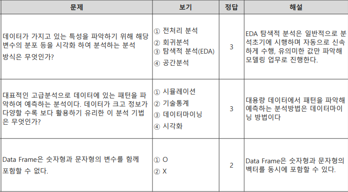
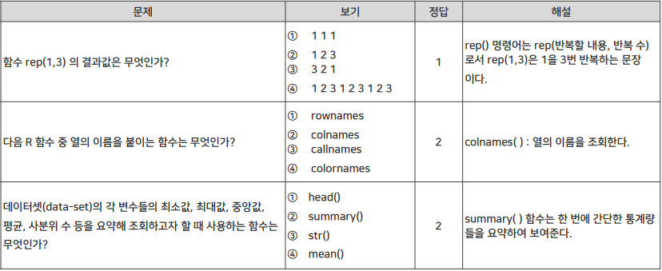
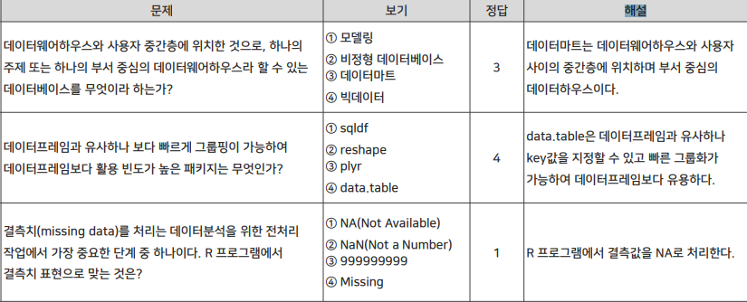
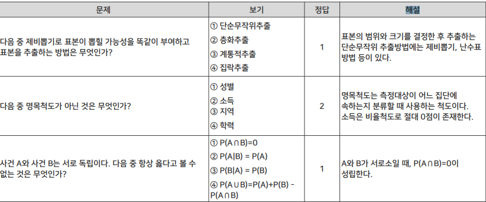
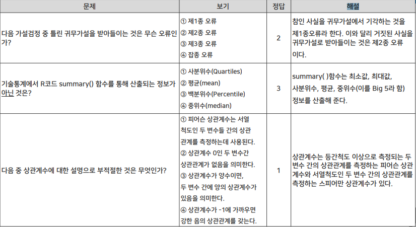
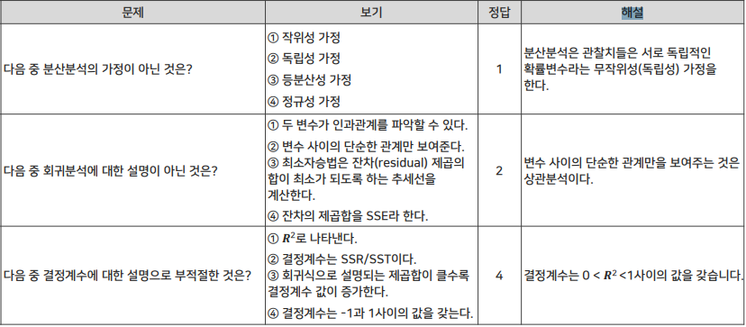
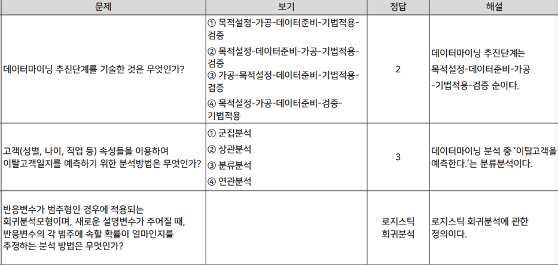
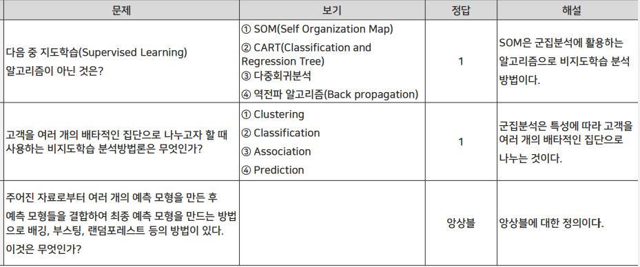
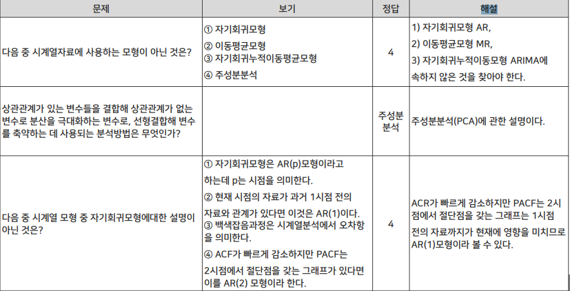

기초통계부터 3과목 다 > 이론강의

(문제 위주로풀기) 

업데이트 된 문제들 올려준대 거기도 보래

30% 판다스(강의)

20% 분반해서 진도 나간데까지 nipy랑 미아?거 위주래

scikit learn 표(탭에 캡쳐해놓음)

- feature processing 이 제일 중요함
- metrics
- utility는 제외한대(시험에서)

나이브 베이즈

\- 스팸메일 분류, 네트워크 침입 탐지, 비정상행위 탐지, 질병진단

- 카데고리 나이브 베이즈 분류모델
- 가우시안 나이브 베이즈 분류모델
- 베르누이분포 나이브 베이즈 분류모델
- 다항분포 나이브 베이즈 분류모델
- 장점
  - 구현 쉬움, 대부분 좋은 결과
  - 연관성 고려하지 않아 계산 빠름
  - 적은 크기 훈련데이터에서도 잘 동작
- 단점
- **특성들 간 독립을 가정**하기 때문에 종속적 자료들 경우 정확도 떨어짐 **월요일 문제**

1. 이진분류
   1. 
2. 다중분류

교재 4장

---

## 무신사 데이터 분석가 채용

###### 주요업무

• MYSQL SQL-PLSQL 개발
• DATA 분석 기반 고객 경험 향상

###### 자격요건

• DATA 분석 유경험자
• MYSQL SQL-PLSQL 개발 가능자

###### 우대사항

• 물류 관련 데이터 분석 유경험자

###### 혜택 및 복지

• 선택적 출퇴근과 자유로운 복장으로 자율성 보장
• 직급 없이 ‘님’으로 소통하는 수평적 조직문화 
• 업무에 필요한 장비 최고 사양으로 제공
• 업무 관련 교육, 세미나, 워크숍, 팀빌딩 비용 지원
• 연간 180만원 상당의 자기계발비 지원
• 연간 140만원 상당의 무신사 스토어 제품 구매 및 생일 쿠폰 지원
• 3, 6, 9, 12년 만근 시 여행비와 포상 휴가 제공
• 연차는 1일, 0.5일, 0.25일로 분할 사용 가능
• 샐러드, 과일, 쿠키 등 얼리버드 베이크와 드링크 제공
• 자녀 48개월까지 월 10만원 상당의 육아용품 구매 지원
• 자녀 학자금 지원 (초등학교 입학 축하금, 대학교 학기별 등록금)
• 금융 지원 (은행 대출 이자 지원, 사내 대출)
• 본인과 가족 1인에게 건강검진 지원
• 월 주차비 50% 지원
• 경조사비 지원

- 머신러닝 프로세스
  1. 데이터 정리
  2. 데이터 분리
  3. 알고리즘 준비
  4. 모형 학습
  5. 예측
  6. 모형 평가
  7. 모형 활용

**캐글**

다 쪼개보래

appendix

20분 정도에 10페이지 정도로 발표

목차 만들어보기

결과해석에는 의견 들어가면 안되고

insight를 얻어서 기대효과를 설명

**[이 대회에서는 러시아 최대 소프트웨어 회사 중 하나인 1C Company](http://1c.ru/eng/title.htm)** 에서 친절하게 제공하는 일일 판매 데이터로 구성된 까다로운 시계열 데이터 세트로 작업하게 됩니다 . 

다음 달의 모든 제품과 매장의 총 매출을 예측해 달라고 요청합니다. 이 경쟁을 풀면 데이터 과학 기술을 적용하고 향상시킬 수 있습니다.