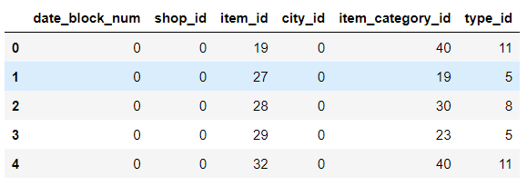

### 1일차(02.15)

1. 멤버 소개
2. 팀명 정하기 -> NT
3. 일정계획

- 2/15~2/19 : 전처리, EDA
- 2/20 : 기획안 작성, 어떤 모델 쓸 지, 모델링 팀 구성
- 2/21 : 전처리, EDA 1차 완료
- 2/22 ~ 2/28 :  모델링, 성능평가
- 3/1~3/2 : PPT 제작(이서현) 및 주피터 정리(남궁정후), 발표 준비(김홍비, 정영훈, 이재호)
- 3/3 : 발표

4. 각자 데이터 보면서 생각해보기


### 2일차(02.16)

#### 1. 전처리

- `sales_train` 데이터

1. 중복값 -> 삭제 
2. 이상치
   1. 판매갯수 (-) -> 환불처리로 파악, (구매 행과 같이) 삭제
   1. 판매가격 (-) -> 삭제
   2. 판매갯수 큰 값 ESD, 400, 500-> 500
   2. 가격 큰 값(이상치) 처리 ESD, 40000, 50000 -> 50000
3. 결측치 -> 없음.

4. date -> object -> datetime으로 변경


- 러시아어
- 1. 라벨인코딩만!!
  2. 지역 별 분석


[추후 해야할 전처리]

1. 데이터 merge

2. 스케일링, 표준화

   1. 스케일링

   - standardscaler -> 표준 정규분포 사용
   
   
      - minmax -> 최소, 최대값 사용
   
   
      - MaxAbsscale -> 최대 절댓값 사용
   
   
      - robust_scale -> 중위수, 사분위범위 사용
   
        
   

   2. 인코딩

   - 레이블 인코딩

   - 원-핫 인코딩

   - 더미변수(get_dummies)

   - 평균값 인코딩


#### 2. EDA

- boxplot 꼭 사용! (강사님 얘기론)


[Jupyter notebook]

정리하면서 진행


[오늘 할 일]

- 러시아어 라벨인코딩,  지열 컬럼 만들기
  - item_name
  - item_category_name
  - shop_name
- date, date_block, 가격, 상점id, 상품id, 지역, 월 별 구매 수량 등으로 EDA 분석해보기 -> 추가 컬럼 생각하기


### 3일차(02.17)

#### 1. 전처리

1. 전처리 (러시아어 라벨 인코딩)

- items data 

- item_categorys data

- shops data

- test data


#### 2. EDA

1. 이상치 (월별 item 가격, 거래량 boxplot)
2. 월별 거래수

3. 월별 거래된 shop 수, 월별 거래된 item 수
4. 가격별 item 하루 판매 개수
5. 월별 총 판매금액
6. 월별 총 판매개수
7. 품목별 판매량
8. 카테고리별 판매 금액
9. 연도별 판매량
10. 월별 판매량
11. 연도별 판매 총액
12. 월별 상점별 판매개수
13. 월별 카테고리별 판매개수
14. 도시별 판매개수


#### 3. train data


- data_block_num
- shop_id
- item_id
- item_category_id
- city_id
- type_id


- item_cnt_month (월별 매출액) *
- shop_cnt_month(상점별 매출액) *
- shop별 item별 가격 -
- item 별 판매 주기 *
- 12, 1월 -> 1, 나머지 -> 0 인코딩 *


월별 item 평균 판매량 *


[오늘 할 일]

- train 데이터에 변수 어떤걸 넣을지 각자 생각해서 코드 짜오기(2개씩)

  


### 4일차(02.18)

[회의 계획]

- 같이 코드 정리 하기(dataframe 짜기) ***

- 전처리 전 EDA, 전처리 후 EDA로 나누기

- 정후님이 매 회의 전까지 코드를 다듬어 주시면 좋을 것 같습니다
  - (제목, 주석, 그래프 (스타일 통합, 제목 달기), 팀원 데이터 (뒤죽박죽 복붙 된 데이터) 읽기 쉽게 정리 등)


- 일요일 회의 전까지 기획안은 어떤식으로 쓸 지 생각해보기(역할, 전처리, 스케일링, 모델링, 모델 성능평가)
- 월요일 회의 전까지 각자 코드 보면서 
  - 수정할 부분 보고, 추가 or 삭제할 변수, 그래프(EDA) 생각
  - 러시아어, 이상치 등 전처리 더 할 거(데이터 더 분석해보기)

- 월요일 회의 때 전처리 1차 확정(같이 코드 정리하기)


- 박혜정 강사님 팁: 전처리 후 변수 추가하기


2014~2015 러시아 경제 위기

2014년 기간 [러시아 루블](https://ko.wikipedia.org/wiki/러시아_루블)에 대한 [통화](https://ko.wikipedia.org/wiki/통화)의 평가절하가 일어나고 [러시아 경제](https://ko.wikipedia.org/wiki/러시아_경제)의 둔화된 현상이다.[[3\]](https://ko.wikipedia.org/wiki/2014~2015년_러시아_경제_위기#cite_note-financialcrisis-3)[[4\]](https://ko.wikipedia.org/wiki/2014~2015년_러시아_경제_위기#cite_note-sanctions-4) 이 경제 위기는 러시아의 최대 수출 품목인 [석유](https://ko.wikipedia.org/wiki/석유) 가격이 2014년 6월에서 12월동안 50% 이상 감소하면서 쇠퇴에 영향을 주었다.[[3\]](https://ko.wikipedia.org/wiki/2014~2015년_러시아_경제_위기#cite_note-financialcrisis-3)[[5\]](https://ko.wikipedia.org/wiki/2014~2015년_러시아_경제_위기#cite_note-oilpricedecline-5)

이 경제 위기는 러시아의 소비자와 기업 모두에게 큰 영향을 주었으며, 금융계에도 부정적인 영향을 주었다. 특히 러시아 주식 시장인 [RTS 인덱스](https://ko.wikipedia.org/w/index.php?title=RTS_인덱스&action=edit&redlink=1)는 12월 초부터 12월 16일까지 30$나 감소하였다.[[6\]](https://ko.wikipedia.org/wiki/2014~2015년_러시아_경제_위기#cite_note-russianstocks-6)

2014년 2월 28일쯤에 우크라이나 침공

 2015년 2월 21일에 신용등급 떨어짐


---


(나는 졸업식 때문에 줌을 못켰는데, 오늘 하루동안 컬럼 추가시킨 것들 확인해보자)

sales의 컬럼들

- date 
- date_block_num
- shop_id
- item_id
- item_price
- item_cnt_day
- revenue(수익) = item_price * item_cnt_day
- 월별, 상점별, 아이템별로 가능한 조합들 보여주는 데이터프레임

```python
ts = time.time() # 코드 시작 시간
matrix = []
cols = ['date_block_num', 'shop_id', 'item_id'] # 월별, 상점별, 아이템별
for i in range(34): #date_block_num 수
    sales_df = sales[sales.date_block_num == i]
    matrix.append(np.array(list(itertools.product([i], sales_df.shop_id.unique(), sales_df.item_id.unique())), dtype='int16'))
matrix = pd.DataFrame(np.vstack(matrix), columns=cols)
#vstack > ndarray형식 배열 결합(세로로)
# int8 -> Byte (-128 to 127), int16 -> Integer (-32768 to 32767)
matrix['date_block_num'] = matrix['date_block_num'].astype(np.int8)
matrix['shop_id'] = matrix['shop_id'].astype(np.int8)
matrix['item_id'] = matrix['item_id'].astype(np.int16)
matrix.sort_values(cols, inplace=True)
time.time()-ts # 코드 실행 시간

# 월별, 상점별, 아이템별로 모든 가능한 조합을 나타낸다.
# vstack : 이 조합들을 월 순서대로 행 아래에 더해준다.

###근데 int16이랑 int8로 하는 이유는?
###코드 실행 시간을 구하는 목적은?
```

```0
itertools : 순열, 조합, product 등 구현하거나 사용할 때 쓰는 표준 라이브러리

**주의할 점**
아래 것들은 모두 generator이기 때문에 리스트 형태`list()`로 만들어서 저장해야 됨
안그러면 한 번 하고 사라짐

product : 두 개 이상의 리스트의 모든 조합
- product('abcd', repeat = 2) >> aa ab ac ad ba bb bc bd..dd

permutations(순열) : 중복 허용, 모든 경우의 수
-permtations('abcd', 1) >> ab, ac, ad, ba, bc, bd, ca, cb, cd .. dc

combinations(조합) : 중복 허용 x
-combinations('abcd',2) >> ab, ac, ad, bc, bd, cd

combinations_with_replacement('abcd', 2) >> aa, ab, ac, ad, bb, bc, bd, cc, cd, dd
```


- city_id  + item_category_id + type_id 컬럼 추가

```python
matrix = pd.merge(matrix, shops, on = ['shop_id'], how = 'left')
matrix = pd.merge(matrix, items, on = ['item_id'], how = 'left')
matrix = pd.merge(matrix, item_categories, on = ['item_category_id'], how = 'left')
```



- 월별 매출 아이템 수량

```python
#월별, 가게별, 아이템별 그룹화 > 일별 판매 개수 더하기
group = sales.groupby(['date_block_num', 'shop_id','item_id']).agg({'item_cnt_day' : ['sum']})

#agg() : 여러 함수 동시에 입력하고 결과 출력
#		 .agg(func, axis = 0/1, 입력변수)
#apply() : 비슷하지만 한 번에 여러 함수 동시 입력 불가

### 아니 근데 왜 월별 매출액인데 왜 가게별과 아이템별까지 그룹화했지?
```


- 월별 가게별 평균 판매 수량

```python
group.columns = ['item_cnt_month']
group.reset_index(inplace=True)
group.head()
```


**전처리 전 EDA**


**전처리 후 EDA**


**일요일 회의 전까지 기획안은 어떤식으로 쓸 지 생각해보기(역할, 전처리, 스케일링, 모델링, 모델 성능평가)**


- 역할
  - 역할은 저번에 나눴던 역할들 쓰면 될 것같고
- 전처리
  - 전처리는 일단 지금까지 한 것들에
  - 

- 스케일링(데이터 값 범위 조정)
  - 스케일링은 수업시간에 배웠던 네 개 다 해보고
- 모델링
  - 랜덤 포레스트
  - 
- 모델 성능평가
  - 지도학습
    - 회귀분석
      - linear
    - 분류
  - 비지도학습
    - 군집
    - 패턴검색
    - 차원축소
  - 강화학습
    - 근데 이건 하지 말래(성공한 사례 못봤대)
  - So with all this information, where is a beginner to start? I recommend starting with Trees, Bagging, Random Forests, and Boosting. They are basically different implementations of a decision tree, which is the easiest concept to learn and understand.(트리, 배깅, 랜덤 포레스트, 부스팅)

- xgboost regression
  - 약한 예측 모형들을 세트로 묶어서 정확도 예측
  - greedy 알고리즘을 사용해서 분류기 발견하고 분산처리를 해서 빠른 속도로 적합한 비중 파라미터 찾는
  - 과적합이 잘 안일어난다
  - 다른 알고리즘과 연계해서 앙상블 학습 가능
  - 병렬 처리라서 학습과 분류 빠름
  - 다른 코드들은 13~32까지 훈련 데이터, 33은 검증 데이터, 34는 테스트 데이터로 함(월)
  - 하지만 이상치에 굉장히 민감하대
  - 그리고 앙상블 모델이 예측 시간이 많이 소요되고 해석이 어려운 점이 단점
  - 
