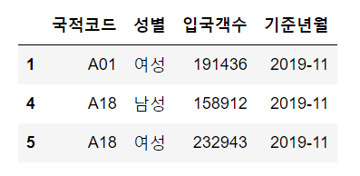
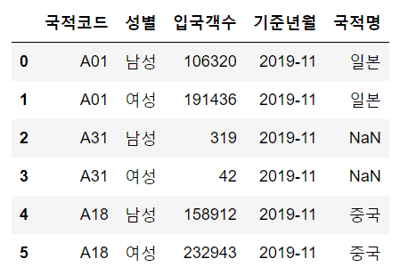
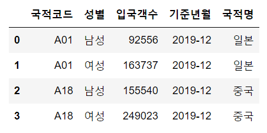
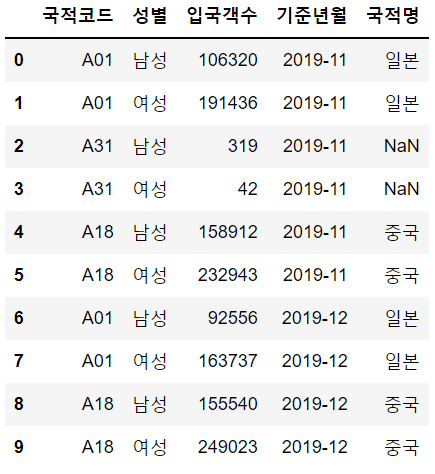
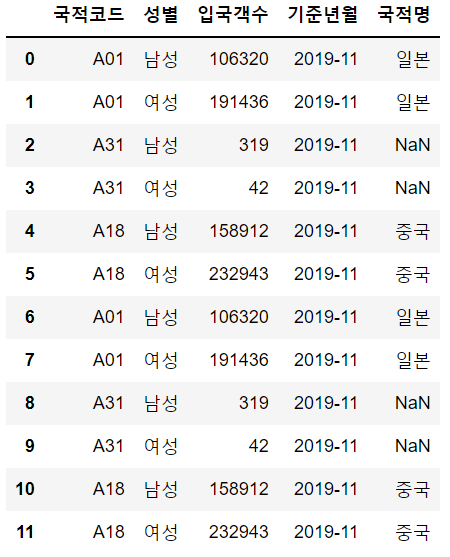
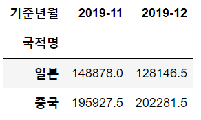
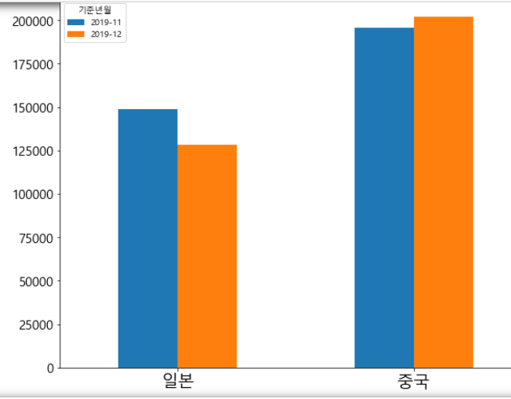

# Crawling

> 크롤링 : 데이터 수집, 분류 >> 주로 인터넷 상의 웹페이지(html, 문서 등) 수집해서 분류하고 저장


### 기본 문법

```python
import pandas as pd
import numpy as np

sample_1 = pd.read_excel('./files/sample_1.xlsx',
                        header = 1,				#헤더를 따로 저장하려면 header = next(data)	
                        usecols = 'A:C',		 #컬럼은 A-C
                        skipfooter = 2,			#밑에 2행은 스킵
                        #names = ['A','B','C'],	 #이름은 A,B,C로 하겠다
                        #dtype = {'입국객수' : np.float64}	#입국객수의 자료형을 float형으로 바꾸겠다
                        )
type(sample_1) 		#dataframe
sample_1.dtypes
#국적코드    object
#성별      object
#입국객수     int64
#dtype: object

#엑셀파일 외에도 직접 주소를 가져오는 것도 가능
fish = pd.read_csv('https://bit.ly/fish_csv', encoding = 'utf-8')
print(fish)
```

```python
sample_1.head()
sample_1.tail()
sample_1.info()

sample_1.index		#RangeIndex(start=0, stop=6, step=1)
sample_1.columns	#Index(['국적코드', '성별', '입국객수', '기준년월'], dtype='object')
sample_1.dtypes		
#국적코드    object
#성별      object
#입국객수     int64
#기준년월    object
#dtype: object
```

```python
sample_1.describe()
sample_1['성별'].value_counts()
#남성    3
#여성    3
#Name: 성별, dtype: int64
sample_1[['국적코드', '성별']]
```

```python
sample_1['기준년월'] = '2019-11'	#열값 바꿈
sample_1[sample_1['성별'] == '남성']	#표로 나옴
condition = sample_1['성별'] == '남성'	#True or False로 나옴

print(condition)
print(~(condition))			#(~())  위의 결과랑 반대
sample_1[condition]
sample_1[~condition]		#[~]
```

```python
condition = (sample_1['입국객수'] >= 150000)	#입국객수가 150000넘는 애들만 condition
condition									#얘로 쓰면 True or False로만 나옴(표로 X)
sample_1[condition]							 #컨디션 애들만 표로 나오게
```



```python
conditions_1 = (sample_1['성별'] == '남성')
conditions_2 = (sample_1['입국객수'] >= 150000)
print(sample_1[conditions_1])
print(sample_1[conditions_2])
print(sample_1[conditions_1 & conditions_2])	#둘 다 만족하는 애들(한 []안에 두 개 &해야)

conditions = conditions_1 | conditions_2
print(sample_1[conditions])					#이렇게 써도 O
```

```python
conditions = (sample_1['국적코드'] == 'A01') | \
			(sample_1['국적코드'] == 'A18') | \
    		(sample_1['국적코드'] == 'A31')
print(conditions)			#or 인데 쓸 때 \ 조심

conditions = (sample_1['국적코드'].isin(['A01', 'A18']))	#isin쓰면 한 번에 가능(위에처럼 안써도)
print(conditions)
```

```python
#판다스 데이터 접근방식 두 가지
#loc, iloc

sample_1.loc[1:3, '성별']	
#1    여성
#2    남성
#3    여성
#Name: 성별, dtype: object
```

```python
code_master = pd.read_excel('./files/sample_codemaster.xlsx',
                           header = 0,
                           usecols = 'A:B',
                           skipfooter = 0)
print(code_master)
#  국적코드     국적명
#0  A01      일본
#1  A02      대만
#2  A03      홍콩
#3  A18      중국
#4  A19      이란
#5  A22  우즈베키스탄
#6  A23   카자흐스탄
#7  A99  아시아 기타
```

```python
#sample_1 과 code_master 합치기
sample_1_code = pd.merge(left = sample_1,
                        right = code_master,
                        how = 'left',			#inner, outer, right등 있음
                        left_on = '국적코드',	#그냥 on인데 굳이 이렇게 씀
                        right_on = '국적코드')
sample_1_code
```



```python
#sample_2와 code_master 합치기
sample_2 = pd.read_excel('./files/sample_2.xlsx',
                        header = 1,
                        skipfooter = 2,
                        usecols = 'A:C')
sample_2['기준년월'] == '2019-12'

sample_2_code = pd.merge(left = sample_2,
                        right = code_master,
                        how = 'inner',
                        left_on = '국적코드',
                        right_on = '국적코드')
sample_2_code
```



```python
#sample_1_code랑 sample_2_code
sample = sample_1.append(sample_2_code,
                        ignore_index = True)
sample
```



```python
sample_concat = pd.concat([sample_code, sample_2_code],
                         ignore_index = True,
                         axis = 0)
sample_concat
```



```python
sample.to_excel('./files/sample_class.xlsx',
               index = False,
               na_rep = 'NaN',
               sheet_name= '1일차')

with pd.ExcelWriter('./files/multiple_sheet.xlsx') as writer:	#한 파일에 여러개
    sample.to_excel(writer, sheet_name = 'my_sheet1'),
    sample_1_code.to_excel(writer, sheet_name = 'my_sheet2',
                          index = False, na_rep= 'NaN')			#인덱스 없앰
```

```python
#pivot table
sample_pivot = sample.pivot_table(
		values = '입국객수',
		index = '국적명',
		columns = '기준년월',
		aggfunc = 'mean')	#mean이 기본값
sample_pivot
```



```python
import matplotlib.pyplot as plt
type(sample_pivot)
sample_pivot.plot(kind = 'bar',
                 figsize = (10,8),
                 rot = 0)
plt.rc('font', family = 'Malgun Gothic')
plt.rcParams['axes.unicode_minus'] = False
plt.xlabel('')
plt.xticks(size = 20)
plt.yticks(size = 15)
plt.show()
```



```python
sample.groupby('성별').mean()
#
#입국객수
#성별	
#남성	102729.4
#여성	167436.2
sample.groupby('성별')['입국객수'].mean()
#성별
#남성    102729.4
#여성    167436.2
#Name: 입국객수, dtype: float64
```


---

### 웹크롤링

> selenium 라이브러리의 webdriver를 활용해서 웹 브라우저 조작하고
>
> BeautifulSoup 라이브러리로 html 데이터에서 필요한 정보 가져오기

`webdriver`  : 크롬이나 인터넷 익스플로러 등에서 사이트 접속, 버튼 클릭, 글자 입력과 같이 웹 브라우저에서 사람이 할 수 있는 일들을 코드로 제어할 수 있는 라이브러리 >> 사용하려면 드라이버 필요 >> 밑에서는 크롬드라이버 사용


`!pip install selenium` << 먼저 해야

```python
from selenium import webdriver
webdriver __version__
#4.1.0

from selenium.webdriver.chrom.service import Service	#옛날처럼 그냥 service만 하면 안됨
service = Service('../chromedriver/chromedriver.exe')
driver = webdriver.Chrome(service = service)	#앞 service는 변수 / 뒤 service는 위에 있는 service
```

```python
html = driver.page_source
html = '''
<html>
    <head>
    </head>
    <body>
        <h1> 우리동네시장</h1>
            <div class = 'sale'>
                <p id='fruits1' class='fruits'>
                    <span class = 'name'> 바나나 </span>
                    <span class = 'price'> 3000원 </span>
                    <span class = 'inventory'> 500개 </span>
                    <span class = 'store'> 가나다상회 </span>
                    <a href = 'http://bit.ly/forPlaywithData' > 홈페이지 </a>
                </p>
            </div>
            <div class = 'prepare'>
                <p id='fruits2' class='fruits'>
                    <span class ='name'> 파인애플 </span>
                </p>
            </div>
    </body>
</html>
'''
html
#"\n<html>\n    <head>\n    </head>\n    <body>\n        <h1> 우리동네시장</h1>\n            <div class = 'sale'>\n                <p id='fruits1' class='fruits'>\n                    <span class = 'name'> 바나나 </span>\n                    <span class = 'price'> 3000원 </span>\n                    <span class = 'inventory'> 500개 </span>\n                    <span class = 'store'> 가나다상회 </span>\n                    <a href = 'http://bit.ly/forPlaywithData' > 홈페이지 </a>\n                </p>\n            </div>\n            <div class = 'prepare'>\n                <p id='fruits2' class='fruits'>\n                    <span class ='name'> 파인애플 </span>\n                </p>\n            </div>\n    </body>\n</html>\n"
```

```python
#!pip install bs4
from bs4 import BeautifulSoup

soup = BeautifulSoup(html, 'html.parser')	#html 문법에 맞게 잘 보이도록
soup
#<html>
#<head>
#</head>
#<body>
#<h1> 우리동네시장</h1>
#<div class="sale">
#<p class="fruits" id="fruits1">
#<span class="name"> 바나나 </span>
#<span class="price"> 3000원 </span>
#<span class="inventory"> 500개 </span>
#<span class="store"> 가나다상회 </span>
#<a href="http://bit.ly/forPlaywithData"> 홈페이지 </a>
#</p>
#</div>
#<div class="prepare">
#<p class="fruits" id="fruits2">
#<span class="name"> 파인애플 </span>
#</p>
#</div>
#</body>
#</html>
```

```python
tags_span = soup.select('span')		#tag
len(tags_span)					   #리스트로 길이가 5개
type(tags_span)					   #bs4.element.ResultSet

tags_p = soup.select('p')
len(tags_p)
tags_p

soup.select('#fruits1')			#id 샵을 앞에 붙이면 됨

#class
soup.select('.price')			#dot을 앞에 붙이면 됨
soup.select('.inventory')

soup.select('#fruits1 > span.name')
soup.select('div.sale > #fruits1 > span.name')
soup.select('div.sale span.name')
soup.select('div.sale > p.fruits > span.name')			
#이 네 개 결과는 다 똑같음 >> 그냥 표현의 차이
#[<span class="name"> 바나나 </span>] << 결과값
```

```python
#네이버 홈페이지 접속해보기
url = 'https://www.naver.com/'
driver.get(url)
```

```

```

