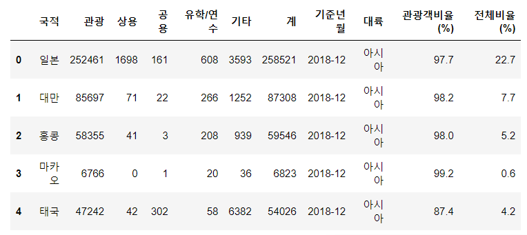
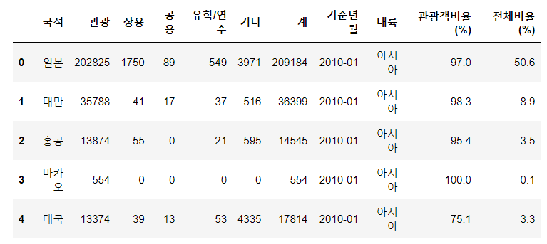
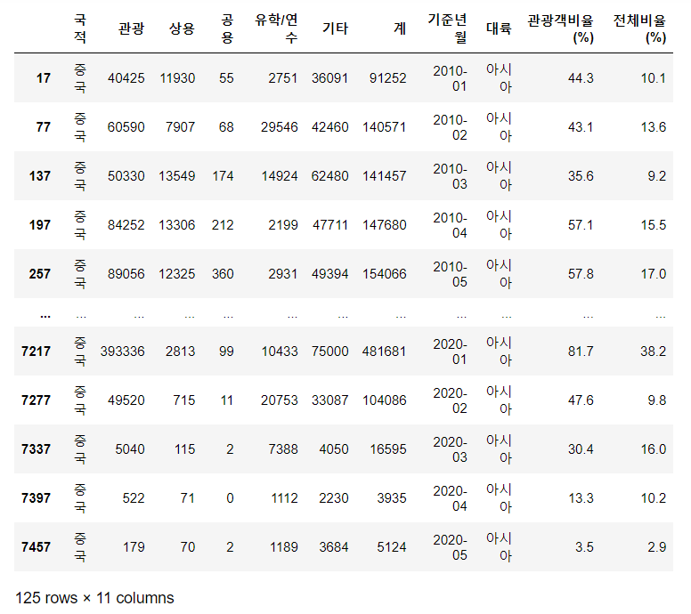
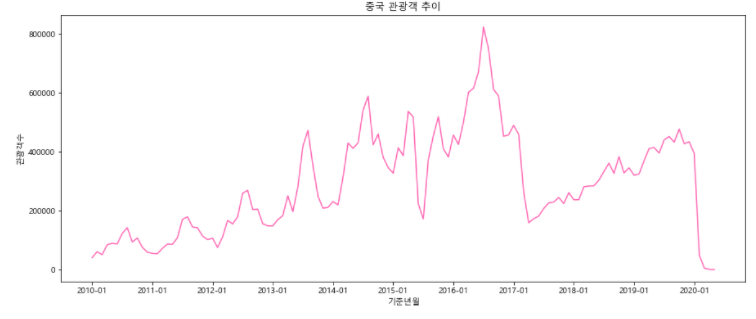
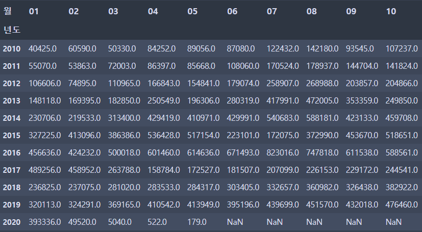
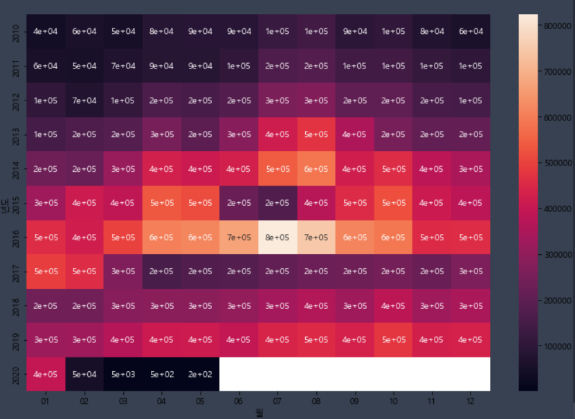
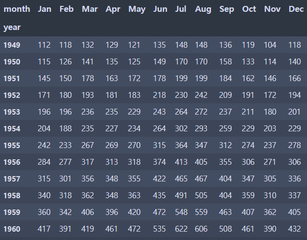
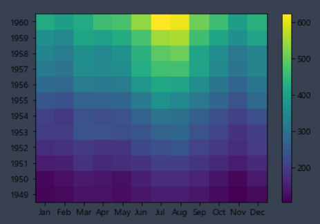
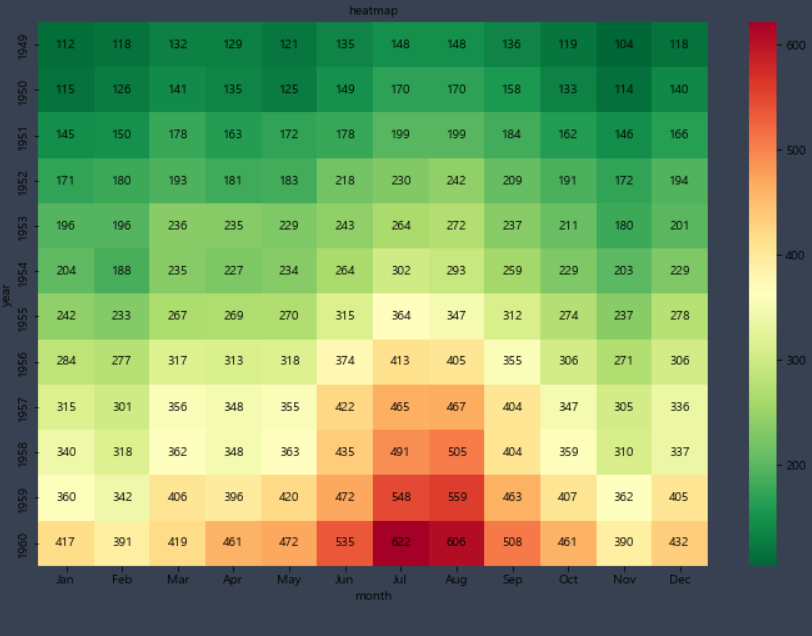

#  코로나 바이러스의 영향으로 중국인 관광객이 얼마나 줄었을까?

> 한국 관광 데이터랩에서 방한 외래관광객 데이터자료(엑셀)을 불러와서 크롤링 후 원하는 데이터 얻기
>
> \>> 나라별 관광객비율과 전체비율을 얻고 10년간의 관광 데이터 모아서 엑셀 파일에 저장하기
>
> \>> 시각화 & 히트맵으로 만들기


### 2019년 01월치 데이터 하나 크롤링

```python
import pandas as pd
import numpy as np
kto_201901 = pd.read_excel('./files/kto_201901.xlsx',
                          header = 1,		#시작 1
                          usecols = 'A:G',	#A~G열 데려오기
                          skipfooter = 4)	#밑에 4개행은 필요없음
kto_201901.head()
```


```python
#기준년월 열 추가하기
kto_201901['기준년월'] = '2019-01'
```

```python
kto_201901['국적'].unique()
#출력결과 >> 필요없는 아시아주, 미주 등의 행도 존재 >> 이 필요없는 행들 삭제

#필요없는 행 삭제하기
continents_list = ['아시아주','미주','구주','대양주','아프리카주','기타대륙','교포소계']
condition = kto_201901['국적'].isin(continents_list)	#국적 중 위에 있는 애들을 condition으로
kto_201901_country = kto_201901[~condition] #condition을 제외한 애들을 kto_201901_country에 저장

kto_201901_country  #실행하면 인덱스가 0부터 시작 안함 >> 중간중간 데이터가 빠져서 >> 다시 만들어

kto_201901_country_newindex = kto_201901_country.reset_index(drop = True)
#reset_index로 인덱스 다시 정렬 / drop = true >> 기존 인덱스 삭제
```

```python
#대륙 열 추가하기
continents = ['아시아'] * 25 + ['아메리카'] * 5 + ['유럽'] * 23 + ['오세아니아'] * 3 + ['아프리카'] * 2 + ['기타대륙'] + ['교포']
kto_201901_country_newindex['대륙'] = continents  #대륙 열 추가
kto_201901_country_newindex.head()
```


```python
#관광객비율 열 추가하기
kto_201901_country_newindex['관광객비율(%)'] = round(kto_201901_country_newindex['관광'] / kto_201901_country_newindex['계'] * 100, 2) 
#나라별 관광객비율(관광 / 계 * 100)후 소수점 둘 째자리까지 컷한 걸 관광객비율(%) 열로 추가

kto_201901_country_newindex.head()
```


```python
#관광객비율에 대해 내림차순으로 정렬
kto_201901_country_newindex.sort_values(by = '관광객비율(%)', ascending = False,inplace = False)		#inplace >> True로 하면 데이터 저장되는 거

#대륙별 관광객비율 pivot_table로 만들어보기
kto_201901_country_newindex.pivot_table(values = '관광객비율(%)',
                                       index = '대륙',
                                       aggfunc = 'mean')
```


```python
#전체비율 열 추가하기
trouist_sum = kto_201901_country_newindex['관광'].sum()
#얘는 numpy int형태 / sum()을 밖에 쓰면 그냥 int형으로 나옴
kto_201901_country_newindex['전체비율(%)'] = round(kto_201901_country_newindex['관광'] / tourist_sum * 100, 1)
```


여기까지가 기본 데이터 크롤링 방법(파일 한 개)

---

### 2010년부터 2020년까지 자료를 한 번에 읽어서 크롤링하기(여러 엑셀파일 크롤링)

> def 이용해서 반복되는 작업들 한 번에


```python
def path(yy,mm):
    #엑셀 파일 경로 지정
    file_path = './files/kto_{}{}.xlsx'.format(yy,mm) #년도랑 월 받아서 kto_yymm인 파일 경로
    
    #엑셀 파일 불러오기
    kto = pd.read_excel(file_path,
                       header = 1,
                       skipfooter = 4,
                       usecols = 'A:G')
    
    #[기준년월] 컬럼 추가
    kto['기준년월'] = '{}-{}'.format(yy,mm)
    
    #국적 컬럼에서 대륙 제거하고 국가만 남기기(필요없는 행 삭제)
    ignore = ['아시아주','미주','구주','대양주','아프리카주','기타대륙','교포소계'] #필요없는 행들
    condition = (kto['국적'].isin(ignore) == False) #ignore제외한 행들만 condition에
    kto_country = kto[condition].reset_index(drop = True) #제외한 애들로 리셋 인덱스해서 새로
    
    #대륙 컬럼 추가
    continents = ['아시아'] * 25 + ['아메리카'] * 5 + ['유럽'] * 23 + ['대양주'] * 3 + ['아프리	카'] * 2 + ['기타대륙'] + ['교포']  #해당 대륙들 숫자 세서 나열
    kto['대륙'] = continents  #대륙컬럼에 나열된 리스트 추가
    
    #국가별 관광객비율 컬럼 추가
    kto_country['관광객비율(%)'] = round(kto['관광'] / kto_country['계'] * 100, 1)
    
    #전체 비율 컬럼 추가
    tour_sum = sum(kto_country['관광'])	#모든 국가들의 관광객수 더해서 tour_sum에
    kto_country['전체비율(%)'] = round(kto['관광'] / tour_sum * 100, 1)
    
    #결과 출력
    return(kto_country)  #모든 것들을 다 저장한 kto_country 출력
```

```python
#잘 나오는지 확인
kto_201812 = path(2018,12)
kto_201812.head()
```



```python
#반복문을 사용해서 여러 엑셀파일을 가져와서 하나로 합치기(def)
pf = DataFrame() #빈 데이터프레임 만들기(표로 작성해야 하니까 리스트말고 데이터프레임)

for yy in range(2010, 2021):	#년도 반복문이니까 2010부터 2020까지
    for mm in range(1, 13):		#월 반복문이니까 1부터 12까지
        try:					#시도해봐
            temp = path(str(yy), str(mm).zfill(2))	#path함수에 두 개 
            #zfill(n) << n칸으로 채우기 << 월이 한 자리수가 아닌 두 자리수로 나와야 하기 때문에
            pf = pf.append(temp, ignore_index = True) #pf에 추가(temp를, 인덱스 무시)
        except:
            pass	#2020년 6월자료는 없기 때문에 try except구문이 없으면 오류남
pf.head()
```



```python
#하나의 엑셀파일로 저장하기
pf.to_excel('./files/kto_total.xlsx',
           index = False)	#인덱스 열없이 파일변환
```


---

### 국적별로 데이터 나눠서 따로 엑셀파일 저장하기

```python
pf_list =pf['국적'].unique()	#국적만 따로 빼

for l in pf_list:
    condition = (pf['국적'] == l)
    pf_filter = pf[condition]	#한 국적만 뽑아서
    file_path = './files/[국적별 관광객 데이터] {}.xlsx'.format(l)	#파일 경로 지정
    df_filter.to_excel(file_path, index = False)	#지정한 파일경로에 df_filter 
```


---

### 크롤링한 정보 가지고 중국 관광객수의 추이를 나타내는 시각화 그래프 나타내기

```python
from matplotlib import rc, font_manager  #한글 폰트
import matplotlib.pyplot as plt
plt.rc('font', family = 'Malgun Gothic')	#한글 폰트
plt.rcParams['axes.unicode_minus'] = False	#마이너스값 표시
import seaborn		#데이터 시각화 라이브러리
import pandas as pd
```

```
! seaborn !

matplotlib을 기반으로 만들어졌지만, 색상 테마와 다양한 통계용 차트 기능이 추가되어있어서 조금 더 까리하다.
```

```python
df = pd.read_excel('./files/kto_total.xlsx')
df_filter = df[df['국적'] == '중국']
df_filter
```



```python
# 이 데이터를 가지고 그래프로 시각화하기
plt.figure(figsize = (15,6))    #그래프 사이즈
plt.plot(df_filter['기준년월'], df_filter['관광'], color = 'hotpink')	
#x축은 기준년월, y축은 관광, 색은 핫핑크색(헤헷)
plt.title('중국 관광객 추이')	#제목
plt.xlabel('기준년월')		#x축은 기준년월로 레이블
plt.ylabel('관광객수')		#y축은 관광객수로 레이블
plt.xticks(['2010-01','2011-01','2012-01','2013-01','2014-01','2015-01','2016-01','2017-01','2018-01','2019-01','2020-01'])	#얘를 하는 이유는 자료를 더 깔끔하게 보기 위해서(안하면 지저분)
plt.show()
```




---

### 히트맵(Heatmap)

> 중국 관광객 변화를 피벗테이블로 만든 후, 히트맵으로 시각화해보기


```python
pf_pivot = pf_filter.pivot_table(values = '관광',
                                index = '년도',
                                columns = '월',
                                afffunc = 'sum')
pf_pivot
```



(11,12월은 잘림 ㅎㅎ)

```python
#히트맵으로 만들어보기
import seaborn as sns
plt.figure(figsize = (12,8))
sns.heatmap(pf_pivot,
           annot = True,  #칸마다 숫자써지게
           fmt = '.0')    #숫자로(소수점을)
plt.show()
```



```python
#중국, 일본, 대만, 미국, 홍콩 관광객 히트맵 만들어보기
for c in c_list:
    condition = pf['국적'] == c
    pf_filter = pf[condition]
    pf_pivot = pf_filter.pivot_table(values = '관광',
                                    index = '년도',
                                    columns = '월')
```


---

### 히트맵 작성법

```python
flights = sns.load_dataset('flights')
flights_pivot = flights.pivot_table(values = 'passengers',
                                   index = 'year',
                                   columns = 'month')
flights_pivot
```



```python
plt.pcolor(flights_pivot)
plt.xticks(np.arange(0.5, len(flights_pivot.columns)), #0.5부터 컬럼 길이만큼인데 표시는 컬럼
          flights_pivot.columns)
plt.yticks(np.arange(0.5, len(flights_pivot.index)),
          flights_pivot.index)
plt.colorbar()
plt.show()
```



```python
plt.figure(figsize = (12,8))
sns.heatmap(flights_pivot,
           annot = True,
           fmt = 'd',   #d는 integer
           cmap = 'RdYlGn_r',
           annot_kws = {'size' : 10, 'color' : 'black'}) #딕셔너리 형태로 만들어야 함
plt.title('heatmap', fontsize = 10)
plt.show()
```

