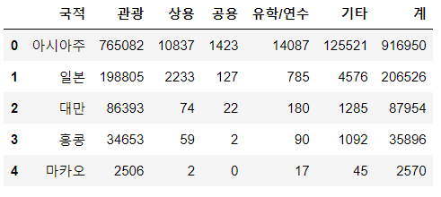
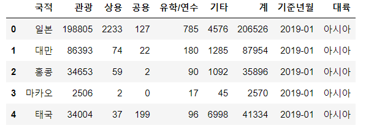
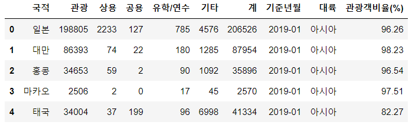
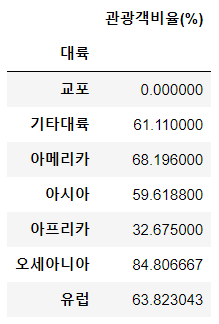

#  코로나 바이러스의 영향으로 중국인 관광객이 얼마나 줄었을까?

> 한국 관광 데이터랩에서 방한 외래관광객 데이터자료(엑셀)을 불러와서 크롤링 후 원하는 데이터 얻기
>
> \>> 나라별 관광객비율과 전체비율을 얻고 10년간의 관광 데이터 모아서 엑셀 파일에 저장하기
>
> \>> 히트맵으로 만들기


### 2019년 01월치 데이터 하나 크롤링

```python
import pandas as pd
import numpy as np
kto_201901 = pd.read_excel('./files/kto_201901.xlsx',
                          header = 1,		#시작 1
                          usecols = 'A:G',	#A~G열 데려오기
                          skipfooter = 4)	#밑에 4개행은 필요없음
kto_201901.head()
```



```python
#기준년월 열 추가하기
kto_201901['기준년월'] = '2019-01'
```

```python
kto_201901['국적'].unique()
#출력결과 >> 필요없는 아시아주, 미주 등의 행도 존재 >> 이 필요없는 행들 삭제

#필요없는 행 삭제하기
continents_list = ['아시아주','미주','구주','대양주','아프리카주','기타대륙','교포소계']
condition = kto_201901['국적'].isin(continents_list)	#국적 중 위에 있는 애들을 condition으로
kto_201901_country = kto_201901[~condition] #condition을 제외한 애들을 kto_201901_country에 저장

kto_201901_country  #실행하면 인덱스가 0부터 시작 안함 >> 중간중간 데이터가 빠져서 >> 다시 만들어

kto_201901_country_newindex = kto_201901_country.reset_index(drop = True)
#reset_index로 인덱스 다시 정렬 / drop = true >> 기존 인덱스 삭제
```

```python
#대륙 열 추가하기
continents = ['아시아'] * 25 + ['아메리카'] * 5 + ['유럽'] * 23 + ['오세아니아'] * 3 + ['아프리카'] * 2 + ['기타대륙'] + ['교포']
kto_201901_country_newindex['대륙'] = continents  #대륙 열 추가
kto_201901_country_newindex.head()
```



```python
#관광객비율 열 추가하기
kto_201901_country_newindex['관광객비율(%)'] = round(kto_201901_country_newindex['관광'] / kto_201901_country_newindex['계'] * 100, 2) 
#나라별 관광객비율(관광 / 계 * 100)후 소수점 둘 째자리까지 컷한 걸 관광객비율(%) 열로 추가

kto_201901_country_newindex.head()
```



```python
#관광객비율에 대해 내림차순으로 정렬
kto_201901_country_newindex.sort_values(by = '관광객비율(%)', ascending = False,inplace = False)		#inplace >> True로 하면 데이터 저장되는 거

#대륙별 관광객비율 pivot_table로 만들어보기
kto_201901_country_newindex.pivot_table(values = '관광객비율(%)',
                                       index = '대륙',
                                       aggfunc = 'mean')
```



```python
#전체비율 열 추가하기
trouist_sum = kto_201901_country_newindex['관광'].sum()
#얘는 numpy int형태 / sum()을 밖에 쓰면 그냥 int형으로 나옴
kto_201901_country_newindex['전체비율(%)'] = round(kto_201901_country_newindex['관광'] / tourist_sum * 100, 1)
```


여기까지가 기본 데이터 크롤링 방법(파일 한 개)

---

### 2010년부터 2020년까지 자료를 한 번에 읽어서 크롤링하기(여러 엑셀파일 크롤링)

> def 이용해서 반복되는 작업들 한 번에


```python
def path
```

