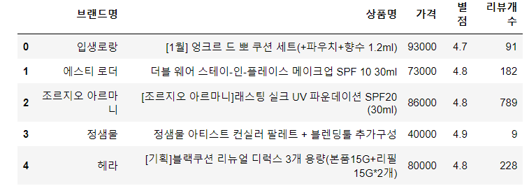

# 롯데 on 사이트에서 베이스메이크업 리스트 뽑기

> 백화점 쇼핑몰 페이지에 있는 베이스메이크업 인기 제품들의 소스들을 크롤링 후 
>
> 엑셀파일로 저장하고 시각화하기


```python
from selenium import webdriver
from selenium.webdriver.chrome.service import Service
from bs4 import BeautifulSoup
import pandas as pd
import numpy as np
import time
import folium
import json
```

```python
driver = webdriver.Chrome(service = Service('../chromedriver.exe'))
url = 'https://www.lotteon.com/search/render/render.ecn?render=nqapi&platform=pc&collection_id=9&login=Y&u9=navigate&u8=FC04140100&mallId=1'
driver.get(url)
```

```python
html = driver.page_source
soup = BeautifulSoup(html, 'html.parser')
soup
```

```python
#쿠션 파운데이션 순위
#가격, 별점, 리뷰개수, 브랜드
foundations = soup.select('div.srchResultProductArea li.srchProductItem')
foundation = foundations[0]
brand = foundation.select('div.srchProductUnitTitle')[0].text.strip().split('\n')[0]
brand
name = foundation.select('div.srchProductUnitTitle')[0].text.strip().split('\n')[1]
name
price = foundation.select('del.s-product-price__original')[0].text.strip().replace('정상가','').replace('원','').replace(',','')
price = int(price)
star = foundation.select('span.s-product-score__number')[0].text
star = float(star)
review = foundation.select('span.s-product-score__number')[1].text.replace('리뷰','').strip()
review = int(review)
print(brand, name, price, star, review, sep = '/')
```

```python
#for문 돌려서 리스트 쭉 받는 함수 만들기
foundation_data = []

def foundation_list(foundations):
    for foundation in foundations:
        try:
            brand = foundation.select('div.srchProductUnitTitle')[0].text.strip().split('\n')[0]
        except:
            brand = ''
        try:
            name = foundation.select('div.srchProductUnitTitle')[0].text.strip().split('\n')[1]
        except:
            name = ''
        try:
            price = foundation.select('del.s-product-price__original')[0].text.strip().replace('정상가','').replace('원','').replace(',','')
            price = int(price)

        except:
            price = 0
        try:
            star = foundation.select('span.s-product-score__number')[0].text
            star = float(star)
        except:
            star = 0
        try:
            review = foundation.select('span.s-product-score__number')[1].text.replace('리뷰','').strip()
            review = int(review)
        except:
            review = 0
        mylist = [brand, name, price, star, review]
        foundation_data.append(mylist)
    return (foundation_data)
```

```python
foundation_data_list = foundation_list(foundations)
```

```python
#DataFrame으로 만들기
foundation_df = pd.DataFrame(foundation_data_list)
foundation_df.columns = ['브랜드명','상품명','가격','별점','리뷰개수']
```

```python
foundation_df.to_excel('./files/foundation.xlsx', index = False)
```

```python
foundation_df.head()  #120개
```



```python
#시각화
from matplotlib import font_manager, rc
import matplotlib.pyplot as plt
import seaborn as sns
# import platform 

rc('font', family = 'Malgun Gothic')
```

```python
plt.figure(figsize = (25, 15))
sns.scatterplot(x = '가격', y = '리뷰개수',
               size = '별점', hue = foundation_df['브랜드명'],
               data = foundation_df, legend = False,
               sizes = (10, 1000)
               )
plt.yticks(np.arange(0, 900, step = 400))
plt.title('LOTTE on 백화점몰 속 베이스메이크업 인기도')
    
for index, row in foundation_df.iterrows():
    x = row['가격']
    y = row['리뷰개수']
    s = row['브랜드명'].split(' ')[0]
    plt.text(x,y,s, size=10)
    
plt.show()
```

