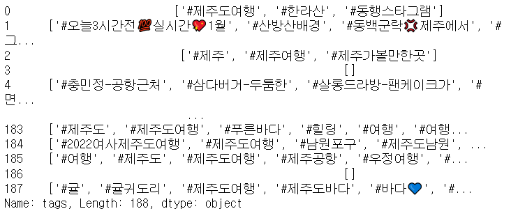
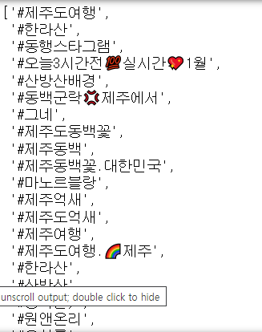
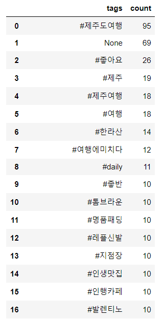
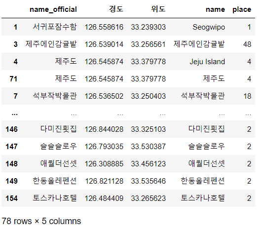
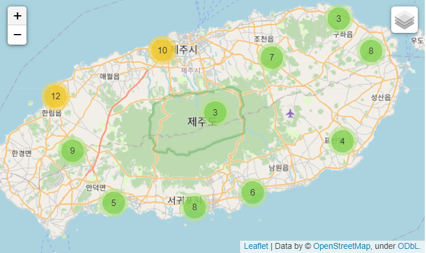

# 배운 내용들로 우리 가족 제주도 여행 위한 제주도 여행 데이터 크롤링 후 시각화

> 크롬드라이버로 인스타 설정 후
>
> searching 함수로 url 들어가고
>
> 내용/날짜/태그/좋아요수/장소 
>
> 다음장으로 넘어가는 함수
>
> 데이터 프레임으로
>
> 엑셀로 저장
>
> wordcloud로 시각화(태그 이용해서)
>
> 제주도 지도 그리기(장소 이용해서)


```python
from selenium import webdriver
from selenium.webdriver.chrome.service import Service
from bs4 import BeautifulSoup
import pandas as pd
import numpy as np
import time
service = Service('../chromedriver.exe')
driver = webdriver.Chrome(service = service)
```

```python
#크롬드라이버로 인스타 설정
def insta_searching(word):
    url = 'https://www.instagram.com/explore/tags/' + word
    return url
```

```python
#첫번째 인기게시물 클릭
from selenium.webdriver.common.by import By
def select_first(driver):
    first = driver.find_element(By.CSS_SELECTOR, 'div._9AhH0')
    first.click()
    time.sleep(2)
```

```python
#content, tags, date, like, place
html = driver.page_source
soup = BeautifulSoup(html, 'html.parser')

content = soup.select('div.C4VMK > span')[0].text

import re
tags = re.findall(r'#[^\s#,\\]+', content)

date = soup.select('time._1o9PC.Nzb55')[0]['datetime'][:10]

like = soup.select('a.zV_Nj > span')[0].text

place = soup.select('div > a.O4GlU')[0].text
```

```python
#위의 것들을 함수로
def get_content(driver):
    html = driver.page_source
    soup = BeautifulSoup(html, 'html.parser')
    
    try:
        content = soup.select('div.C4VMK > span')[0].text
    except:
        content = ''
    try:
        tags = re.findall(r'#[^\s#,\\]+', content)
    except:
        tags = 0
    try:
        date = soup.select('time._1o9PC.Nzb55')[0]['datetime'][:10]
    except:
        date = ''
    try:
        like = soup.select('a.zV_Nj > span')[0].text
    except:
        like = 0
    try:
        place = soup.select('div > a.O4GlU')[0].text
    except:
        place = ''
        
    data = [content, date, like, place, tags]
    return(data)
```

```python
#다음 장으로 넘겨주기
#from selenium.webdriver.common.by import By

def move_next(driver):
    right = driver.find_element(By.CSS_SELECTOR, 'div.l8mY4.feth3')
    right.click()
    time.sleep(3)

move_next(driver)
```

```python
#메인
from tqdm.notebook import tqdm
def insta_crawling(word, n):
    url = insta_searching(word)
    
    driver.get(url)
    time.sleep(5)
    
    select_first(driver)
    time.sleep(3)
    
    results = []
    
    for i in tqdm(range(n)):
        try:
            data = get_content(driver)
            results.append(data)
            move_next(driver)
            
        except:
            time.sleep(2)
            move_next(driver)
            
    return(results)
```

```python
#제주도 여행으로 검색하기
travel_place = insta_crawling('제주도여행', 200)
```

```python
travel_place_df = pd.DataFrame(travel_place)
travel_place_df.columns = ['contents', 'date','like','place','tags']
travel_place_df
```

```python
travel_place_df.drop_duplicates(subset = ['contents'],inplace = True)
travel_place_df.shape   #65개 없어짐 >> (188,5)
#travel_place_df.head()
```

```python
#엑셀파일로 저장하기
travel_place_df.to_excel('./files/Jeju_Travel_For_Family.xlsx',
                        index = False)
```

```python
raw_total = travel_place_df.copy()

#해시태그 리스트로 만들기
tags_total = []
for tags in raw_total['tags']:
    tags_list = tags[2:-2].split("', '")
    for tag in tags_list:
        tags_total.append(tag)
tags_total
```



여기에서



이렇게 나오게

```python
#태그 하나당 얼마나 언급됐는지
from collections import Counter
tag_counts = Counter(tags_total)
tag_counts.most_common(50) #순위 50위

#stopword
STOPWORDS = ['#일상', '#선팔', '#제주자연눈썹', '#제주눈썹문신', '#소통', '#맞팔',
             '#제주속눈썹', '#제주일상', '#제주도','#jeju','#반영구','#제주살이',
             '#제주도민', '#여행스타그램', '#제주반영구', '#제주메이크업', '#남자옷',
            '#맞팔','#jejuisland','#일상','#스톤패딩','#명품신발','#래플신발','#발리신발','#구찌신발',
            '#커플신발','#로렉스시계','#태그호이어시계','#명품시계','#명품클러치','#보테가클러치',
            '#구찌클러치','#남자쇼핑몰','#남친선물','#고야드지갑','#고야드클러치','#발렌시아가']
tag_total_selected = []
for tag in tags_total:
    if not tag in STOPWORDS:
        tag_total_selected.append(tag)
tag_total_selected = Counter(tag_total_selected)
tag_total_selected

tag_count_df = pd.DataFrame(tag_total_selected.most_common(50))
tag_count_df.columns = ['tags','count']
tag_count_df['tags'].replace('','None', inplace = True)
tag_count_df.dropna(subset = ['tags'], inplace = True)
```




---

### wordcloud로 시각화

```python
#wordcloud로 만들어보기
import matplotlib.pyplot as plt
from wordcloud import WordCloud
import platform

if platform.system() == 'Windows':
    font_path = 'C:/Windows/Fonts/malgun.ttf'
    
wordcloud = WordCloud(font_path = font_path,
                     background_color = 'white',
                     max_words = 100,
                     relative_scaling = 0.3,
                     width = 800,
                     height = 400).generate_from_frequencies(tag_total_selected)

plt.figure(figsize = (18,10))
plt.imshow(wordcloud)
plt.axis('off')
```


---

### Folium

> 위치정보를 시각화하기 위한 라이브러리

```python
#크롤링한 장소 데이터들로 제주도 지도 맵 짜보기
import requests
def find_places(searching):
    url = 'https://dapi.kakao.com/v2/local/search/keyword.json?query={}'.format(searching)
    headers = {
          'Authorization':'KakaoAK 자기 api'
    }
    places = requests.get(url, headers = headers).json()['documents']
    place = places[0]
    name = place['place_name']
    x = place['x']
    y = place['y']
    
    data = [name, x, y, searching]
    
    return(data)
```

```python
location_counts = raw_total['place'].value_counts()
location_counts_df = pd.DataFrame(location_counts)
location_counts_df.to_excel('./files/Jeju_Travel_For_Family_Places.xlsx')
locations = list(location_counts_df.index)
```

```python
locations_inform = []
for location in tqdm(locations):
    try:
        data = find_places(location)
        locations_inform.append(data)
        time.sleep(1)
    except:
        pass
```

```python
locations_inform_df = pd.DataFrame(locations_inform)
locations_inform_df.columns = ['name_official','경도','위도','name']
locations_inform_df.to_excel('./files/Jeju_Trip_For_Map.xlsx',
                            index = False)
```

```python
#두 파일 합병시키기(merge)
location_counts_df = pd.read_excel('./files/3_location_counts.xlsx', index_col = 0)
location_inform_df = pd.read_excel('./files/3_3_locations.xlsx')

location_counts_df.head()
location_inform_df.head()

location_data = pd.merge(location_inform_df, location_counts_df,
                        how = 'inner',
                        left_on = 'name_official',
                        right_index = True)
location_data
```



```python
from folium.plugins import MarkerCluster
import folium
locations = []
names = []
for i in range(len(location_data)):
    data = location_data.iloc[i]
    locations.append((float(data['위도']), float(data['경도'])))
    names.append(data['name_official'])
    
Mt_Hanla = [33.362500,126.533694]
map_jeju2 = folium.Map(location = Mt_Hanla,
                     zoom_start = 11)
tiles = ['stamenwatercolor', 'cartodbpositron', 
         'openstreetmap', 'stamenterrain','cartodbdark_matter']

for tile in tiles:
    folium.TileLayer(tile).add_to(map_jeju2)

market_cluster = MarkerCluster(locations = locations,
                              popups = names,
                              name = 'jeju',
                              overlay = True,
                              control = True).add_to(map_jeju2)
folium.LayerControl().add_to(map_jeju2)
map_jeju2
```




----

### + 특정 단어를 포함한 게시글 찾아서 단어들끼리 모아 엑셀파일로 저장하기

```python
raw total = pd.read_excel('./files/1_crawling_raw.xlsx')
select_word_list = ['해돋이','박물관','힐링','게스트하우스','섭지코지']

def select_word(select_word_list):
    for select_word in select_word_list:
        check_list = []
        for content in raw_total['content']:
            if select_word in content:
                check_list.append(True)
            else:
                check_list.append(False)
        select_df = raw_total[check_list]
        fpath = './files/select_data{}.xlsx'.format(select_word)
        select_df.to_excel(fpath, index = False)
       
select_word(select_word_list)
```

