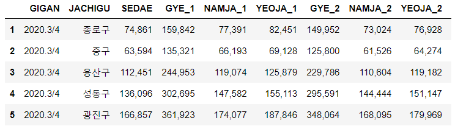

# 왜 우리 동네에는 스타벅스가 없을까?

> 서울에서 스타벅스가 어떤 전략으로 매장입지를 선택하는지 살펴보기
>
> \> 스타벅스의 매장 입지에 대한 두 가지 가설을 세우고, 맞는지 데이터 분석을 통해 알아보기
>
> \>> 1. 거주 인구가 많은 지역에 스타벅스 매장이 많이 입지해 있을 것이다
>
> \>> 2. 직장인이 많은 지역에 스타벅스 매장이 많이 입지해 있을 것이다
>
> 이를 위해 스타벅스 위치를 파악하고, 인구통계 데이터 수집해야


```python
from selenium import webdriver
from selenium.webdriver.chrome.service import Service
from bs4 import BeautifulSoup
from selenium.webdriver.common.by import By
import pandas as pd
import numpy as np
import time
```

```python
# (1) 서울시 어떤 군구가 스타벅스가 많니
service = Service('../chromedriver.exe')
driver = webdriver.Chrome(service = service)
url = 'https://www.starbucks.co.kr/store/store_map.do'
driver.get(url)
```

```python
#지역검색 클릭하게
find_geography = '#container > div > form > fieldset > div > section > article.find_store_cont > article > header.loca_search > h3 > a'
driver.find_element(By.CSS_SELECTOR, find_geography).click()

#서울 지역 클릭하게
seoul_btn = '#container > div > form > fieldset > div > section > article.find_store_cont > article > article:nth-child(4) > div.loca_step1 > div.loca_step1_cont > ul > li:nth-child(1) > a'
driver.find_element(By.CSS_SELECTOR, seoul_btn).click()
time.sleep(3)

#서울 전체 지역 클릭하게
all_btn = '#mCSB_2_container > ul > li:nth-child(1) > a'
driver.find_element(By.CSS_SELECTOR, all_btn).click()
time.sleep(3)
```

```python
#568개 서울시 크롤링
#이름, 위도, 경도, 가게타입, 주소, 전화번호
html = driver.page_source
soup = BeautifulSoup(html, 'html.parser')

starbucks_soup_list = soup.select('div.loca_step3 li.quickResultLstCon')
len(starbucks_soup_list)   #568 얘가 서울 전체 지역 스타벅스 

starbucks_store = starbucks_soup_list[0] #첫 번째 애 데려와
starbucks_store

name = starbucks_store.select('strong')[0].text.strip() #태그 접근할 때()
lat = starbucks_store['data-lat'].strip() #데이터 접근할 때 []
lng = starbucks_store['data-long'].strip()
store_type = starbucks_store.select('i')[0]['class'][0][4:].strip()
address = starbucks_store('p')[0].text[:-9]
tel = str(starbucks_store.select('p.result_details')[0]).split('<br/>')[1].split('<')[0]
```

```python
#568개 데이터 가져오기 리스트로
starbucks_list = []

for starbucks_store in starbucks_soup_list:
    name = starbucks_store.select('strong')[0].text.strip() #태그 접근할 때()
    lat = starbucks_store['data-lat'].strip() #데이터 접근할 때 []
    lng = starbucks_store['data-long'].strip()
    store_type = starbucks_store.select('i')[0]['class'][0][4:].strip()
    address = starbucks_store('p')[0].text[:-9]
    tel = str(starbucks_store.select('p.result_details')[0]).split('<br/>')[1].split('<')[0]
    
    mylist = [name, lat, lng, store_type, address, tel]
    starbucks_list.append(mylist)

#리스트를 데이터프레임(표) 형태로 저장(컬럼이름도 변경)
columns = ['매장명','위도','경도','매장타입','주소','전화번호']
seoul_starbucks_df = pd.DataFrame(starbucks_list,
                                 columns = columns)
seoul_starbucks_df.head()
```


```python
#엑셀파일로 저장
seoul_starbucks_df.to_excel('./files/seoul_starbucks_list_mine.xlsx', index = False)
```


---

```python
#(2) 시군구마다의 인구
#서울시 열린인구 데이터 ~ 에서 api가져오기
import requests
```

```python
SEOUL_API_AUTH_KEY = #자기 api키
Open_API = 'GangseoListLoanCompany'
url =  'http://openAPI.seoul.go.kr:8088/{}/json/{}/1/5/'.format(SEOUL_API_AUTH_KEY, Open_API)
```

```python
result_dict = requests.get(url).json()
result_dict #list_total_count >> 데이터 전체 개수 / code >> inf0-000나오는거면 정상
result_dict['GangseoListLoanCompany']['list_total_count'] #접근방식은 이런 식
```

```python
sample_df = pd.DataFrame(result_dict['GangseoListLoanCompany']['row'])
sample_df
```


```python
#서울시 주민등록 인구 자료 불러옴
sgg_pop_df = pd.read_csv('../6_Starbucks_Location/files/report.txt',
                        header = 2, sep = '\t')
sgg_pop_df.head()
```


```python
#서울열린데이터광장 open api를 호출하는 함수 작성
service = 'GangseoListLoanCompany'

def seoul_open_api_data(url, service):
    data_list = None
    try:
        result_dict = requests.get(url).json()
        result_data = result_dict[service]
        code = result_data['RESULT']['CODE']
        
        if code == 'INFO-000':
            data_list = result_data['row']
    except:
        pass
    return(data_list)
```

```python
url = 'http://openAPI.seoul.go.kr:8088/{}/json/{}/1/5/'.format(SEOUL_API_AUTH_KEY, service)
service = 'GangseoListLoanCompany'
a = seoul_open_api_data(url, service)
a[0]
```


```python
#인구수 데이터 열이름 rename하기
sgg_pop_df = pd.read_csv('../6_Starbucks_Location/files/report.txt',
                        header = 2, sep = '\t')
columns = {
    '기간': 'GIGAN',
    '자치구': 'JACHIGU',
    '계': 'GYE_1',
    '계.1': 'GYE_2',
    '계.2': 'GYE_3',
    '남자': 'NAMJA_1',
    '남자.1': 'NAMJA_2',
    '남자.2': 'NAMJA_3',
    '여자': 'YEOJA_1',
    '여자.1': 'YEOJA_2',
    '여자.2': 'YEOJA_3',
    '세대': 'SEDAE',
    '세대당인구': 'SEDAEDANGINGU',
    '65세이상고령자': 'N_65SEISANGGORYEONGJA'
}
sgg_pop_df.rename(columns = columns, inplace = True)
sgg_pop_df
```

```python
#자치구에서 합계행을 뺀 걸 sgg_pop_df_select로
sgg_pop_df['JACHIGU']
condition = sgg_pop_df['JACHIGU'] != '합계'
sgg_pop_df_select = sgg_pop_df[condition]
sgg_pop_df_select.head()
```



```python
#자치구, 계-1 가지고 와서 컬럼명 바꾸고 엑셀로 저장
sgg_pop_df_final = sgg_pop_df_select[['JACHIGU', 'GYE_1']]
sgg_pop_df_final.columns = ['시군구명','주민등록인구']
sgg_pop_df_final.head()

sgg_pop_df_final.to_excel('../6_Starbucks_Location/files/seoul_sgg_mine.xlsx', index = False)
```

```python
#이제 통합하기
#동이 소계인 것만 뽑기
#columns = ['시군구명','종사자수','사업체수']
sgg_biz_df = pd.read_csv('../6_Starbucks_Location/files/report2.txt',
                        header = 2,
                        sep = '\t')
condition = sgg_biz_df['동'] == '소계'
sgg_biz_df_selected = sgg_biz_df[condition]
sgg_biz_df_final = sgg_biz_df_selected[['자치구','계','사업체수']]

sgg_biz_df_final = sgg_biz_df_final.reset_index(drop = True)
sgg_biz_df_final.head()

sgg_biz_df_final.to_excel('../6_Starbucks_Location/files/sgg_biz.xlsx',
                         index = False)
```

