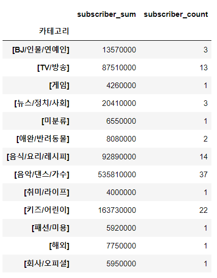

# 크롤링한 유튜브 차트 엑셀 파일을 가지고 시각화해보기

> 카테고리별 구독자수를 비교해보는 활동
>
> pie chart로 작성


```python
import pandas as pd
from matplotlib import rc, font_manager

#path잡아서 한글 나오게
path = 'C:/Windows/Fonts/malgun.ttf'
font_name = font_manager.FontProperties(fname = path).get_name()
rc('font',family = font_name)
```

```python
df = pd.read_excel('./files/youtube_rank_class.xlsx')
df.head()
df['카테고리'].value_counts()	#카테고리별 수

#구독자수 int형으로 고치기
df['구독자수']  #string 형태
df['replaced_subscriber'] = df['구독자수'].str.replace('만', '0000') #글자 만을 0000으로 대체
#still object
df['replaced_subscriber'] = df['replaced_subscriber'].astype('int') #type을 int로 
```

```python
#int형으로 변환된 replaced_subscriber를 가지고 피벗테이블 만들기
#카테고리별 구독자수의 합과 계를 나타내는 피벗테이블
pivot_df = df.pivot_table(values = 'replaced_subscriber',	#내용replaced subscriber
                         index = '카테고리',				 #행은 카테고리
                         aggfunc = ['sum', 'count'])		#함수는 덧셈과 카운트
pivot_df.columns = ['subscriber_sum', 'subscriber_count'] #컬럼 이름을 이렇게 두 개로 하겠다
#pivot_df = pivot_df.reset_index()	#바꾼 걸로 리셋됨
pivot_df
```



```python
#이 피벗 테이블을 가지고 sort 해보기
pivot_df = pivot_df.sort_values(by = 'subscriber.sum', ascending = False)
pivot_df = pivot_df.reset_index(drop = True, inplace = False)
```


```python
#pie chart로 만들어보기
pivot_df.head(5)  #너무 양이 많아서 5개로만
plt.figure(figsize = (6,6))   #사이즈는 6,6
plt.rcParams['font size'] = 15	#폰트 사이즈는 15
ratio = 'subscriber_sum'	#합계

plt.pie(pivot_df.head()['subscriber_sum'],	#합계가져오는데 head값만
       labels = pivot_df.head()['카테고리'],	#레이블은 카테고리로
       autopct = '%.1F%%')					#값은 소수점 1자리 가져오고 %로
plt.show()
```

