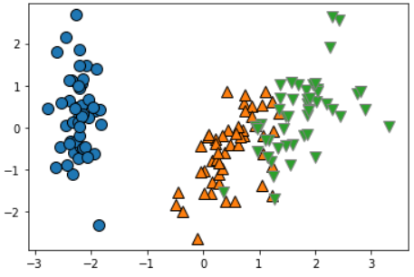

# Dimensionality_Reduction(차원축소)

> -분석대상이 되는 여러 변수의 정보를 최대한 유지하면서
>
> '변수의 개수를 줄이는 탐색적 분석기법'
>
> -하나의 완결된 분석기법으로 사용되기보다, 다른 분석과정을 위한 전단계, 
>
> 분석 수행 후 개선 방법, 또는 효과적인 시각화 목적으로 사용
>
> -저차원으로 학습할 경우, 회귀/분류/클러스터링 등의 머신러닝 알고리즘이 더 잘 동작


```python
# 1) data loading
from sklearn.datasets import load_iris

iris_x = load_iris()['data']
iris_y = load_iris()['target']

iris_x		#변수가 4개 >> 4차원
```

```python
# 2) 2차원 축소
from sklearn.preprocessing import StandardScaler as standard
m_sc = standard()
iris_x_sc = m_sc.fit_transform(iris_x)
#PCA 적용 전 스케일링 반드시 해줘야
```

```python
# 3) 주성분 개수 설정 축소(주성분 개수 : 2개)
from sklearn.decompostion import PCA
m_pca2 = PCA(n_components = 2)		#주성분 개수 2개
iris_x_pca2 = m_pca2.fit_transform(iris_x_sc)
iris_x_pca2							#2차원으로 축소
```

```python
# 4) 유도된 인공변수로 시각화
import mglearn
#시각화 : 1, 2번째 컬럼만 뽑아
mglearn.discrete_scatter(iris_x_pca2[:,0], iris_x_pca2[:,1], y = iris_y)
#y = iris_y 안하면 다 똑같이 나옴
```



```python
# 5) 3차원으로 축소
from sklearn.decomposition import PCA
m_pca3 = PCA(n_components = 3)
iris_x_pca3 = m_pca3.fit_transform(iris_x_sc)

from mpl_toolkits.mplot3d import Axes3D, axes3d
import matplotlib.pyplot as plt
```

```python
#도화지 그리기, 축 그리기
fig1 = plt.figure()		#도화지
ax = Axes3D(fig1)		#축

#step1. y == 0인 데이터 포인트만 시각화 << 타깃이 0,1,2로만 구서오딘
ax.scatter(iris_x_pca3[iris_y == 0,0],	  #x축 좌표
           iris_x_pca3[iris_y == 0,1],    #y축 좌표
           iris_x_pca3[iris_y == 0,2],    #z축 좌표
           c = 'blue',					  #색상
           cmap = mglearn.cm2,
           s = 60,                        #점 크기(size)
           edgecolors = 'k'   )			  #엣지컬러

#step 2. y == 1인 데이터 포인트만 시각화
ax.scatter(iris_x_pca3[iris_y == 1,0],    #x축 좌표
           iris_x_pca3[iris_y == 1,1],    #y축 좌표
           iris_x_pca3[iris_y == 1,2],    #z축 좌표
           c = 'y',
           cmap = mglearn.cm2,
           s = 60,                        #점 크기(size)
           edgecolors = 'g'               #green
           )   

#step 3. y == 2인 데이터 포인트만 시각화
ax.scatter(iris_x_pca3[iris_y == 2,0],    #x축 좌표
           iris_x_pca3[iris_y == 2,1],    #y축 좌표
           iris_x_pca3[iris_y == 2,2],    #z축 좌표
           c = 'hotpink',
           cmap = mglearn.cm2,
           s = 60,                        #점 크기(size)
           edgecolors = 'r'               #red
           )   
```


```python
# 모델 적용(KNN - 최근접 이웃)
from sklearn.neighbors imort KNeighborsClassifier as knn

m_knn1 = knn()
m_knn2 = knn()

from sklearn.model_selection import train_test_split

train_x1, test_x1, train_y1, test_y1 = train_test_split(iris_x_pca2, iris_y, 										   random_state=0)    #이렇게 네 개로 나누겠다
train_x2, test_x2, train_y2, test_y2 = train_test_split(iris_x_pca3, iris_y, 										   random_state=0)  
#random_state=0 << 이걸 꼭 해줘야 함 계속 분석하려면  / 초기값 설정 seed값 고정함

m_knn1.fit(train_x1, train_y1)            #KNeighborsClassifier()
m_knn1.score(test_x1, test_y1)            #0.8947368421052632     #fit 한 다음 transform 안함 knn은

m_pca2.explained_variance_ratio_  #각 인공변수의 분산 설명력  #array([0.72962445, 0.22850762])  << 앞에 어레이가 압도적으로 중요한 변수
sum(m_pca2.explained_variance_ratio_)     #0.9581320720000165

m_knn2.fit(train_x2, train_y2)
m_knn2.score(test_x2, test_y2)            #0.9736842105263158

m_pca3.explained_variance_ratio_          #array([0.72962445, 0.22850762, 0.03668922])
sum(m_pca3.explained_variance_ratio_)     #0.9948212908928452
```

```
! knn 최근접이웃 !

지도 학습 알고리즘 중 하나
굉장히 직관적이고 간단
데이터의 주변 데이터를 살펴본 뒤 더 많은 데이터가 포함되어있는 범주로 분류
k를 어떻게 정하냐에 따라 결과값이 바뀔 수 있음
k가 너무 작아도 커도 안됨 default값은 5(일반적으로 홀수로 씀)

훈련이 따로 필요없음
다른 모델들은 훈련데이터를 기반으로 모델 만들고 테스트 데이터로 테스트
>> 하지만 knn은 훈련 데이터를 저장하는 게 훈련의 전부 

데이터와 데이터 사이의 거리를 구해야 함
방식 >> 유클리드 거리 / 맨해튼 거리 (얘네는 나중에 개념정리에서 따로 정리할 예정)
```


----

### 다차원 척도법(MDS)

```python
# 다차원 척도법(MDS)
# 개체들 사이 유사성, 비유사성을 거리로 측정해서 2차원/3차원 공간상에 점으로 표현
# 개체들 사이의 집단화를 시각적으로 표현하는 분석방법
# 차원 축소과정에서 발생하는 오차(stress)정의
# stress 크기로 차원 축소에 대한 적합도 판단
# stress( 0 : 완벽, 5 : 좋음, 10 : 보통, 20 : 나쁨)

from sklearn.mainfold import MDS
```

```python
# 1) data loading
from sklearn.datasets import load_iris

iris_x = load_iris()['data']
iris_y = load_iris()['target']

iris_x   # << 변수가 4개 = 4차원
```

```python
# 2) scailing 정규화
from sklearn.preprocessing import StandardScaler as standard
m_sc = standard()
m_sc.fit_transform(iris_x)
iris_x_sc = m_sc.fit_transform(iris_x)	#PCA 적용 전 스케일링 변환

m_mds2 = MDS(n_components = 2)
m_mds3 = MDS(n_components = 3)
```

```python
# 3) 데이터 변환
iris_x_mds1 = m_mds2.fit_transform(iris_x_sc)
iris_x_mds2 = m_mds3.fit_transform(iris_x_sc)
```

```python
# 4) 유도된 인공변수 확인
m_mds2.stress_		#235.99503699761914 << 적합도 평가(.stress_)
m_mds2.embedding_	#변환된 데이터셋 값

points = m_mds.embedding_  #변환된 데이터셋 값 points 변수에 담기
```

```python
# 5) 크루스칼 스트레스 계산
import numpy as np
from sklearn.metrics import euclidean_distances

DE = euclidean_distances(points)	#변환된 값의 거리
DA = euclidean_distances(iris_x)	#실제 거리

stress = 0.5*np.sum((DE-DA)**2)					#3520.2388671697586
stress1 = np.sqrt(stress / (0.5*np.sun(DA**2))) #0.18570605767068438
stress1
```

```python
# 3차원
m_mds3.stress_										#8.031072009566191
m_mds3.embedding_
points3 = m_mds3.embedding_
DE = euclidean_distances(points3)
DA = euclidean_distances(iris_x)
stress = 0.5*np.sum((DE-DA)**2)						#3382.670413067615
stress2 = np.sqrt(stress / (0.5*np.sum(DA**2)))		#0.18191231566817634
```

