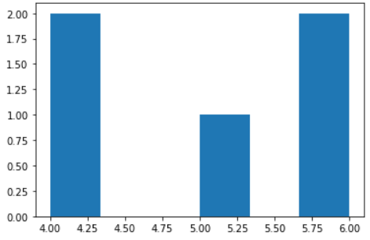
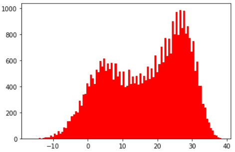
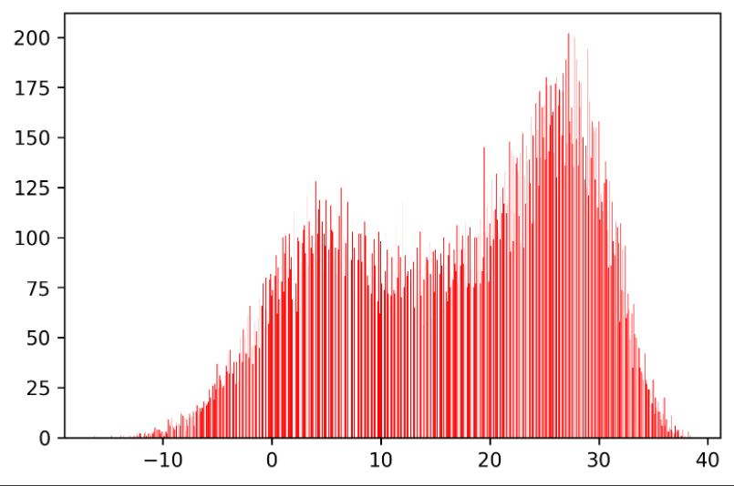
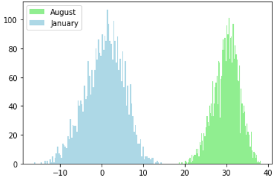
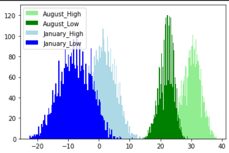

# Histogram

> 1월과 8월의 최고기온과 최저기온을 이용해서 그래프 그리기


```python
#히스토그램 기본

import random
dice = []

for i in range(5):						#반복문 사용해서 5번 수행
    dice.append(random.randint(1,6))	#랜덤함수(1~6까지 랜덤) 값 리스트에 추가
    
print(dice)
plt.hist(dice, bins = 6)				#히스토그램 (bins는 막대 개수)
```



 

```python
import csv
f =  open('./seoul_book.csv', encoding = 'cp949')
data = csv.reader(f)
next(data)
result = []

for row in data:
  if row[-1] != '':
    result.append(float(row[-1]))

import matplotlib.pyplot as plt
plt.hist(result, bins = 100, color = 'r')
```




```python
plt.figure(dpi = 300)
plt.hist(result, bins = 1000, color = 'red')
plt.show()
```




---

### 데이터 이용해서 히스토그램 그리기

```python
#8월과 1월 데이터 출력(최고 기온)

import csv
f = open('./seoul_book.csv', encoding = 'cp949')
data = csv.reader(f)
next(data)
aug = []		#8월치 넣을 리스트		
jan = []		#1월치 넣을 리스트

for row in data:
    month = row[0].split('-')[1]		#0번째(날짜)를 -로 분할해서 1번째 부분을 month
    if row[-1] != '':					#최고기온이 빈칸이 아니면
        if month == '08':				#그리고 월이 8월이면
            aug.append(float(row[-1]))	#aug 리스트에 실수형 최고기온 추가
        elif month == '01':				#만약 월이 1월이면
            jan.append(float(row[-1]))	#jan 리스트에 실수형 최고기온 추가
            
import matplotlib.pyplot as plt
plt.hist(aug, bins = 100, color = 'lightgreen', label = 'August')	#aug 히스토그램
plt.hist(jan, bins = 100, color = 'lightblue', label = 'January')	#jan 히스토그램
plt.legend()							#라벨 표시
plt.show()								#출력
```




 ```python
 #8월과 1월의 최고기온과 최저기온 모두 나타내기
 
 import csv
 import matplotlib.pyplot as plt
 
 f = open('./seoul_book.csv', encoding = 'cp949')
 data = csv.reader(f)
 next(data)
 aug_high = []		#8월 최고기온 리스트
 aug_low = []		#8월 최저기온 리스트
 jan_high = []		#1월 최고기온 리스트
 jan_low = []		#1월 최저기온 리스트
 
 for row in data:
     month = row[0].split('-')[1]
     if row[-1] != '' and row[-2] != '':
         if month == '08':
             aug_high.append(float(row[-1]))
             aug_low.append(float(row[-2]))
         elif month == '01':
             jan_high.append(float(row[-1]))
             jan_low.append(float(row[-2]))
             
 plt.hist(aug_high, bins = 100, color = 'lightgreen', label = "August_High")
 plt.hist(aug_low, bins = 100, color = 'green', label = 'August_Low')
 plt.hist(jan_high, bins = 100, color = 'lightblue', label = 'January_High')
 plt.hist(jan_low, bins = 100, color = 'blue', label = 'January_Low')
 plt.legend()
 plt.show()
 ```




