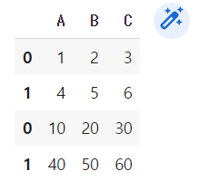
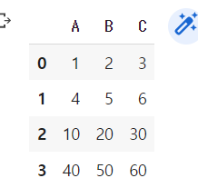

# 데이터 합치기

> 행이 서로 분리되어 있는 데이터 하나의 데이터 프레임으로 합치기


Pandas에서는 데이터를 합치는 방식이 두 가지가 있다.

**merge**와 **concat**


```python
import pandas as pd
import numpy as np
from pandas import Series, DataFrame

df1 = DataFrame(np.arange(1,7).reshape(2,3), columns=list('ABC'))
df2 = DataFrame(np.arange(10,61,10).reshape(2,3), columns=list('ABC'))

#concat
pd.concat([df1, df2], axis = 0)		#행의 결합 >> 기본은 세로 방향으로 합쳐짐
pd.concat([df1, df2], axis = 1)		#열의 결합 >> axis 이용해서 가로 방향으로
pd.concat([df1, df2], ignore_index = True)	#순차적인 인덱스 부여

emp = pd.read_csv('./emp.csv')		#emp라는 파일 불러오기
df_dept = DataFrame({'deptno' : [10,20,30], 'dname' : ['인사부','총무부','분석팀']})

#merge
#pd.merge(left,				#1번째 데이터프레임
#        right,				#2번째 데이터프레임
#        how = 'inner',		#같은 값이 있을 때만 조인
#        on = ,				#조인하는 컬럼(컬럼명이 서로 같을 때)
#        left_on = ,		#컬럼명이 틀릴 때 첫 번째 데이터 프레임 조인
#        right_on = 		#컬럼명이 틀릴 때 두 번째 데이터 프레임 조인
#        )
pd.merge(emp, df_dept, how = 'inner', on = 'deptno')

df_dept_new = DataFrame({'deptno' : [10,20], 'dname' : ['인사총무부','IT분석팀']})
pd.merge(emp, df_dept_new, on = 'deptno')	#30번 부서원 생략
pd.merge(emp, df_dept_new, on = 'deptno', how = 'outer')	#NaN생김(30번)
pd.merge(emp, df_dept_new, on = 'deptno', how = 'left')
```


| merge(병합)                                                  | concat(연결)                                            |
| ------------------------------------------------------------ | ------------------------------------------------------- |
| 공통된 하나의 열을 기준으로 동일한 값을 가지는 행을 찾은 뒤 nXm 조합으로 합치기 | 동일한 인덱스나 컬럼을 가지고 있을 때 연속적으로 붙이기 |
| pd.merge(emp, df_dept, how='inner', on='deptno')             | pd.concat([df1, df2], axis = 0)                         |





​									`pd.concat([df1, df2], ignore_index = True)`를 했을 때 변화