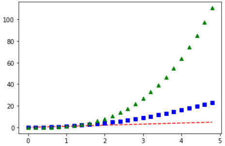
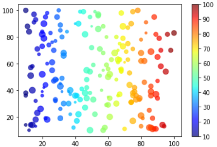
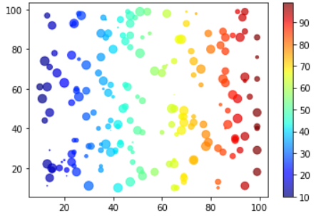
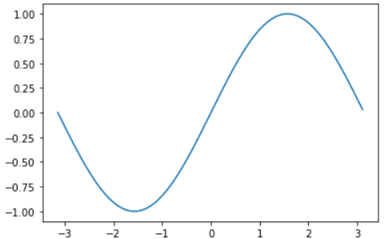
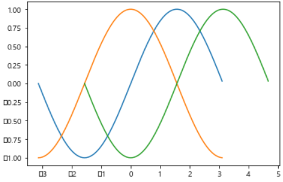
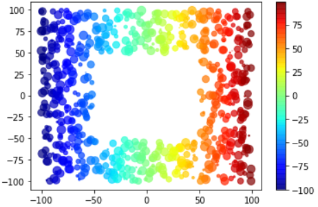

# Numpy

> NUMerical PYthon


### 일반 리스트와 넘파이의 차이

```python
#일반 리스트로
import matplotlib.pyplot as plt
t = []
p2 = []
p3 = []

for i in range(0,50,2):
    t.append(i/10)
    p2.append((i/10) ** 2)
    p3.append((i/10) ** 3)
    
plt.plot(t, t, 'r--', t, p2, 'bs', t, p3, 'g^')
plt.show()
```



```python
#넘파이 사용시
import matplotlib.pyplot as plt
import numpy as np
t = np.arange(0.,5.,0,2) 	#0이상 5미만 구간, 0.2 간격으로 실수 생성
plt.plot(t, t, 'r--', t, t**2, 'bs', t, t**3, 'g^')
plt.show()
```


​                      				

​								*** "결과적으로는 차이가 없지만, 코드가 간결하고 for문이 없어서 빠름"***		


---

### numpy 라이브러리의 함수

```python
import numpy as np
print(np.sqrt(2))		#제곱근
print(np.pl)			#원주율
print(np.sin(0))		#싸인
print(np.cos(np.pi))	#코싸인
```

```python
#random 함수
a = np.random.rand(5)	#0과 1사이 n개 실수 5개 반환 / randint << 정수 반환
print(a)
print(type(a))			#리스트와 유사한 배열

print(np.random.choice(6,10))	#1~5까지 숫자를 10번 랜덤 선택
print(np.random.choice(6,10, replace = False))	#'중복 없이'

print(np.random.choice(6,10, p = [0.1,0.2,0.3,0.1,0.2,0.1])) #확률 설정 >> 합 1
```


---

### 라이브러리 이용해서 그래프 그리기

```python
#버블 차트
import matplotlib.pyplot as plt
import random

x = []
y = []
size = []

for i in range(200):
    x.append(random.randint(10,100))	#10~100 사이 랜덤 정수 x에 추가
    y.append(random.randint(10,100))
    size.append(random.randint(10,100))
    
plt.scatter(x,y, s = size, c = x, cmap = 'jet', alpha = 0.7)
plt.colorbar()
plt.show()
```




```python
#numpy 활용
import matplotlib.pyplot as plt
import numpy as np

x = np.random.randint(10, 100, 200)  # 10 이상 100 까지 정수 200개
y = np.random.randint(10, 100, 200)
size = np.random.rand(200) * 100 # 0에서 1 사이의 200개의 실수(float)를 만들고 * 100
    
plt.scatter(x, y, s=size, c=x, cmap='jet', alpha=0.7)
plt.colorbar()
plt.show()
```




---

### numpy array

```python
import numpy as np
a = np.array([1,2,3,4])
print(a)					#[1 2 3 4] << 구분하는 쉼표가 없음

print(a[1], a[-1])			#2 4
print(a[1:])				#[2 3 4] << 슬라이싱 가능

a = np.array([1,2,'3',4])
print(a)					#['1','2','3','4'] << 한 가지 타입의 데이터만 저장 가능

a = np.zeros(10)
print(a)					#0으로 이뤄진 크기가 10인 배열 생성
#[0. 0. 0. 0. 0. 0. 0. 0. 0. 0.]
a = np.ones(10)
print(a)					#1로 이뤄진 크기가 10인 배열 생성
#[1. 1. 1. 1. 1. 1. 1. 1. 1. 1.]

a = np.eye(3)
print(a)					#3X3 단위 배열 생성
#[[1. 0. 0.]
# [0. 1. 0.]
# [0. 0. 1.]]

print(np.arange(3))			#0~2 
print(np.arange(3,7))		#3~6
print(np.arange(3,7,2))		#3, 5 << 간격이 2
print(np.arange(1,2,0.1))	#0.1간격 실수 배열
print(np.arange(1,2,11))	#11개 구간으로 나눈 실수 배열

print(np.arange(-np.pi, np,pi, np,pi/10))
print(np.linspace(-np.pi, np.pi, 20))	#20개로
```


---

### numpy array 활용

```python
import numpy as np

a = np.zeros(10) + 5
print(a)				#10개의 요소가 다 5가 나옴
a = np.zeros(10) + 2
print(a)				#10개의 요소가 다 2가 나옴

a = np.linspace(1,2,11)	#1~2까지 11개 구간으로 나눈 실수 배열
print(np.sqrt(a))		# >> 배열에 연산이나 함수 적용하면 배열 모든 값 한 번에 계산 >> b
#[1.         1.04880885 1.09544512 1.14017543 1.18321596 1.22474487
# 1.26491106 1.30384048 1.34164079 1.37840488 1.41421356]
```

```python
import matplotlib.pyplot as plt
import numpy as np

a = np.arange(-np.pi, np.pi, np.pi/100)
plt.plot(a, np.sin(a))	#특정 구간의 sin() 모습을 쉽게 시각화
plt.show()
```



```python
plt.plot(a, np.sin(a))
plt.plot(a, np.cos(a))
plt.plot(a+np.pi/2, np.sin(a))
plt.show()			# << 함수의 평행이동
```




---

### mask

> 어떤 조건에 부합하는 데이터만 선별적으로 저장


```python
import numpy as np

a = np.arange(-5,5)
print(a)				
print(a<0)				#0보다 작은 값인지 확인 >> True or False
print(a[a<0])			#위 조건을 배열에 적용하면 그 데이터만 출력
#[-5 -4 -3 -2 -1  0  1  2  3  4]
#[ True  True  True  True  True False False False False False]
#[-5 -4 -3 -2 -1]

mask1 = abs(a) > 3
mask2 = abs(a) % 2 == 0
print(a[mask1+mask2])		#두 조건 중 하나라도 참인 거
print(a[mask1*mask2])		#두 조건 모두 참인 거
#[-5 -4 -2  0  2  4]
#[-4  4]
```

```python
#Bubble chart
import matplotlib.pyplot as plt
import numpy as np

x = np.random.randint(-100, 100, 1000)
y = np.random.randint(-100,100, 1000)

mask1 = abs(x) > 50		#절대값이 50보다 크면 거르기
mask2 = abs(y) > 50

x = x[mask1+mask2]
y = y[mask1+mask2]

size = np.random.rand(len(x)) * 100

plt.scatter(x, y, s = size, c = x, cmap = 'jet', alpha = 0.7)
plt.colorbar()
plt.show()
```

