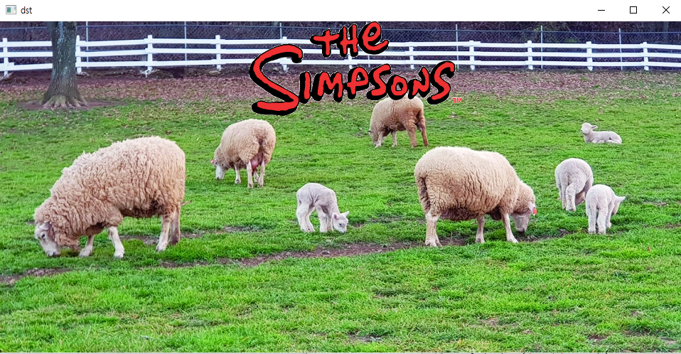

# OpenCV

> opencv를 설치하고
>
> 이를 이용해서 이미지를 데려오고 크기와 색상 등을 조절하는 기초 내용 복습


```python
! pip install opencv-python
```

```python
import cv2
import numpy as np
import sys
cv2.__version__  #4.5.5
```

```python
img = cv2.imread(filename = './fig/puppy.bmp') #이미지 파일 불러와
cv2.namedWindow('image')
cv2.imshow('image', img)   #imshow로 보여주기
cv2.waitKey()              #이것까지 써야 창이 뜸
cv2.distroyAllWindows()    #어떤 키를 누르든 키를 누르면 종료
```

```python
import cv2
import numpy as np
import sys
#보통 창에서 문제가 생기면 커널이 죽어버려서 그냥 임포트 여기에다가 한 번에 씀

img = cv2.imread(filename = './fig/puppy.bmp') #안쓰면 그냥 디폴트 컬러
type(img) #numpy.ndarray
img.shape  #(480, 640, 3)

img2 = cv2.imread(filename = './fig/puppy.bmp',
                flags = cv2.IMREAD_GRAYSCALE)   #grayscale로 하면 
img2.shape  #(480, 640)

img3 = cv2.imread(filename = './fig/puppy.bmp',
                flags = cv2.IMREAD_COLOR)
img3.shape  #(480, 640, 3)

print('image dimension', img.shape)

if img is None:       #만약 파일이 없으면
    print('image read failed')
    sys.exit()        #나와

cv2.namedWindow('image')
cv2.imshow('image', img3)
key = cv2.waitKey()
print(key)                        #아스키 키값이 출력됨
cv2.destroyAllWindows()
```

```python
#사이즈를 줄이고 싶을 땐?
img = cv2.imread('./fig/puppy_jpg', cv2.IMREAD_REDUCED_GRAYSCALE_2) #이렇게 사이즈 줄임
if img is None:
    print('image read failed')
    sys.exit()

cv2.namedWindow('image')
cv2.imshow('image', img)
cv2.waitKey()
cv2.destroyAllWindows()
```

```python
img = cv2.imread('./fig/puppy.bmp', cv2.IMREAD_COLOR)  #이렇게 쓰면 작아져서 나옴
#print(img.shape)

if img is None:
    print('image read failed')
    sys.exit()

img_re = cv2.resize(img, (320, 240), interpolation = cv2.INTER_AREA)  
#영상 보관 방식(interpolation)
    
cv2.namedWindow('image')
cv2.namedWindow('image_re')
cv2.imshow('image', img)
cv2.imshow('image_re', img_re)
cv2.imwrite('puppy_resize.png', img_re)
cv2.waitKey()
cv2.destroyAllWindows()
```

```python
#창의 위치를 바꾸고 싶을 때
img = cv2.imread('./fig/puppy.bmp', flags = cv2.IMREAD_COLOR)

if img is None:
    print('image read failed')
    sys.exit()
    
cv2.namedWindow('image', cv2.WINDOW_AUTOSIZE)  # < 이거 안해도 창이 뜨긴 함
#cv2.namedWindow('image', cv2.WINDOW_NORMAL)  # < 사이즈 왔다갔다 가능
cv2.moveWindow('image',0,0)  #여기서 창의 위치 바꿈
cv2.imshow('image', img)

cv2.waitKey()
cv2.destroyAllWindows()
```

```python
img = cv2.imread('./fig/puppy.bmp', cv2.IMREAD_COLOR)

if img is None:
    print('image read failed')
    sys.exit()
    
cv2.namedWindow('image')
cv2.imshow('image' img)

while True:
    key = cv2.waitKey()
    if key == ord('q') or key == 27:  #q키를 누르거나 esc 키를 누르면
        break
        
cv2.destroyAllWindows()
```

```python
#out창에도 사진이 나오게 
import matplotlib.pyplot as plt

img = cv2.imread('./fig/puppy.bmp', cv2.IMREAD_COLOR)
#bgr 순서(openCV는)
if img is None:
    print('filed')
    sys.exit()
    
cv2.namedWindow('image')
cv2.imshow('image',img)

imgRGB = cv2.cvtColor(img, cv2.COLOR_BGR2RGB) #이렇게 bgr을 rgb로 바꿔놔야 사진이 정상으로 나와
imgGray = cv2.cvtColor(img, cv2.COLOR_BGR2GRAY)

plt.subplot(131), plt.imshow(img), plt.axis('off')
plt.subplot(131), plt.imshow(imgRGB), plt.axis('off')
plt.subplot(131), plt.imshow(imgGray, cmap = 'gray'), plt.axis('off')

plt.imshow(imgGray, cmap = 'gray')  #cmap을 gray로 해줘야 나옴
plt.axis('off')
plt.show()
#rgb로 인식(plt)

while True:
    key = cv2.waitKey()
    if key == 27:
        break

cv2.destroyAllWindows()
```

```python
#for문 돌려서 연속으로 이미지 파일이 나오게
import os

img_list = os.listdir('./fig/images/')
#print(img_list)

img_path = []

for i in img_list:
    img_path_all = './fig/images/' + i
    img_path.append(img_path_all)
#img_path

cv2.namedWindow('image', cv2.WINDOW_NORMAL)              #그냥 전체화면(창은 나옴)
cv2.setWindowProperty('image', cv2.WND_PROP_FULLSCREEN,  #진짜 ㄹㅇ 전체화면으로 뜸(창까지 다 없애서)
                     cv2.WINDOW_FULLSCREEN)

for i in img_path:
    img = cv2.imread(i, cv2.IMREAD_COLOR)
    cv2.imshow('image', img)
    cv2.waitKey(3000)
    
cv2.destroyAllWindows()
```

```python
#for문 말고 무한루프로 나오게 하면서 esc키를 누르면 나오게
idx = 0

while True:
    img_name = img_path[idx]
    img = cv2.imread(img_name, cv2.IMREAD_COLOR)
    
    cv2.imshow('image', img)
    if cv2.waitKey(2000) == 27:
        break
    
    idx += 1
    
    if idx >= len(img_path):
        idx = 0
        
cv2.destroyAllWindows()
```


### 정리

---

resize 할 때

\> `cv2.resize(img, (320, 240), interpolation = cv2.INTER_AREA)`


창의 사이즈를 왔다갔다 조절하고 싶을 때

\> `cv2.namedWindow('image', cv2.WINDOW_NORMAL)`


창의 위치 지정

\> `cv2.moveWindow('image', 0, 0)`    #0,0은 왼쪽 위가 시작


rgb로 바꾸기

\> `cv2.cvtColor(img, cv2.COLOR_BGR2RGB)`

\>` cv2.cvtColor(img, cv2.COLOR_BGR2GRAY)`


주피터 내에서 사진 나타내기

\> matplot으로

\> `plt.subplot(131), plt.imshow(img), plt.axis('off')`


창은 나오는 전체화면으로 나타내기

\> `cv2.namedWindow('image', cv2.WINDOW_NORMAL)`


창까지 안나오는 완전 전체화면으로

\> `cv2.setWindowProperty('image', cv2.WIND_PROP_FULLSCREEN, cv2.WINDOW_FULLSCREEN)`

---


## 둘째 날

```python
#픽셀값 참조
img = cv2.imread('./fig/puppy.bmp', 1)
img2 = cv2.imread('./fig/puppy.bmp', 0)

x = 120
y = 320

img1_move = img1[y, x] #x축 y축으로 옮긴 값  #[194 198 209]
img2_move = img2[y, x]  #201 << 얘는 흑백이어서

h, w = img1.shape[:2]
img1_center = img1[h//2, w//2]  #[0 14 40]
img2_center = img2[h//2, w//2]  # 20

img1[10:110, 100:200] = (200, 0, 250)
img2[10:110, 100:200] = 200  #흑백에 컬러로 넣으면 오류남(한 개만 써야)

cv2.imshow('image1', img1)
cv2.imshow('image2', img2)
cv2.waitKey()
cv2.destroyAllWindows()
```

```python
img1 = np.zeros((240, 320, 3), dtype = np.uint8)
img2 = np.ones((240, 320), dtype = np.uint8)*255  #255로 하면 하얀 화면
img3 = np.full((240, 320, 3), 255, dtype = np.uint8) #안에다가 255 넣어도 됨
img4 = np.random.randint(o, 255, size = (240,320), dtype = np.uint8) #0~255까지 랜덤

img1[10:60,10:60] = (200,0,200) #(R, G, B)순서
```

```python
#영상 복사
img1 = img #이렇게 하면 둘 중에 하나가 바뀌면 나머지도 바뀜
img2 = img.copy()  #이렇게 copy()를 써야 바뀐 게 적용이 안됨
```

```python
#사진에 원 그리기
img = cv2.imread('./fig/puppy.bmp')
img2 = img1[200:400, 300:500]
img3 = img2.copy()

#circle(img, center, radius, color[, thickness[, lineType[, shift]]]) -> img
cv2.circle(img2, (120, 90), 50, (250, 0, 120), -1, cv2.LINE_AA) #라인을 자연스럽게(안삐뚤)
```

```python
#copyTo
src = cv2.imread('./fig/airplane.bmp', cv2.IMREAD_COLOR)
mask = cv2.imread('./fig/mask_plane.bmp', c2.IMREAD_GRAYSCALE)
dst = cv2.imread('./fig/field.bmp', cv2.IMREAD_COLOR)

cv2.copyTo(src, mask, dst) #0이 아닌 부분을 뽑아서 합성
```

```python
##만약 mask가 없으면 > mask를 만드는 방법
src_gray = cv2.cvtColor(src, cv2.COLOR_BGR2GRAY)
ret, mask = cv2.threshold(src_gray, 165, 255, cv2.THRESH_BINARY_INY)
#를 copyTo 위에 
```

```python
#송아지 사진을 합성
src = cv2.imread('./fig/cow.png')
dst = cv2.imread('./fug/green.png')
src_gray = cv2.cvtColor(src, cv2.COLOR_BGR2GRAY)

h, w = src.shape[:2]  
src.shape #600 /600
dst.shape #1125 / 1500

img2 = cv2.resize(dst, (w, h), cv2.INTER_AREA)  #이렇게 resize를 해야 합성이 됨(사이즈를 맞춰야)

ret, mask = cv2.threshold(src_gray, 246, 255, cv2.THRESH_BINARY_INV)
```

```python
#송아지 사진을 합성하는데 좀 더 사실적으로
img1 = cv2.imread('/.fig/cow.png')
img2 = cv2.imread('./fig/green.png')

h, w = img1.shape[:2]

img2_seg = img2[350:350+h, 200:200+w] #개 코 뜯어서 원 그렸을 때 원본에도 그려졌던 것과 같은 이치

ret, mask = cv2.threshold(img1, 244, 255, cv2.THRESH_BINARY_INV)

cv2.copyTo(img1, mask, img2_seg)

cv2.imshow('img1', img1)
cv2.imshow('img2', img2)
cv2.imshow('mask', mask)
cv2.imshow('img_seg', img2_seg)
cv2.waitKey()
cv2.destroyAllWindows()
```

```python
#양떼 목장 사진에서 심슨 사진 합성하기

src = cv2.imread('./simpson.png')
dst = cv2.imread('./sheep.jpg')
src_gray = cv2.cvtColor(src, cv2.COLOR_BGR2GRAY)
dst.shape  #466/960
src.shape  #133/300

h, w = src.shape[:2]

dst_size = dst[0:0+h, 350:350+w]

ret, mask = cv2.threshold(src_gray, 250, 255, cv2.THRESH_BINARY_INV)

cv2.copyTo(src, mask, dst_size)

cv2.imshow('src', src)
cv2.imshow('mask', mask)
cv2.imshow('dst_size', dst_size)
cv2.imshow('dst', dst)
cv2.waitKey()
cv2.destroyAllWindows()
```



```python
#알파 채널 이용해서 강아지 얼굴에 안경 합치기
src = cv2.imread('./fig/puppy.bmp')
img_alpha = cv2.imread('./fig/imbin_sunglasses_1.png', cv2.IMREAD_UNCHANGED)
#알파 쓸 때는 꼭 unchanged를 써야 함

sunglass = img_alpha[:,:,0:3] #왜냐하면 sunglass.shape이 480,960,4이기 때문에 0~3을 가져와야 함
mask = img_alpha[:,:,-1] #4번째 거 가져옴
#이거 둘이 합친 게 선글라스가 됨

cv2.copyTo(img_alpha, mask, src)

cv2.imshow('mask', mask)
cv2.imshow('src', src)
cv2.imshow('sunglass', sunglass)
cv2.waitKey()
cv2.destroyAllWindows()
#이렇게 하면 그냥 띄우기

#-------------------------------------------------------------------------------

#안경씌우기
#안경 사이즈를 src에 맞게 줄인 후 copyTo
src = cv2.imread('./fig/puppy.bmp', cv2.IMREAD_COLOR)
img_alpha = cv2.imread('./fig/imgbin_sunglasses_1.png', cv2.IMREAD_UNCHANGED)

img_alpha = cv2.resize(img_alpha, (300, 150))  

if src is None or img_alpha is None:
    print('failed')
    sys.exit()

sumglass = img_alpha[:,:,0:3]   #sunglass인데 오타냄
mask = img_alpha[:,:,-1]     #마스크는 흑백으로 만들지 않고 컬러로 해놔야 색이 바뀜

h, w = mask.shape[:2]
crop = src[120:120+h, 220:220+w]  #120~120+h , 220 ~ 220+w 만큼을 crop

crop[mask > 0] = (255, 0, 255)  #선글라스 색깔 바꾸기

#cv2.copyTo(sumglass, mask, crop)

#cv2.copyTo(img_alpha, mask, src)

cv2.imshow('sunglass', sumglass)
cv2.imshow('mask', mask)
cv2.imshow('src', src)
cv2.imshow('crop', crop)
cv2.waitKey()
cv2.destroyAllWindows()')
```

