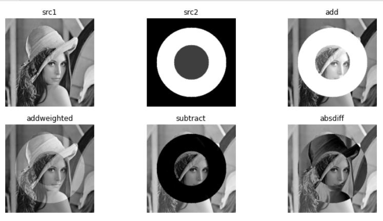
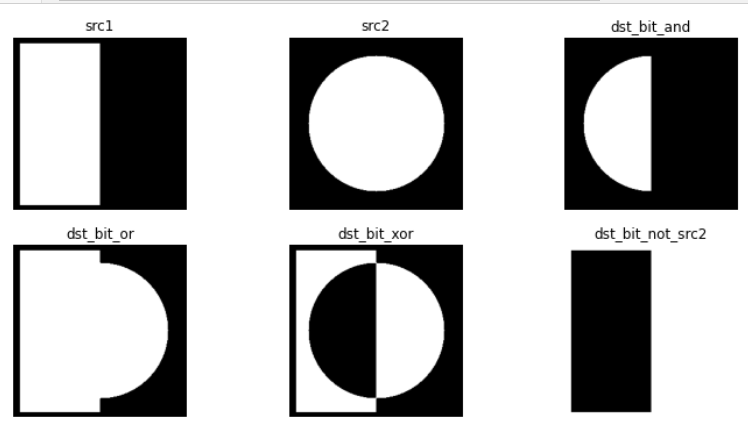

# 1) 키, 마우스, 트랙바로 컨트롤하기


###  키

---

```python
img = cv2.imread('./fig/cat.bmp', 0)

if img is None:
    print('failed')
    sys.exit()
    
img1 = img.copy()

cv2.imshow('image', img)

while True:
    key = cv2.waitKey()
    
    if key == 27:
        break
    elif key == ord('e'):
        cv2.Canny(img, 50, 150)
        cv2.imshow('image', img)
        
    elif key == ord('i'):
        img = 255 - img
        cv2.imshow('image', img)
        
    elif key == ord('r'):
        img = img1.copy()
        cv2.imshow('image', img)  #리셋할 때는 copy를 이용해서 해야
        
cv2.destroyAllWindows()
```


###  마우스

---

```python
def call_mouse(event, x, y, flags, param):
    if event == cv2.EVENT_LBUTTONDOWN:     	#누를 때 좌표
        prnt('left button down : ', x, y)
    elif event == cv2.EVENT_LBUTTONUP: 		#눌렀다가 뗐을 때 좌표
        print('left button up : ', x, y)
    elif e vent == cv2.EVENT_MOUSEMOVE:		#움직일 때 좌표들 다 나옴
        if flags == cv2.EVENT_FLAG_LBUTTOM:	#이렇게 써야 눌렀을 때 상태의 좌표들만 나옴(클릭 후)
            print(x,y)

img = np.ones((480,640,3), np.uint8) * 255

cv2.namedWindow('image')
cv2.setMouseCallback('image', call_mouse, img) 
#어느 창에서 받을 건지 / 이 함수를 호출해라 / 인자
cv2.imshow('image', img)
cv2.waitKey()
cv2.destroyAllWindows()
```

```python
#마우스로 그림 그려보기
oldx = oldy = 0
def call_mouse(event, x, y, flags, param):
    global oldx, oldy
    if event == cv2.EVENT_LBUTTONDOWN:     	#누를 때 좌표
        prnt('left button down : ', x, y)
    elif e vent == cv2.EVENT_MOUSEMOVE:		#움직일 때 좌표들 다 나옴
        if flags == cv2.EVENT_FLAG_LBUTTOM:	#이렇게 써야 눌렀을 때 상태의 좌표들만 나옴(클릭 후)
            cv2.line(img, (oldx, oldy), (x, y), (250,10,10), 4, cv2.LINE_AA)
            cv2.imshow('image', img)
            oldx, oldy = x, y #0으로 가면 0이랑 이어져서 이상해짐

img = np.ones((480,640,3), np.uint8) * 255

cv2.namedWindow('image')
cv2.setMouseCallback('image', call_mouse, img) 
#어느 창에서 받을 건지 / 이 함수를 호출해라 / 인자
cv2.imshow('image', img)
while True:
    
    key = cv2.waitKey()
    
    if key == 27:
        break
    
    elif key == ord('w'):
        cv2.imwrite('./fig/sign.jpg', img)  #저장
        

cv2.destroyAllWindows()
```


###  트랙바 나타내기

---

```python
def call_trackbar(pos):
    img[:] = pos
    cv2.imshow('image', img)
    
img = np.zeros((480, 640), np.uint8)
cv2.namedWindow('image')
cv2.createTrackbar('level', 'image', 50, 255, call_trackbar) #최대값은 항상 255
cv2.imshow('image', img)
cv2.waitKey()
cv2.destroyAllWindows()
```

```python
#선글라스 이미지가 트랙바로 나타나게

def trackbar(pos):
    global mask
    img_glass = mask*pos   #mask 0~1인데 pos값에 곱해져서 나옴 >> 그래서 곱해야
    cv2.imshow('mask', img_glass)
    
img = cv2.imread('./fig/imgbin_sunglasses_1.png', cv2.IMREAD_UNCHANGED)
mask = img[:,:,-1]

mask[mask > 0] = 1  #여기 부분도 잘 이해가 안 감 아직까지

cv2.namedWindow('mask', cv2.WINDOW_NORMAL)
cv2.imshow('mask',mask)
cv2.createTrackbar('level', 'mask', 0, 255, trackbar)
cv2.waitKey()
cv2.destroyAllWindows()
```


# 2) 포인트 프로세싱

```python
#흑백영상 포인트 프로세싱
src = cv2.imread('../Ch_3_Basic_img_proc/fig/lenna.bmp', cv2.IMREAD_GRAYSCALE)

#dst = np.clip(src + 100., 0, 255).astype(np.uint8) #0부터 255까지
#위에 걸 한 번에 해주는 함수가 아래 거
dst = cv2.add(src + 100)

cv2.imshow('src', src)
cv2.imshow('dst', dst)
cv2.waitKey()
cv2.destroyAllWindows()
```

```python
#컬러 영상 포인트 프로세싱
src = cv2.imread('../Ch_3_Basic_img_proc/fig/lenna.bmp', 1)

dst = cv2.add(src,(100,100,100,0))  #마지막 0은 알파

cv2.imshow('src', src)
cv2.imshow('dst', dst)
cv2.waitKey()
cv2.destroyAllWindows()
```

```python
#add, addweight, subtract, absdiff
src1 = cv2.imread('../Ch_3_Basic_img_proc/fig/lenna256.bmp', 1)

src2 = np.zeros_like(src1, dtype = np.uint8)
cv2.circle(src2, (128, 128), 100, 205, -1)
cv2.circle(src2, (128,128), 50, 50, -1)

dst1 = cv2.add(src1, src2)
dst2 = cv2.addWeighted(src1, 0.8, src2, 0.2, 0.0)  #숫자는 비율
dst3 = cv2.subtract(src1, src2)
dst4 = cv2.absdiff(src1, src2)

plt.figure(figsize = (12,6))
plt.subplot(231), plt.imshow(src1, cmap = 'gray'), plt.axis('off'), plt.title('src1')
plt.subplot(232), plt.imshow(src2, cmap = 'gray'), plt.axis('off'), plt.title('src2')
plt.subplot(233), plt.imshow(dst1, cmap = 'gray'), plt.axis('off'), plt.title('add')
plt.subplot(234), plt.imshow(dst2, cmap = 'gray'), plt.axis('off'), plt.title('addweighted')
plt.subplot(235), plt.imshow(dst3, cmap = 'gray'), plt.axis('off'), plt.title('subtract')
plt.subplot(236), plt.imshow(dst4, cmap = 'gray'), plt.axis('off'), plt.title('absdiff')
plt.show()

cv2.waitKey()
cv2.destroyAllWindows()
```



```python
#bitwise_and / or / xor / not
src1 = np.zeros((256,256), np.uint8)
cv2.rectangle(src1, (10,10), (127, 248), 255, -1)

src2 = np.zeros((256,256), np.uint8)
cv2.circle(src2, (128, 128),100, 255, -1)

dst_bit_and = cv2.bitwise_and(src1, src2)
dst_bit_or = cv2.bitwise_or(src1, src2)
dst_bit_xor = cv2.bitwise_xor(src1, src2)
dst_bit_not = cv2.bitwise_not(src1)


plt.figure(figsize = (12, 6))
plt.subplot(231), plt.axis('off'), plt.imshow(src1, 'gray'), plt.title('src1')
plt.subplot(232), plt.axis('off'), plt.imshow(src2, 'gray'), plt.title('src2')
plt.subplot(233), plt.axis('off'), plt.imshow(dst_bit_and, 'gray'), plt.title('dst_bit_and')
plt.subplot(234), plt.axis('off'), plt.imshow(dst_bit_or, 'gray'), plt.title('dst_bit_or')
plt.subplot(235), plt.axis('off'), plt.imshow(dst_bit_xor, 'gray'), plt.title('dst_bit_xor')
plt.subplot(236), plt.axis('off'), plt.imshow(dst_bit_not, 'gray'), plt.title('dst_bit_not_src2')
plt.show()

cv2.waitKey()
cv2.destroyAllWindows()
```



```python
src = cv2.imread('../Ch_3_Basic_img_proc/fig/flowers.jpg')

b, g, r = cv2.split(src)
dst = cv2.merge((b, g, r))
dst1 = cv2.merge((r, g, b))
dst2 = cv2.cvtColor(src, cv2.COLOR_BGR2RGB)

cv2.imshow('dst2', dst2)
cv2.imshow('dst1', dst1)
cv2.imshow('src', src)
cv2.imshow('dst', dst)
cv2.imshow('b',b)
cv2.imshow('g',g)
cv2.imshow('r',r)
cv2.waitKey()
cv2.destroyAllWindows()
```


```python
#nearest vs linear

img = cv2.imread('./fig/lenna.bmp')

h, w = img.shape[:2]

img_half = cv2.resize(img, (w//2, h//2), interpolation = cv2.INTER_AREA)
img_double =  cv2.resize(img,(int(2*w), int(2*h)), interpolation = cv2.INTER_AREA)

if img is None:
    print('failed')
    sys.exit()
    
cv2.namedWindow('image', cv2.WINDOW_AUTOSIZE)
cv2.imshow('image', img)
cv2.imshow('image1', img_half)
cv2.imshow('image2', img_double)

while True:
    key = cv2.waitKey()
    if key == 27:
        break
cv2.destroyAllWindows()

#nearest는 사각형이 보임(픽셀처럼/크게 보면)
```


### opencv에서 히스토그램 그리기

``` 
src = cv2.imread('./fig/lenna.bmp', 0)
hist = cv2.calcHist([src], [0], None, [256],[0,256]) #256부분 값을 줄이면 그만큼 합쳐짐
cv2.imshow('src',src)
cv2.waitKey()
cv2.destroyAllWindows()

plt.plot(hist)
plt.show()
```

### 모자 사진과 내 얼굴 사진 합성하기

```python
hat = cv2.imread('./fig/imgbin_hat.png', cv2.IMREAD_UNCHANGED) 
face = cv2.imread('./fig/mypic.JPG')

hat = cv2.resize(hat, (1100,1500))
mask = hat[:,:,-1]

h, w = mask.shape[:2]

crop = face[0:0+h, 60:60+w]  #모자의 위치를 어디로 할 건지 정해줌
crop[mask > 0] = (0, 0, 0)   #근데 이게 정확히 무슨 뜻인지 모르겠음

cv2.namedWindow('face', cv2.WINDOW_NORMAL)
cv2.imshow('face', face)
cv2.waitKey()
cv2.destroyAllWindows()
```

