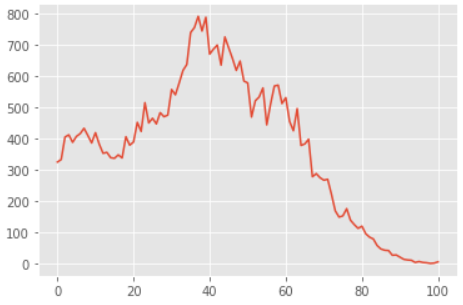
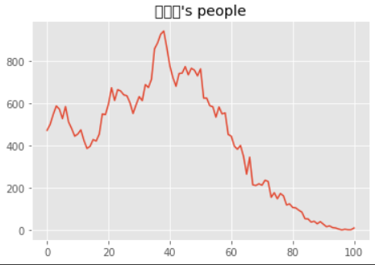
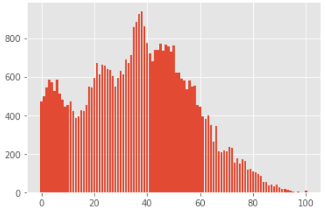
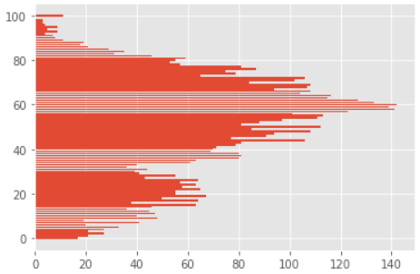
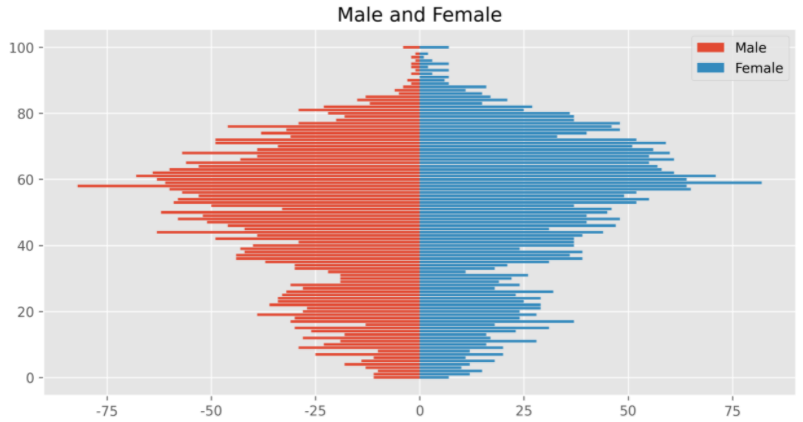

# 우리 동네 인구 구조  시각화

> 동을 입력받아서 그 동네의 인구 구조를 알아보자


## 지역별 인구 구조 시각화

```python
import matplotlib.pyplot as plt
import csv

f = open('./age.csv', encoding = 'cp949')
data = csv.reader(f)

for row in data:
    if '신도림' in row[0]:			#만약 row[0]에 신도림이 들어가면
        print(row)				  #출력
```

```
! 다른 방법 !

for row in data:
  if '신도림' in row[0]:
    print(row)
    
대신 

print('신도림' in '서울특별시 구로구 신도림동(1153051000)')
로 해도 가능
>> 출력 결과는 True
```


```python
#ggplot으로 표현

plt.style.use('ggplot')
plt.plot(result)
plt.show()
```




```python
#자동화 프로그램 만들기

import matplotlib.pyplot as plt
import csv

f = open('./age.csv', encoding = 'cp949')
data = csv.reader(f)
#next(data)

result = []
name = input('인구 구조 알고 싶은 지역 이름 입력 : ')   #string

for row in data:
  if name in row[0]:
    for i in row[3:]:
      result.append(int(i))     #문자열 >> 정수 변경 필요(출력 결과 'str')
print(result)

import matplotlib.pyplot as plt

plt.style.use('ggplot')
plt.rc('font', family = 'Malgun Gothic')
plt.title(name + "'s people")
plt.plot(result)
plt.show()
```

#### 역삼동 출력결과



```
! 한글이 깨져 나오는 이유 !

원래 
plt.rc('font', family = 'Malgun Gothic')
를 쓰면 한글이 잘 나오는데, 구글 코랩으로 작성해서 깨져나온다..ㅠ
```

 

```python
#자동화 프로그램 바 그래프로 그리기

import matplotlib.pyplot as plt
import csv

f = open('./age.csv', encoding = 'cp949')
data = csv.reader(f)
#next(data)

result = []
name = input('인구 구조 알고 싶은 지역 이름 입력 : ')
for row in data:
  if name in row[0]:
    for i in row[3:]:
      result.append(int(i))    
print(result)

plt.bar(range(101), result)			#이 부분만 바꾸면 됨
plt.show()
```




```
plt.barh(range(101), result)
로 하면 출력결과는
```



 

---

## 성별 인구 구조 시각화

> 성별 인구구조 항아리 모형 그리기


```python
import csv
f = open('./gender.csv', encoding = 'cp949')
data = csv.reader(f)

m = []			#남자 담을 리스트
f = []			#여자 담을 리스트

gender = input('성별 분포를 보기 원하는 지역을 입력 : ')

for row in data:
  if gender in row[0]:				#입력받은 지역이 있으면
    for i in row[3:104]:			
      m.append(-int(i))				#-로 표시해서 겹치지 않게 / 남자 리스트에 추가(정수)
    for i in row[106:]:
      f.append(int(i))				#여자 리스트에 추가(정수형으로)

#print(m)
#print(f)

import matplotlib.pyplot as plt
plt.style.use('ggplot')						#ggplot으로
plt.figure(figsize = (10,5), dpi=300)
plt.title('Male and Female')
plt.rc('font', family ='Malgun Gothic')
plt.rcParams['axes.unicode_minus'] = False
plt.barh(range(101), m, label = 'Male')
plt.barh(range(101), f, label = 'Female')
plt.legend()
plt.show()
```

