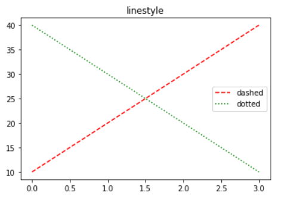
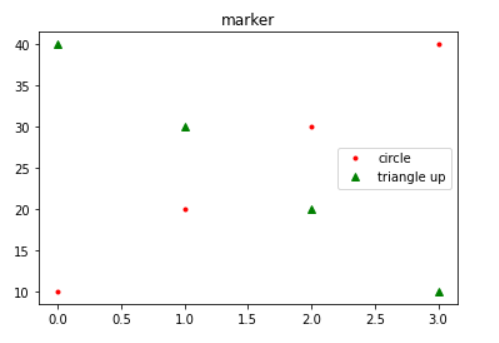
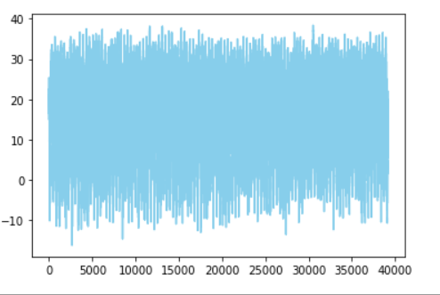
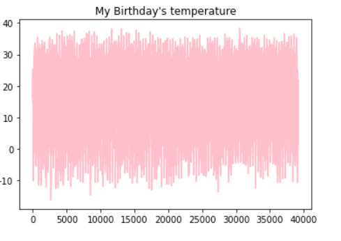
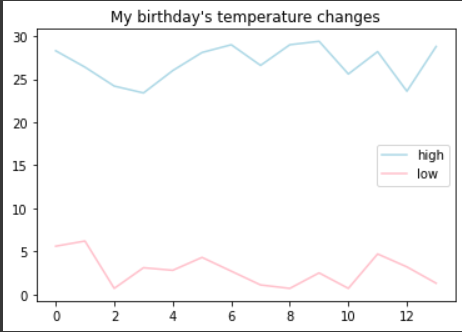

# 기본 그래프 그리기

> 데이터 시각화의 기본


### 선 모양 바꾸기

```python
import matplotlib.pyplot as plt

plt.title('linestyle')		#제목 설정
plt.plot([10,20,30,40], color = 'r', linestyle = '--', label = 'dashed')
plt.plot([40,30,20,10], c = 'g', ls = ':', label = 'dotted')
plt.legend()				#범례 표시
plt.show()
```



---

### 마커 모양 바꾸기

```python
plt.title('marker')
plt.plot([10,20,30,40], 'r.', label = 'circle')
plt.plot([40,30,20,10], 'g^', label = 'triangle up')
plt.legend()
plt.show()
```



---

### 최고기온 그래프 그리기

```python
import csv
import matplotlib.pyplot as plt
f = open('./seoul_book.csv', encoding = 'cp949')
data = csv.reader(f)
next(data)
result = []

for row in data:
	if row[-1] != '':
		result.append(float(row[-1]))
print(result)		#최고기온 모아놓은 리스트 출력
plt.plot(result, 'skyblue') #리스트를 그래프로
plt.show()
```



---

### 내 생일의 기온변화를 그래프로 그리기

```python
for row in data:
    if row[-1] != '':
        if row[0].split('-')[1] == '10' and row[0].split('-')[2] == '30':
            result.append(float(row[-1]))
plt.plot(result, 'pink')
plt.title("My Birthday's temperature")
plt.show()
```



---

### 내 생일의 최고 최저 기온 그래프

```python
import matplotlib.pyplot as plt
import csv
d = open('./seoul.csv') 					#현재 위치의 seoul이라는 csv파일
data = csv.reader(d)
next(data)

low = []									#최저 기온 담을 리스트
high = []									#최고 기온 담을 리스트

for row in data:							
    if row[2] != '':						#만약 row[2]가 공백이 아니면
        if row[2].split('-')[1] == '10':	#만약 -로 나눴을 때 1번째 인덱스가 10이면
            high.append(float(row[5]))		#high에 추가 >> row[5]값을
            low.append(float(row[-2]))		#low에 추가 >> row-[2]값을
            
plt.plot(high, 'lightblue', label = 'high')	#high 그래프 / 연한블루 / 이름 : high
plt.plot(low, 'pink', label = 'low')		#low 그래프 / 핑크색 / 이름 : low
plt.title("My birthday's temepratures")		#제목 정하기
plt.rcParams['axes.unicode_minus'] = False	#마이너스 깨지지 않고 잘 출력될 수 있도록
plt.legend()								#범례 표시하기
plt.show()									#보여줘!
```

