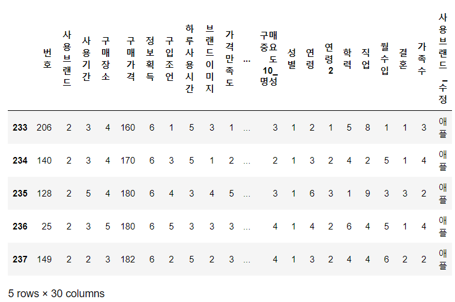
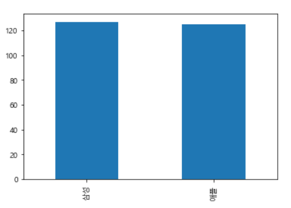
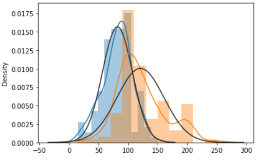
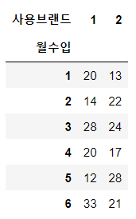

# 통계 기초 - 실습

```python
import numpy as np
import pandas as pd
import matplotlib.pyplot as plt
import seaborn as sns

from scipy.stats import chisquare
from scipy import stats
import scipy as sp
import statsmodels.api as sm
from statsmodels.formula.api import ols, logit, glm
```

```python
df = pd.read_csv('./spstat1.csv', sep = ',', encoding = 'euc-kr')
df[(df['구매가격'] > 150) & (df['구매가격'] < 200)]
```




## 기술통계

> 측정이나 실험에서 수집한 자료의 정리, 요약, 해석, 표현 등을 통해 자료의 특성을 규명


통계 > **데이터를 다루는 목적** > 2가지

1. 기술통계(desciptive statistics)  >> desciptive : 묘사하는, 설명하는(not technique)
2. 추리통계(inferential statistics)

(추리통계는 다음 시간에...)


기술 통계 **기법 **> 2가지

1. 데이터의 집중화 경향에 대한 기법
   - 수집한 데이터를 대표하는 값이 무엇인지, 어떤 값에 집중되어 있는지
   - 평균(mean), 중앙값(median), 최반값(mode) 등
2. 분산도 기법
   - 수집한 데이터가 어떻게 퍼져있는지
   - 뭉쳐있는지, 퍼져있는지
   - 표준편차(standard deviation), 사분위(quartile) 등


**kurtosis**(첨도) : 확률분포의 꼬리가 두꺼운 정도를 나타냄(극단적 편차나 이상치가 많을수록 값 커짐)

​							 =확률분포의 뾰족한 정도(얼마나 평균에 몰려있는가)

​							 3에 가까우면 산포도가 정규분포에 가까움

​							 >3이면 완만한 분포, <3이면 더 뾰족한 분포

```python
df['구매가격'].kurtosis()  #1.3613500036652209
```

**skewness**(왜도) : 분포의 비대칭도(어느 짝으로 쏠렸냐)

​								왜도 0 : 정규분포

​								왜도 > 0 : 왼쪽으로 치우침

​								왜도 < 0 : 오른쪽으로 치우침

```python
df['구매가격'].skew()     #0.8074518614845148
```


```python
df['사용브랜드'].value_counts()  #각 몇 개인지
```


`%matplotlib inline` > IPython에서 제공하는 rich output(그림, 소리..)에 관한 표현방식

\>> notebook 브라우저 안에서 바로 그림을 볼 수 있게 해줌


```python
df['사용브랜드'].replace([1,2],['삼성','애플']).value_counts().plot(kind = 'bar')
```




**T검정** : 검정통계량이 정규분포를 따르며 분포와 관련된 스케일링 변수값들이 알려진 경우에 사용

​			 간편하게 평균을 비교할 수 있는 통계 가설 검정

​			 모집단의 분산이나 표준편차를 알지 못할 때 표본으로부터 추정된 분산이나 표준편차로 검정

1. 두 모집단 평균 간의 차이는 없다 >> 귀무가설

   - 버려질 것으로 예상되는 가설

   - t검정 이후 가설을 수용할지, 기각할지 결정

2. 두 모집단 평균 간의 차이가 있다 >> 대립가설

중 하나를 선택

특징

- 독립된 두집단의 평균 차이가 있는지 검사하는 방법
- 30개 이하의 적은 수의 표본에 대해 활용
- 모집단의 표준편차를 알 수 없을 때 사용 > 모집단의 표준편차 대신 표본의 표준편차 사용


**T값**(t-value) : t검정에 이용되는 검정통계량, 두 집단의 차이의 평균을 표준오차로 나눈 값

​					    t값이 커져서(평균차이가 있을 가능성이 커져서) 기각역에 존재하여 유의확률(p-value)이 						0.05보다 작으면 평균 차이가 유의미한 것으로 해석됨 >> 귀무가설 기각


**T분포** : 평균이 0, 좌우 대칭을 이루며, t값이 커질수록 표준정규분포와 같은 형태


기각역 > 단측검정일 때는 하나 존재 / 양측검정일 때는 두 개 존재

유의확률(p-value) : 귀무가설이 맞다고 가정할 때 얻은 결과보다 극단적인 결과가 실제로 관측될 확률


```python
mean1 = df[df['사용브랜드'] == 1].구매가격.values #브랜드가 삼성인 것들의 구매가격 값들
mean2 = df[df['사용브랜드'] == 2].구매가격.values
```

```python
%matplotlib inline
sns.distplot(mean1, kde = True, fit = sp.stats.norm) #커널 데스티네이션(커널 밀도 함수)
sns.distplot(mean2, kde = True, fit = sp.stats.norm) #fit > 튜플을 pdf형태로 받아서 그리드형태로 그려줌
plt.show()
sp.stats.shapiro(mean1)
```




**교차분석**(카이제곱 검정) : 질적 독립변수와 질적 종속변수의 관계를 보기 위한 분석

​											 ex) 거주지역과 성별간 관계를 알아보고 싶을 때 쓰는 방식

```python
pd.crosstab(df['월수입'],df['사용브랜드'])
```



```
#chisquare() 이 부분은 강사님이 다음날에 다시 공부해서 알려주신댜
```


레빈테스트 : 둘 이상의 그룹에 대해 계산된 변수에 대한 분산의 동등성을 평가하는 데 사용


비교하고픈 그룹이 3개 이상일 때 분석하는 방법 >> 분산분석(ANOVA), kruskal-wallis test

|          | 모수적 방법 | 비모수적 방법          |
| -------- | ----------- | ---------------------- |
| 2개      | T-test      | wilcoxon rank sum test |
| 3개 이상 | ANOVA       | kruskal-wallis test    |

(모수 : 모집단의 모평균, 모표준편차, 모분산 등)

\- 모수적 방법과 비모수적 방법은 정규성 가정을 만족하는지 여부에 따라 나뉨


**가정 검토**

1. 정규성 가정
   - 표본의 크기가 충분히 크지 않은데 모집단이 정규분포를 따르는지 모를 때 사용하는 검정
   - 내가 뽑은 표본이 정규분포를 따르는 모집단에서 나온 건지 아닌지 판단
2. 등분산 가정
   - 등분산 = 그룹 간 분산 같다
   - 그룹간 변동과 그룹내 변동을 이용해서 분석
   - 그룹간 변동 > 그룹내 변동 하다면, 그룹 간 차이가 존재한다고 검정
   - 등분산 가정을 확인하는 검정 >> levene's test(레빈의 검정), bartlett's test(바틀렛 검정)


**레빈의 등분산 검정**

\- 집단 간 분산이 같은지 다른지 여부 알아 볼 때, oneway ANOVA 실시 전 가정에서 확인 용도 등

   bartlett과 달리 표본이 정규성을 보이지 않아도 사용 가능

​	분포 특성에 따라 대표값을 평균, 중앙값, 절사평균값 셋 중 하나로 설정 > 검정

   평균을 대표값 > 정규분포처럼 좌우 대칭, 한 쪽으로 치우치지 X

   중앙값을 대표값 > 카이제곱분포처럼 표본 분포가 한 쪽으로 치우쳐져 있을 때

   절사평균을 대표값 > 표본 분포가 코시분포와 같이 꼬리가 두꺼운 경우

```python
sp.stats.levene(mean1, mean2)
#LeveneResult(statistic=13.443717170975082, pvalue=0.00030027808643848084)
```

```python
#t-test
stats.ttest_ind(mean1, mean2, equal_var = False) #equal_var : 등분산이 같냐
#pvalue=3.598124628532717e-17) >> 두 집단 간 차이 있음
```

