# Visualization 시각화

> 데이터 전처리 후 시각화하는 과정


### 기본 그래프

```python
import matplotlib.pyplot as plt
import pandas as pd
import numpy as np
from pandas import Series, DataFrame


#선 그래프 : plot
plt.plot([1,2,3,4],
        [10,20,30,40],
        marker = '^',
        linestyle = '--',
        color = 'r')

#예제
s1 = Series([10,20,30,40])
s1.plot()

plt.plot(xticks = [0,1,2,3],		#x축 눈금 좌표
        ylim = [0,100],				#y축 범위
        xlabel = 'xname',			#x축 라벨
        ylabel = 'yname',			#y축 라벨
        rot = 90,					#rotation 90도
        title = 'name',				#제목
        marker = '^',				#점 표시 >> 세모
        linestyle = '--',			#선 표시 >> ----
        color = 'red')				#색깔 >> 빨간색
```

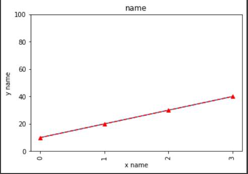


---

### 폰트 지정

```python
font1 = {'family' : 'Malgun Gothic',	#맥은 Apple Gothic
        'weight' : 'bold',
        'size' : 15,
        'color' : 'red',
        'style' : 'italic'}

plt.xticks(ticks = [0,1,2,3], labels = ['a','b','c','d'])
plt.ylim([0,100])
plt.ylabel('yname', roatation= 0, labelpad = 30, fontdict = font1)

#global option 변경
plt.rc('font', family = 'Malgun Gothic')
```

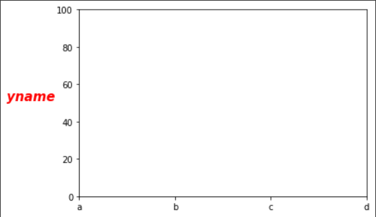

---

### 데이터 프레임의 선 그래프 출력

```python
df1 = DataFrame({'apple' : [10,20,30,40],'banana' : [39,24,20,19],'mango' : [16,66,50,58]})

df1.index = ['a','b','c','d']
df1.index.name = '지점'
df1.columns.name = '과일명'
df1.plot()
plt.legend(fontsize = 9, loc = 'best', title = 'Apple name')
plt.show()
```

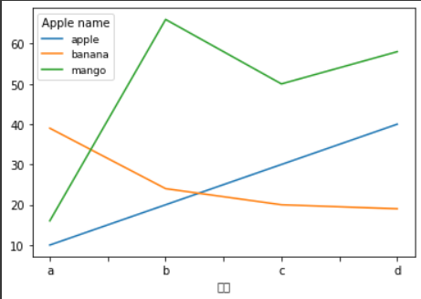

---

### Bar plot

```python
kimchi = pd.read_csv('./kimchi_test.csv', encoding = 'cp949')
kimchi = kimchi.pivot_table(index = '판매월', columns = '제품', values = '수량', aggfunc = 'sum')
kimchi.plot(kind = 'bar')		#바형식
plt.title('kimchi sold')
plt.ylim([0,300000])
plt.ylabel('panmae')
plt.legend(fontsize = 9, loc = 'best', title = 'kimchibeoul')
plt.xlabel('woul')
plt.xticks(rotation = 0)
plt.show()
```

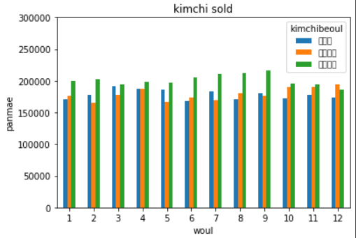

---

### Pie chart(원형 차트)

```python
#plt.pie(kind = )	>> 이런 형태는 안됨

ratio = [34,32,16,18]
labels = ['Apple', 'Banana', 'Melon', 'Grapes']
colors = ['#d96353', '#53d98b', '#53a1d9', '#fab7fa']   
colors = ['#ff9999', '#ffc000', '#8fd9b6', '#d395d0']
explode = [0.1, 0.1, 0.1, 0.1]
wedgeprops={'width': 0.7, 'edgecolor': 'w', 'linewidth': 5}

plt.pie(ratio,                  # 각 파이 숫자
        labels=labels,          # 각 파이 이름
        autopct='%.1f%%',       # 값의 표현 형태(소수점 첫째자리)
        startangle=260,         # 시작위치
        radius = 0.8,           # 파이 크기
        counterclock=False,     # 시계방향 진행 여부
        explode = explode,      # 중심에서 벗어나는 정도 설정(서로 다른 숫자 전달 가능)
        colors=colors,          # 컬러맵 전달 가능
        shadow=False,           # 그림자 설정
        wedgeprops=wedgeprops)  # 부채꼴 모양 설정
#pie chart는 외울 필요없이 있느 거 붙여서 조금만 수정하면 됨

#예제
import matplotlib.pyplot as plt
import numpy as np

plt.style.use('ggplot2')


# make data
x = [1, 2, 3, 4]
colors = plt.get_cmap('Blues')(np.linspace(0.2, 0.7, len(x)))

# plot
fig, ax = plt.subplots()
ax.pie(x, colors=colors, radius=3, center=(4, 4),
       wedgeprops={"linewidth": 1, "edgecolor": "white"}, frame=True)

ax.set(xlim=(0, 8), xticks=np.arange(1, 8),
       ylim=(0, 8), yticks=np.arange(1, 8))

plt.show()
```

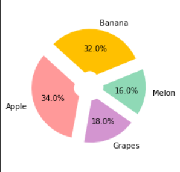

```python
#예제_2
import matplotlib.pyplot as plt
import numpy as np

plt.style.use('ggplot')


# make data
ratio = [1,2,3,4]
colors = plt.get_cmap('Blues')(np.linspace(0.2, 0.7, len(x)))
#linspace(거리를 원하는 형태로 설정할 수 있는 함수)

# plot
fig, ax = plt.subplots()
ax.pie(x, colors=colors, radius=3, center=(4, 4),
       wedgeprops={"linewidth": 1, "edgecolor": "white"}, frame=True)

ax.set(xlim=(0, 8), xticks=np.arange(1, 8),     #ticks 표시하는 거 1~7까지 나타내는
       ylim=(0, 8), yticks=np.arange(1, 8))

plt.show()
```

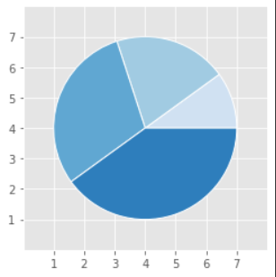

---

### hist(히스토그램)

```python
#4. hist : 히스토그램(밀도 표현!)(전체 합 = 1)
s1 = Series(np.random.randn(1000))     #정규분포에서 무작위 추출 / 꼭 randn으로 해야돼!
#s1.hist(bins = 4)                       #bins = 면적을 4등분해서 네 개로 나오게(막대 개수)

#rand : 정해진 숫자에서 무작위 추출(균등하게 >> uniform distribution)
#randn : 정규분포 (normal distribution)에서 무작위 추출

plt.hist(s1,
         bins = 5,			#막대 개수 5개
         density = False)   #True로 설정시, 막대 아래 총 면적이 1이 되는 밀도함수 출력
                            #즉 y축 값이 확률로 변경되어 출력됨
```

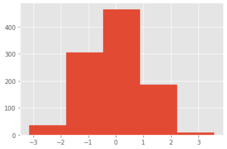

```python
plt.hist(s1, density = True)      #확률 값으로 출력     
```

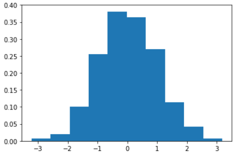

```python
s1.plot(kind = 'kde')                #커널 밀도 함수 출력(연속형 히스토그램)  
```

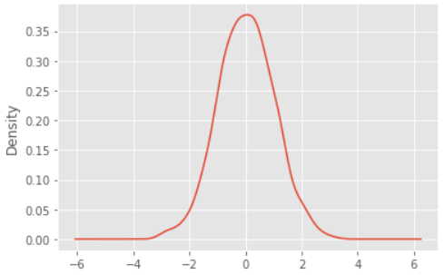

```
! 커널 밀도 함수 !

히스토그램 등을 스무딩(smoothing)하는 것
>> 굴곡이 심한 그래프나 히스토그램을 평준화할 때 사용하는 추정방법
```

---

### 산점도

```python
#5. 산점도
#점으로 표시해서 두 개 변수 간의 관계를 나타내는 그래프
#iris data loading
from sklearn.datasets import load_iris

iris = load_iris()    #함수의 객체화
iris.keys()
#dict_keys(['data', 'target', 'frame', 'target_names', 'DESCR', 'feature_names', 'filename', 'data_module'])

iris['DESCR']
iris_x = iris['data']
x_names = iris['feature_names']
plt.subplot(2,2,1)      #2*2 그래프 중 첫 번째
plt.scatter(iris_x[:,0],          #x축 좌표 (첫 번째 설명변수)
            iris_x[:,1],          #y축 좌표 (두 번째 설명변수)
            c = iris_x[:,1])      #컬러를 얘를 기준으로 바꾼다
            #컬러 설정 안하면 모두 동일한 색으로 나옴
            #서로 다른 숫자 전달시, 서로 다른 색으로 표현됨
plt.spring()
plt.xlabel(x_names[0])
plt.ylabel(x_names[1])
plt.colorbar()


plt.subplot(2,2,2)      #두 번째 그래프
plt.scatter(iris_x[:,1], iris_x[:,2], c = iris_x[:,2])
plt.summer()
plt.xlabel(x_names[0])
plt.ylabel(x_names[1])
plt.colorbar()

plt.subplot(2,2,3)      #세 번째 그래프
plt.scatter(iris_x[:,2], iris_x[:,3], c = iris_x[:,3])
plt.autumn()
plt.xlabel(x_names[0])
plt.ylabel(x_names[1])
plt.colorbar()

plt.subplot(2,2,4)		#네 번째 그래프
plt.scatter(iris_x[:,3], iris_x[:,0], c = iris_x[:,0])
plt.winter()
plt.xlabel(x_names[0])
plt.ylabel(x_names[1])
plt.colorbar()
```

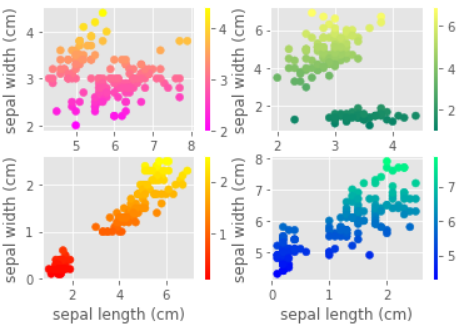

---

### box plot

```python
#6. boxplot

plt.boxplot(iris_x)
plt.xticks(ticks = [1,2,3,4], labels = x_names)
```

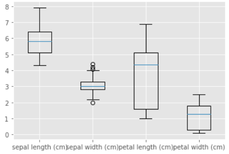