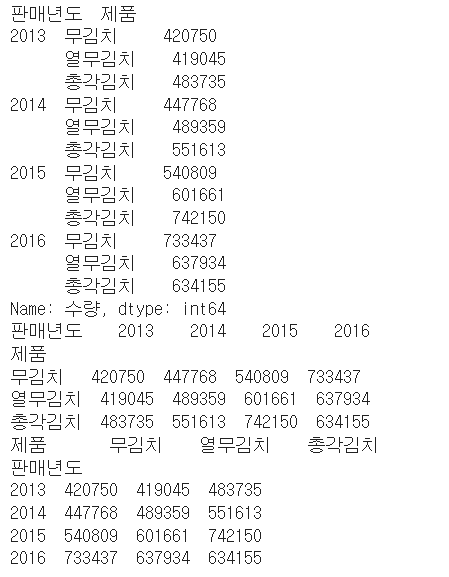
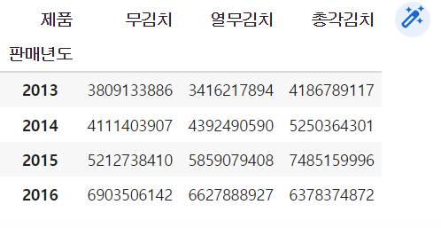

# stack / unstack / pivot_table

>long data(깔끔한 데이터) : 각 속성을 컬럼으로 표현
>
>wide data(교차표) : 하나의 속성을 갖는 데이터가 각 종류마다 서로 다른 컬럼으로 분리되어 나열
>
>stack : wide >> long
>
>unstack : long >> wide


### stack/unstack

````python
import numpy as np
import pandas as pd
from pandas import Series, DataFrame

kimchi =  pd.read_csv('./kimchi_test.csv', encoding = 'cp949')

#kimchi 데이터를 연도별, 제품별, 수량의 총합
df1 = kimchi.groupby(['판매년도','제품'])['수량'].sum()

#멀티인덱스
#인덱스나 컬럼이 여러 레벨로 표현
df2 = df1.unstack()
print(df1)
print(df2(level = 0))
print(df2(level = 1))
````





### pivot_table

```python
#교차표 작성
kimchi.pivot_table(index = '판매월',		#index 방향에 배치할 컬럼명
                  columns = '판매처',		#컬럼 방향에 배치할 컬럼명
                  values = '수량',		#교차표에 작성할 값을 갖는 컬럼명
                  aggfunc = 'sum')		#그룹 함수

#예제
#kimchi를 이용해서 연도별, 제품별 판매금액의 총합을 교차표로 작성
kimchi.pivot_table(index = '연도별',
                  columns = '판매처',
                  values = '판매금액',
                  aggfunc = 'sum')
```

